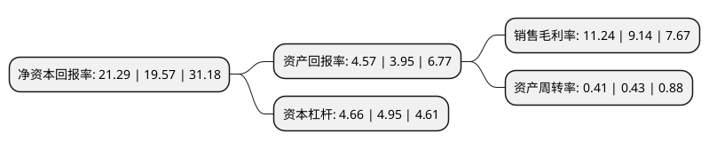

> 本页面由自动化程序生成于 2022年5月20日 01:05
> 内容可能存在错误，如有bug请提交issue至：https://github.com/Eroleice/doc-pi/issues
{.is-warning}

# 上市公司基本情况

## 基本资料

协鑫能源科技股份有限公司（以下简称“协鑫能科”）成立于1992年05月05日，无锡市。于2004年07月08日在深交所中小板上市。

协鑫能科注册资本162,332.461万元，清洁能源项目的开发，投资和运营管理，以及相关领域的综合能源服务以下是详细信息：

- 公司名称: 协鑫能源科技股份有限公司
- 股票代码: 002015.SZ
- 所在地: 江苏 - 无锡市
- 成立日期: 1992年05月05日
- 注册资本: 162,332.461万元
- 法定代表人: 朱钰峰
- 主营业务: 清洁能源项目的开发，投资和运营管理，以及相关领域的综合能源服务
- 公司官网: www.gcl-et.com
- 公司介绍: 公司原主营废弃聚酯的综合处理、有色聚酯纤维及色纺纱线的研发、生产和销售。2019年，公司通过资产置换及购买资产，置出原有经营性资产，购入协鑫智慧能源90%股权。协鑫智慧能源专注于清洁能源项目的开发、投资和运营管理，以及相关领域的综合能源服务，现已成为中国领先的非公有制清洁能源发电及热电联产运营商和服务商之一，目前主要包括燃机热电联产、风力发电、垃圾发电、生物质发电、燃煤热电联产等。公司将成为一家以清洁能源发电及热电联产为主业，同时涉及能源服务的企业。

## 股东及高管情况

上市公司第一大股东为上海其辰投资管理有限公司，持股783,413,333股，占比48.26%，为上市公司实际控制人。

截至2022年03月31日，上市公司的前十大股东中，共有1名自然人股东，7名机构股东，2个产品账户，其中5%以上大股东共有2名。上市公司前十大股东明细如下：

> 截至2022年03月31日，上市公司前十大股东信息如下：

| 股东名称 | 持股数量（股） | 持股比例 |
| --- | --- | --- |
| 上海其辰投资管理有限公司 | 783,413,333 | 48.26% |
| 协鑫创展控股有限公司 | 86,204,109 | 5.31% |
| 江苏新扬子商贸有限公司 | 71,942,446 | 4.43% |
| 苏州工业园区秉颐清洁能源合伙企业(有限合伙) | 56,114,718 | 3.46% |
| 四川交投创新投资发展有限公司 | 32,374,100 | 1.99% |
| 广发证券股份有限公司 | 23,093,525 | 1.42% |
| 财通基金-五矿信托琮玉系列-璟睿1号集合资金信托计划-财通基金五矿信托琮玉3号单一资产管理计划 | 21,582,733 | 1.33% |
| 王孝安 | 18,000,000 | 1.11% |
| 中信证券股份有限公司 | 16,616,413 | 1.02% |
| 成都川商贰号股权投资基金中心(有限合伙) | 16,045,000 | 0.99% |

## 利润表分析

上市公司2021年总收入为113.14亿元，净利润为12.71亿元，实现盈利。

## 杜邦分析

> 数据列示周期：2021年 | 2020年 | 2019年
{.is-info}

上市公司的净资产收益率在近一年有所上升，上升幅度为8.79%，其变化情况分解如下：
- 上市公司的销售毛利率在近一年上升了22.98%，可能是生产效率的提升、商品原材料价格下跌或商品价格的上涨所致。
- 上市公司的资产周转率在近一年下降了-4.65%，可能是源自于更慢的销售回款或库存管理效果下降。
- 上市公司的财务杠杆比率在近一年下降了-5.86%，可能是减少负债降低财务费用。

