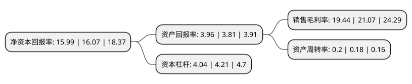

> 本页面由自动化程序生成于 2022年5月20日 01:14
> 内容可能存在错误，如有bug请提交issue至：https://github.com/Eroleice/doc-pi/issues
{.is-warning}

# 上市公司基本情况

## 基本资料

中国广核电力股份有限公司（以下简称“中国广核”）成立于2014年03月25日，深圳市。于2019年08月26日在深交所中小板上市。

中国广核注册资本5,049,861.11万元，主营业务为建设，运营及管理核电站，销售该等核电站所发电力，组织开发核电站的设计及科研工作。主要产品是电力。以下是详细信息：

- 公司名称: 中国广核电力股份有限公司
- 股票代码: 003816.SZ
- 所在地: 广东 - 深圳市
- 成立日期: 2014年03月25日
- 注册资本: 5,049,861.11万元
- 法定代表人: 杨长利
- 主营业务: 主营业务为建设，运营及管理核电站，销售该等核电站所发电力，组织开发核电站的设计及科研工作主要产品是电力
- 公司官网: www.cgnp.com.cn
- 公司介绍: 公司是我国在运装机规模最大的核电开发商与运营商,是中国核电行业最大的参与者,是控股股东中国广核集团核能发电业务最终整合的唯一平台,主要产品是电力,公司管理的在运、在建核电装机容量份额为国内市场第一。公司积极参与国家标准和行业标准的建设工作，现已建立了较为完善的科技研发体系并积极融入国家科技创新体系。公司的子公司工程公司推动建设了国家级科研平台国家能源核电工程建设技术研发(实验)中心；打造全产业链“政产学研用”协同创新平台，推进核电装备自主化与技术升级。已成功获批多项国家级科研项目，包括国家能源核电工程建设技术研发中心、核电工程建设示范专项、大型先进压水堆重大专项等课题,公司力争成为引领核能动力新技术开发和应用拓展的领跑者，保持在中国国内核能发电的领先地位，并努力成为国际核电市场有较强竞争力的核电供应商和专业化的运营服务商。

## 股东及高管情况

上市公司第一大股东为中国广核集团有限公司，持股29,704,943,375股，占比58.82%，为上市公司实际控制人。

截至2022年03月31日，上市公司的前十大股东中，共有1名自然人股东，4名机构股东，3个产品账户，2个海外主体，其中5%以上大股东共有3名。上市公司前十大股东明细如下：

> 截至2022年03月31日，上市公司前十大股东信息如下：

| 股东名称 | 持股数量（股） | 持股比例 |
| --- | --- | --- |
| 中国广核集团有限公司 | 29,704,943,375 | 58.82% |
| 香港中央结算(代理人)有限公司 | 8,856,919,414 | 17.54% |
| 广东恒健投资控股有限公司 | 3,428,512,500 | 6.79% |
| 中国核工业集团有限公司 | 1,679,971,125 | 3.33% |
| 中国人寿保险股份有限公司 | 1,336,430,000 | 2.65% |
| BlackRock, Inc. | 567,500,805 | 1.12% |
| 国新央企运营投资基金管理(广州)有限公司-国新央企运营(广州)投资基金(有限合伙) | 403,989,000 | 0.8% |
| 中国国有企业结构调整基金股份有限公司 | 239,725,551 | 0.47% |
| 全国社保基金一零二组合 | 167,515,200 | 0.33% |
| 李革 | 54,109,000 | 0.11% |

## 利润表分析

上市公司2021年总收入为806.78亿元，净利润为156.83亿元，实现盈利。

## 杜邦分析

> 数据列示周期：2021年 | 2020年 | 2019年
{.is-info}

上市公司的净资产收益率在近一年有所下降，下降幅度为-0.5%，其变化情况分解如下：
- 上市公司的销售毛利率在近一年下降了-7.74%，可能是生产效率的下降、商品原材料价格上涨或商品价格的下跌所致。
- 上市公司的资产周转率在近一年上升了11.11%，可能是源自于更快的销售回款或库存管理效果提升。
- 上市公司的财务杠杆比率在近一年下降了-4.04%，可能是减少负债降低财务费用。

