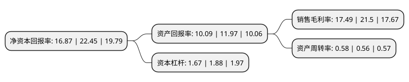

> 本页面由自动化程序生成于 2022年5月20日 01:22
> 内容可能存在错误，如有bug请提交issue至：https://github.com/Eroleice/doc-pi/issues
{.is-warning}

# 上市公司基本情况

## 基本资料

上海能辉科技股份有限公司（以下简称“能辉科技”）成立于2009年02月24日，上海市。于2021年08月17日在深交所创业板上市。

能辉科技注册资本14,979万元，公司是一家以光伏电站设计，系统集成及投资运营一站式服务为主体，并开展垃圾热解气化，储能等新兴技术研发和应用业务的新能源技术服务商。以下是详细信息：

- 公司名称: 上海能辉科技股份有限公司
- 股票代码: 301046.SZ
- 所在地: 上海 - 上海市
- 成立日期: 2009年02月24日
- 注册资本: 14,979万元
- 法定代表人: 罗传奎
- 主营业务: 公司是一家以光伏电站设计，系统集成及投资运营一站式服务为主体，并开展垃圾热解气化，储能等新兴技术研发和应用业务的新能源技术服务商
- 公司官网: www.nhet.com.cn
- 公司介绍: 公司是一家以光伏电站设计、系统集成及投资运营一站式服务为主体，并开展垃圾热解气化、储能等新兴技术研发和应用业务的新能源技术服务商。公司凭借专业高效的发电设计及系统集成方案，承接了贵州省第一个光伏电站项目——威宁县平箐光伏电站项目、贵州省第一个农光互补光伏电站项目——威宁县么站60MWp农业光伏电站项目，同时积累了国家电力投资集团有限公司、中国电力建设集团有限公司、广州发展集团股份有限公司、中国能源建设集团有限公司、中国广核集团有限公司、国家能源投资集团有限责任公司、北京控股集团有限公司相关下属企业等优质客户群体。

## 股东及高管情况

上市公司第一大股东为罗传奎，持股35,424,000股，占比23.65%，**疑似为**上市公司实际控制人。

截至2022年03月31日，上市公司的前十大股东中，共有4名自然人股东，6名机构股东，其中5%以上大股东共有4名。上市公司前十大股东明细如下：

> 未能通过持股比例判定出上市公司实际控制人（持股30%以上）
> 可能存在通过间接持股、联合持股、协议控制等方式拥有实际控制权的主体，具体请参考上市公司定期公告！
{.is-warning}

> 截至2022年03月31日，上市公司前十大股东信息如下：

| 股东名称 | 持股数量（股） | 持股比例 |
| --- | --- | --- |
| 罗传奎 | 35,424,000 | 23.65% |
| 上海能辉投资控股有限公司 | 32,000,000 | 21.36% |
| 浙江海宁同辉投资管理合伙企业(有限合伙) | 10,098,100 | 6.74% |
| 温鹏飞 | 8,809,600 | 5.88% |
| 浙江海宁众辉投资管理合伙企业(有限合伙) | 4,100,000 | 2.74% |
| 张健丁 | 3,766,400 | 2.51% |
| 济南晟兴股权投资合伙企业(有限合伙) | 3,390,000 | 2.26% |
| 济南晟泽股权投资合伙企业(有限合伙) | 3,390,000 | 2.26% |
| 王云兰 | 3,004,000 | 2.01% |
| 海宁东方大通瑞盈投资合伙企业(有限合伙) | 2,300,000 | 1.54% |

## 利润表分析

上市公司2021年总收入为5.92亿元，净利润为1.03亿元，实现盈利。

## 杜邦分析

> 数据列示周期：2021年 | 2020年 | 2019年
{.is-info}

上市公司的净资产收益率在近一年有所下降，下降幅度为-24.86%，其变化情况分解如下：
- 上市公司的销售毛利率在近一年下降了-18.65%，可能是生产效率的下降、商品原材料价格上涨或商品价格的下跌所致。
- 上市公司的资产周转率在近一年上升了3.57%，可能是源自于更快的销售回款或库存管理效果提升。
- 上市公司的财务杠杆比率在近一年下降了-11.17%，可能是减少负债降低财务费用。

