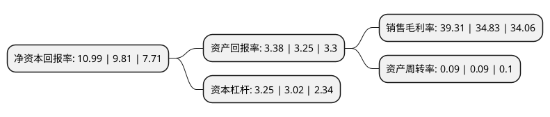

> 本页面由自动化程序生成于 2022年5月20日 01:29
> 内容可能存在错误，如有bug请提交issue至：https://github.com/Eroleice/doc-pi/issues
{.is-warning}

# 上市公司基本情况

## 基本资料

中国三峡新能源(集团)股份有限公司（以下简称“三峡能源”）成立于1985年09月05日，北京市。于2021年06月10日在上交所主板上市。

三峡能源注册资本2,862,095万元，主要产品是电力，主营业务为风能，太阳能的开发，投资和运营。以下是详细信息：

- 公司名称: 中国三峡新能源(集团)股份有限公司
- 股票代码: 600905.SH
- 所在地: 北京 - 北京市
- 成立日期: 1985年09月05日
- 注册资本: 2,862,095万元
- 法定代表人: 王武斌
- 主营业务: 主要产品是电力，主营业务为风能，太阳能的开发，投资和运营
- 公司官网: www.ctgne.com
- 公司介绍: 公司围绕“风光三峡”和“海上风电引领者”的战略目标，坚持规模和效益并重，实施差异化竞争和成本领先战略，努力打造产业结构合理、资产质量优良、经济效益显著、管理水平先进的世界一流新能源公司。公司业务分布范围广，布局合理，集中连片规模化开发海上风电格局基本形成。公司紧紧围绕“风光三峡”和“海上风电引领者”战略，截至2019年12月31日，三峡新能源陆上风电项目遍及内蒙古、新疆、云南等22个省区；海上风电项目全力推进广东、福建、江苏、辽宁、山东等地前期工作，不断巩固海上风电集中连片规模化开发优势；光伏项目遍及甘肃、青海、河北等18个省区。

## 股东及高管情况

上市公司第一大股东为中国长江三峡集团有限公司，持股14,000,000,000股，占比48.92%，为上市公司实际控制人。

截至2022年03月31日，上市公司的前十大股东中，共有9名机构股东，1个海外主体，其中5%以上大股东共有1名。上市公司前十大股东明细如下：

> 截至2022年03月31日，上市公司前十大股东信息如下：

| 股东名称 | 持股数量（股） | 持股比例 |
| --- | --- | --- |
| 中国长江三峡集团有限公司 | 14,000,000,000 | 48.92% |
| 都城伟业集团有限公司 | 998,000,000 | 3.49% |
| 中国水利水电建设工程咨询有限公司 | 998,000,000 | 3.49% |
| 三峡资本控股有限责任公司 | 998,000,000 | 3.49% |
| 珠海融朗投资管理合伙企业(有限合伙) | 998,000,000 | 3.49% |
| 浙能资本控股有限公司 | 998,000,000 | 3.49% |
| 金石新能源投资(深圳)合伙企业(有限合伙) | 500,000,000 | 1.75% |
| 香港中央结算有限公司(陆股通) | 321,895,591 | 1.12% |
| 四川川投能源股份有限公司 | 255,000,000 | 0.89% |
| 湖北长江招银成长股权投资合伙企业(有限合伙) | 255,000,000 | 0.89% |

## 利润表分析

上市公司2021年总收入为154.84亿元，净利润为60.86亿元，实现盈利。

## 杜邦分析

> 数据列示周期：2021年 | 2020年 | 2019年
{.is-info}

上市公司的净资产收益率在近一年有所上升，上升幅度为12.03%，其变化情况分解如下：
- 上市公司的销售毛利率在近一年上升了12.86%，可能是生产效率的提升、商品原材料价格下跌或商品价格的上涨所致。
- 上市公司的资产周转率在近一年下降了0%，可能是源自于更慢的销售回款或库存管理效果下降。
- 上市公司的财务杠杆比率在近一年上升了7.62%，可能是增加负债扩大生产规模。

