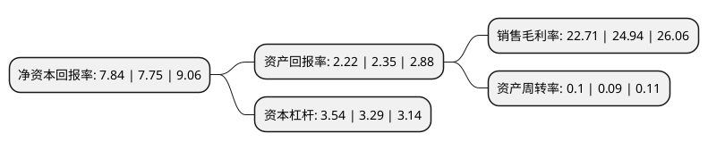

> 本页面由自动化程序生成于 2022年5月20日 01:30
> 内容可能存在错误，如有bug请提交issue至：https://github.com/Eroleice/doc-pi/issues
{.is-warning}

# 上市公司基本情况

## 基本资料

中节能风力发电股份有限公司（以下简称“节能风电”）成立于2006年01月06日，北京市。于2014年09月29日在上交所主板上市。

节能风电注册资本501,280.368万元，主营业务:风力发电的项目开发，建设及运营。以下是详细信息：

- 公司名称: 中节能风力发电股份有限公司
- 股票代码: 601016.SH
- 所在地: 北京 - 北京市
- 成立日期: 2006年01月06日
- 注册资本: 501,280.368万元
- 法定代表人: 刘斌
- 主营业务: 主营业务:风力发电的项目开发，建设及运营
- 公司官网: www.cecwpc.cn
- 公司介绍: 公司是从事风力发电项目开发、投资管理、建设施工、运营维护的专业化公司。作为中国节能唯一风电开发运营平台，公司承继了中国节能在风电领域多年积累的行业经验、技术优势及从事风电行业的优秀管理团队，已发展成为张北坝上地区、甘肃河西走廊地区领先的风电开发商。公司在业内具有较高的知名度和良好的品牌形象，先后中标并示范建设了国家第一个百万千瓦风电基地启动项目——河北张北单晶河200MW特许权项目；中标并示范建设了国家第一个千万千瓦风电基地启动项目——甘肃昌马200MW特许权项目，是国家首个千万千瓦风电基地和首个百万千瓦风电基地的示范者和引领者。公司完成了以河北张北、甘肃酒泉、新疆托里为基地，以蒙西、蒙东、青海为支点，以湖北五峰、广西博白、浙江嵊州、四川剑阁、河南尉氏、陕西定边等为尖兵的陆上布局，以广东阳江、唐山乐亭南北两个地区的海上布局，并建设了澳大利亚白石风电场项目，实现了海外市场的突破，使公司逐步发展成为国内国际全面布局的专业化风电公司。

## 股东及高管情况

上市公司第一大股东为中国节能环保集团有限公司，持股2,402,526,319股，占比47.93%，为上市公司实际控制人。

截至2022年03月31日，上市公司的前十大股东中，共有2名自然人股东，4名机构股东，3个产品账户，1个海外主体，其中5%以上大股东共有1名。上市公司前十大股东明细如下：

> 截至2022年03月31日，上市公司前十大股东信息如下：

| 股东名称 | 持股数量（股） | 持股比例 |
| --- | --- | --- |
| 中国节能环保集团有限公司 | 2,402,526,319 | 47.93% |
| 国开金融有限责任公司 | 85,476,620 | 1.71% |
| 香港中央结算有限公司(陆股通) | 80,547,197 | 1.61% |
| 中信建投证券股份有限公司 | 56,397,027 | 1.13% |
| 全国社会保障基金理事会 | 31,677,266 | 0.63% |
| 吴晓锋 | 19,238,000 | 0.38% |
| 中国农业银行股份有限公司-中证500交易型开放式指数证券投资基金 | 14,394,719 | 0.29% |
| 南方天辰(北京)投资管理有限公司-南方天辰景晟12期私募证券投资基金 | 10,345,300 | 0.21% |
| 刘亚兴 | 8,790,666 | 0.18% |
| 中国国际金融香港资产管理有限公司-客户资金2 | 8,456,583 | 0.17% |

## 利润表分析

上市公司2021年总收入为35.38亿元，净利润为8.03亿元，实现盈利。

## 杜邦分析

> 数据列示周期：2021年 | 2020年 | 2019年
{.is-info}

上市公司的净资产收益率在近一年有所上升，上升幅度为1.16%，其变化情况分解如下：
- 上市公司的销售毛利率在近一年下降了-8.94%，可能是生产效率的下降、商品原材料价格上涨或商品价格的下跌所致。
- 上市公司的资产周转率在近一年上升了11.11%，可能是源自于更快的销售回款或库存管理效果提升。
- 上市公司的财务杠杆比率在近一年上升了7.6%，可能是增加负债扩大生产规模。

