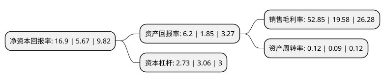

> 本页面由自动化程序生成于 2022年5月20日 01:31
> 内容可能存在错误，如有bug请提交issue至：https://github.com/Eroleice/doc-pi/issues
{.is-warning}

# 上市公司基本情况

## 基本资料

宁夏嘉泽新能源股份有限公司（以下简称“嘉泽新能”）成立于2010年04月16日，吴忠市。于2017年07月20日在上交所主板上市。

嘉泽新能注册资本243,422.001万元，主要产品:电力;主营业务:新能源电力的开发，投资，建设，经营和管理。以下是详细信息：

- 公司名称: 宁夏嘉泽新能源股份有限公司
- 股票代码: 601619.SH
- 所在地: 宁夏 - 吴忠市
- 成立日期: 2010年04月16日
- 注册资本: 243,422.001万元
- 法定代表人: 陈波
- 主营业务: 主要产品:电力;主营业务:新能源电力的开发，投资，建设，经营和管理
- 公司官网: www.jzne.net.cn
- 公司介绍: 公司隶属于宁夏嘉泽集团有限公司，是一家致力于绿色能源开发的民营上市发电企业，公司秉承“献人类清洁绿电，还自然碧水蓝天”的发展理念，经过多年发展，形成了集风力、太阳能发电、智能微电网的投资、建设、开发、运营于一体的发展格局。公司主营业务为新能源电力的开发、投资、建设、经营和管理。公司目前主要从事集中式风力、光伏发电的开发运营。公司拥有一支高素质的精英团队，聚集了众多经济、金融、管理、法律等领域的高端人才和长期致力于清洁能源事业、具有风电场运营丰富经验的资深专家。公司深耕风能资源较为丰富的区域市场，已成为宁夏地区规模领先的风力发电企业。

## 股东及高管情况

上市公司第一大股东为北京嘉实龙博投资管理有限公司，持股393,209,043股，占比16.15%，**疑似为**上市公司实际控制人。

截至2022年05月09日，上市公司的前十大股东中，共有9名机构股东，1个海外主体，其中5%以上大股东共有7名。上市公司前十大股东明细如下：

> 未能通过持股比例判定出上市公司实际控制人（持股30%以上）
> 可能存在通过间接持股、联合持股、协议控制等方式拥有实际控制权的主体，具体请参考上市公司定期公告！
{.is-warning}

> 截至2022年05月09日，上市公司前十大股东信息如下：

| 股东名称 | 持股数量（股） | 持股比例 |
| --- | --- | --- |
| 北京嘉实龙博投资管理有限公司 | 393,209,043 | 16.15% |
| 北京嘉实龙博投资管理有限公司 | 393,209,043 | 16.15% |
| 金元荣泰投资管理(宁夏)有限公司 | 333,591,237 | 13.7% |
| 金元荣泰投资管理(宁夏)有限公司 | 333,591,237 | 13.7% |
| GLP Renewable   Energy Investment II Limited | 251,780,000 | 10.34% |
| 宁夏比泰投资合伙企业(有限合伙) | 194,600,000 | 7.99% |
| 宁夏比泰投资合伙企业(有限合伙) | 190,000,000 | 7.8052% |
| 百年人寿保险股份有限公司-传统自营 | 98,305,944 | 4.04% |
| 山东国瑞能源集团有限公司 | 68,109,338 | 2.8% |
| 国金鼎兴通汇(厦门)股权投资合伙企业(有限合伙) | 18,225,000 | 0.75% |

## 利润表分析

上市公司2021年总收入为14.22亿元，净利润为7.51亿元，实现盈利。

## 杜邦分析

> 数据列示周期：2021年 | 2020年 | 2019年
{.is-info}

上市公司的净资产收益率在近一年有所上升，上升幅度为198.06%，其变化情况分解如下：
- 上市公司的销售毛利率在近一年上升了169.92%，可能是生产效率的提升、商品原材料价格下跌或商品价格的上涨所致。
- 上市公司的资产周转率在近一年上升了33.33%，可能是源自于更快的销售回款或库存管理效果提升。
- 上市公司的财务杠杆比率在近一年下降了-10.78%，可能是减少负债降低财务费用。

