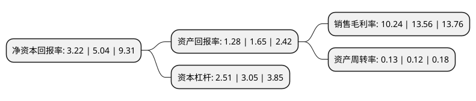

> 本页面由自动化程序生成于 2022年5月20日 01:31
> 内容可能存在错误，如有bug请提交issue至：https://github.com/Eroleice/doc-pi/issues
{.is-warning}

# 上市公司基本情况

## 基本资料

晶科电力科技股份有限公司（以下简称“晶科科技”）成立于2011年07月28日，上饶市。于2020年05月19日在上交所主板上市。

晶科科技注册资本289,431.2万元，主营业务主要分为光伏电站运营和光伏电站EPC两大板块，涉及太阳能光伏电站的开发，投资，建设，运营和管理等环节，以及光伏电站EPC工程总承包，电站运营综合服务解决方案等以下是详细信息：

- 公司名称: 晶科电力科技股份有限公司
- 股票代码: 601778.SH
- 所在地: 江西 - 上饶市
- 成立日期: 2011年07月28日
- 注册资本: 289,431.2万元
- 法定代表人: 李仙德
- 主营业务: 主营业务主要分为光伏电站运营和光伏电站EPC两大板块，涉及太阳能光伏电站的开发，投资，建设，运营和管理等环节，以及光伏电站EPC工程总承包，电站运营综合服务解决方案等
- 公司官网: www.jinkopower.com
- 公司介绍: 公司成立于2011年，是专业从事清洁能源的服务商，晶科电力主营业务主要分为光伏电站运营和光伏电站EPC两大板块，涉及太阳能光伏的电站开发、电站投资、电站建设、电站运营和电站管理等环节，以及光伏电站EPC工程总承包、电站运营综合服务解决方案等。近年来，作为公司核心业务的光伏电站运营取得高速发展，通过自行开发建造、收购等方式，在全国范围内投资开发光伏发电项目，行业地位和市场竞争力不断提升。

## 股东及高管情况

上市公司第一大股东为晶科新能源集团有限公司，持股853,400,000股，占比29.49%，**疑似为**上市公司实际控制人。

截至2022年03月31日，上市公司的前十大股东中，共有7名机构股东，2个产品账户，1个海外主体，其中5%以上大股东共有3名。上市公司前十大股东明细如下：

> 未能通过持股比例判定出上市公司实际控制人（持股30%以上）
> 可能存在通过间接持股、联合持股、协议控制等方式拥有实际控制权的主体，具体请参考上市公司定期公告！
{.is-warning}

> 截至2022年03月31日，上市公司前十大股东信息如下：

| 股东名称 | 持股数量（股） | 持股比例 |
| --- | --- | --- |
| 晶科新能源集团有限公司 | 853,400,000 | 29.49% |
| 碧華創投有限公司 | 241,592,600 | 8.35% |
| 中航创新资本管理有限公司-上饶市晶航新能源投资中心(有限合伙) | 170,909,000 | 5.9% |
| MEGCIF Investments 6 Limited | 109,861,900 | 3.8% |
| 靖安县中安晶盛股权投资合伙企业(有限合伙) | 108,619,986 | 3.75% |
| 深圳前海瑞华资本创新有限公司-珠海光大瑞华新能源股权投资合伙企业(有限合伙) | 91,302,600 | 3.15% |
| 天津金石鹏博股权投资合伙企业(有限合伙) | 54,250,600 | 1.87% |
| 杭州厷盈晶海投资合伙企业(有限合伙) | 38,624,361 | 1.33% |
| 中国银行股份有限公司-华泰柏瑞中证光伏产业交易型开放式指数证券投资基金 | 17,721,033 | 0.61% |
| 中信建投证券股份有限公司-天弘中证光伏产业指数型发起式证券投资基金 | 14,244,900 | 0.49% |

## 利润表分析

上市公司2021年总收入为36.74亿元，净利润为3.76亿元，实现盈利。

## 杜邦分析

> 数据列示周期：2021年 | 2020年 | 2019年
{.is-info}

上市公司的净资产收益率在近一年有所下降，下降幅度为-36.11%，其变化情况分解如下：
- 上市公司的销售毛利率在近一年下降了-24.48%，可能是生产效率的下降、商品原材料价格上涨或商品价格的下跌所致。
- 上市公司的资产周转率在近一年上升了8.33%，可能是源自于更快的销售回款或库存管理效果提升。
- 上市公司的财务杠杆比率在近一年下降了-17.7%，可能是减少负债降低财务费用。

