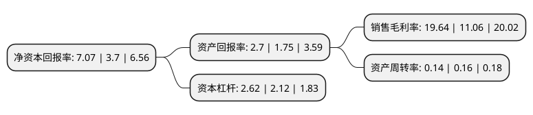

> 本页面由自动化程序生成于 2022年5月20日 01:35
> 内容可能存在错误，如有bug请提交issue至：https://github.com/Eroleice/doc-pi/issues
{.is-warning}

# 上市公司基本情况

## 基本资料

江苏省新能源开发股份有限公司（以下简称“江苏新能”）成立于2002年10月17日，南京市。于2018年07月03日在上交所主板上市。

江苏新能注册资本68,575.068万元，新能源发电项目的投资开发，建设运营及电力销售，目前主要包括风能发电，生物质能发电和光伏发电三个板块。以下是详细信息：

- 公司名称: 江苏省新能源开发股份有限公司
- 股票代码: 603693.SH
- 所在地: 江苏 - 南京市
- 成立日期: 2002年10月17日
- 注册资本: 68,575.068万元
- 法定代表人: 徐国群
- 主营业务: 新能源发电项目的投资开发，建设运营及电力销售，目前主要包括风能发电，生物质能发电和光伏发电三个板块
- 公司官网: www.jsne.com.cn
- 公司介绍: 公司专业从事风能、生物质能和太阳能等新能源项目的投资开发及建设运营，属于国家战略新兴产业。主营业务为新能源发电项目的投资开发、建设运营及电力销售，目前主要包括风能发电、生物质能发电和光伏发电等板块，公司根据新能源和可再生能源产业发展规划，依托各股东在政策、资源、资金、人才等方面的整体优势，促进新能源产业在风能、太阳能、生物质能等领域的协调发展和综合效益的持续提升。公司在多个领域和国内外同行开展广泛的交流合作。公司处于电力工业行业中的发电环节，并专注于利用新能源进行发电，包括风能、太阳能和生物质能发电，并且所处行业为国家重点支持和鼓励发展的行业，符合国家“十三五”规划。

## 股东及高管情况

上市公司第一大股东为江苏省国信集团有限公司，持股392,750,677股，占比57.27%，为上市公司实际控制人。

截至2022年03月31日，上市公司的前十大股东中，共有4名机构股东，6个产品账户，其中5%以上大股东共有3名。上市公司前十大股东明细如下：

> 截至2022年03月31日，上市公司前十大股东信息如下：

| 股东名称 | 持股数量（股） | 持股比例 |
| --- | --- | --- |
| 江苏省国信集团有限公司 | 392,750,677 | 57.27% |
| 江苏省沿海开发集团有限公司 | 75,000,000 | 10.94% |
| 盐城市国能投资有限公司 | 68,890,000 | 10.05% |
| 江苏省农垦集团有限公司 | 25,000,000 | 3.65% |
| 中国工商银行股份有限公司-海富通改革驱动灵活配置混合型证券投资基金 | 5,790,560 | 0.84% |
| 中国银行股份有限公司-西部利得碳中和混合型发起式证券投资基金 | 3,232,300 | 0.47% |
| 中国银行股份有限公司-华泰柏瑞创新升级混合型证券投资基金 | 2,048,001 | 0.3% |
| 中国建设银行股份有限公司-华宝行业精选混合型证券投资基金 | 1,764,000 | 0.26% |
| 中国民生银行股份有限公司-西部利得景瑞灵活配置混合型证券投资基金 | 1,530,600 | 0.22% |
| 中国银行股份有限公司-华宝先进成长混合型证券投资基金 | 1,334,500 | 0.19% |

## 利润表分析

上市公司2021年总收入为18.56亿元，净利润为3.64亿元，实现盈利。

## 杜邦分析

> 数据列示周期：2021年 | 2020年 | 2019年
{.is-info}

上市公司的净资产收益率在近一年有所上升，上升幅度为91.08%，其变化情况分解如下：
- 上市公司的销售毛利率在近一年上升了77.58%，可能是生产效率的提升、商品原材料价格下跌或商品价格的上涨所致。
- 上市公司的资产周转率在近一年下降了-12.5%，可能是源自于更慢的销售回款或库存管理效果下降。
- 上市公司的财务杠杆比率在近一年上升了23.58%，可能是增加负债扩大生产规模。

