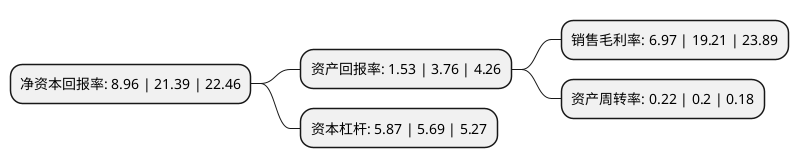

> 本页面由自动化程序生成于 2022年5月20日 01:01
> 内容可能存在错误，如有bug请提交issue至：https://github.com/Eroleice/doc-pi/issues
{.is-warning}

# 上市公司基本情况

## 基本资料

深圳华侨城股份有限公司（以下简称“华侨城A”）成立于1997年09月02日，深圳市。于1997年09月10日在深交所主板上市。

华侨城A注册资本820,179.392万元，主营业务为旅游综合，房地产和纸包装业务。以下是详细信息：

- 公司名称: 深圳华侨城股份有限公司
- 股票代码: 000069.SZ
- 所在地: 广东 - 深圳市
- 成立日期: 1997年09月02日
- 注册资本: 820,179.392万元
- 法定代表人: 段先念
- 主营业务: 主营业务为旅游综合，房地产和纸包装业务
- 公司官网: www.octholding.com
- 公司介绍: 公司是华侨城集团旗下旅游及房地产板块的上市公司，致力于成为国内主题公园的领导者、旅游产业的领军者、城镇化价值的实现者。经过近二十年的探索与升级，华侨城A以旅游综合、房地产为主营业务，构筑了成熟的成片综合开发模式。各业务板块相互融合，文化旅游景区、酒店、住宅和商业类地产以多种形式组成有机整体，成为公司有别于一般旅游、地产开发模式的独特优势，并实现了1+1>2的效用，在业态布局、产品功能、盈利与资金回收等方面形成紧密联系和相互补充，产生明显的协同效应和集群优势。近年来，公司在业务创新上不断进行探索实践，在探索文化旅游发展新模式、房地产综合业务体系的构造、旅游互联网业务研发等方面进行了探索与实践。

## 股东及高管情况

上市公司第一大股东为华侨城集团有限公司，持股3,855,685,442股，占比47.01%，为上市公司实际控制人。

截至2022年04月06日，上市公司的前十大股东中，共有1名自然人股东，5名机构股东，3个产品账户，1个海外主体，其中5%以上大股东共有4名。上市公司前十大股东明细如下：

> 截至2022年04月06日，上市公司前十大股东信息如下：

| 股东名称 | 持股数量（股） | 持股比例 |
| --- | --- | --- |
| 华侨城集团有限公司 | 3,855,685,442 | 47.01% |
| 华侨城集团有限公司 | 3,855,685,442 | 47.01% |
| 前海人寿保险股份有限公司-海利年年 | 570,318,973 | 6.95% |
| 前海人寿保险股份有限公司-海利年年 | 569,366,124 | 6.942% |
| 香港中央结算有限公司(陆股通) | 283,952,659 | 3.46% |
| 全国社保基金一一四组合 | 96,853,100 | 1.18% |
| 中国工商银行股份有限公司-广发多因子灵活配置混合型证券投资基金 | 63,196,038 | 0.77% |
| 中国建设银行股份有限公司-华夏兴和混合型证券投资基金 | 44,844,194 | 0.55% |
| 丁宏 | 39,627,800 | 0.48% |
| 深圳市钜盛华股份有限公司 | 37,000,603 | 0.45% |

## 利润表分析

上市公司2021年总收入为1,025.83亿元，净利润为71.51亿元，实现盈利。

## 杜邦分析

> 数据列示周期：2021年 | 2020年 | 2019年
{.is-info}

上市公司的净资产收益率在近一年有所下降，下降幅度为-58.11%，其变化情况分解如下：
- 上市公司的销售毛利率在近一年下降了-63.72%，可能是生产效率的下降、商品原材料价格上涨或商品价格的下跌所致。
- 上市公司的资产周转率在近一年上升了10%，可能是源自于更快的销售回款或库存管理效果提升。
- 上市公司的财务杠杆比率在近一年上升了3.16%，可能是增加负债扩大生产规模。

