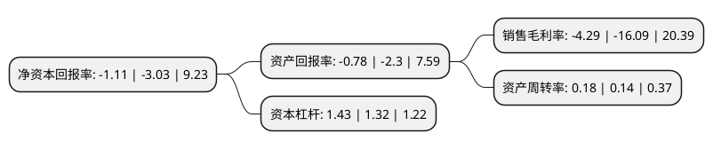

> 本页面由自动化程序生成于 2022年5月20日 01:04
> 内容可能存在错误，如有bug请提交issue至：https://github.com/Eroleice/doc-pi/issues
{.is-warning}

# 上市公司基本情况

## 基本资料

峨眉山旅游股份有限公司（以下简称“峨眉山A”）成立于1997年10月09日，乐山市。于1997年10月21日在深交所主板上市。

峨眉山A注册资本52,691.31万元，主要业务:经营峨眉山风景区游山票，客运索道，旅游宾馆。以下是详细信息：

- 公司名称: 峨眉山旅游股份有限公司
- 股票代码: 000888.SZ
- 所在地: 四川 - 乐山市
- 成立日期: 1997年10月09日
- 注册资本: 52,691.31万元
- 法定代表人: 王东
- 主营业务: 经营峨眉山风景区游山票，客运索道，旅游宾馆
- 公司官网: null
- 公司介绍: 公司主要从事峨眉山游山门票服务、上山索道和酒店经营以及相应的旅游商务营业活动。公司依托世界自然与文化双遗产、国家5A级旅游景区、全国首批智慧旅游试点景区峨眉山风景名胜区，是四川省唯一一家旅游上市公司，也是四川省龙头旅游企业，在峨眉山风景区的门票经营、索道经营业务的拥有不可复制的优势。公司以构建“智慧峨眉山、幸福风景区”为目标，为适应“旅游大众化、出行散客化、服务个性化和营销网络化”的旅游产业发展趋势，推进网络营销体系和网络服务体系的新突破和新发展，取得了非常良好的品牌和口碑效益。公司将一手抓门票、索道、酒店等传统产业，通过构建网络营销服务体系，打通景区“大小循环”，实现景区游客的持续高速增长；另一手抓新兴产业，在夯实传统产业的基础上，拓展由旅游产业派生出的茶叶、文化演艺、旅游养生、智慧旅游等新兴产业，使传统产业和新兴产业相互促进、相互驱动，推动公司走上发展的快车道。

## 股东及高管情况

上市公司第一大股东为四川省峨眉山乐山大佛旅游集团有限公司，持股171,721,744股，占比32.59%，为上市公司实际控制人。

截至2022年03月31日，上市公司的前十大股东中，共有2名自然人股东，2名机构股东，4个产品账户，1个海外主体，1名其他股东，其中5%以上大股东共有2名。上市公司前十大股东明细如下：

> 截至2022年03月31日，上市公司前十大股东信息如下：

| 股东名称 | 持股数量（股） | 持股比例 |
| --- | --- | --- |
| 四川省峨眉山乐山大佛旅游集团有限公司 | 171,721,744 | 32.59% |
| 乐山市红珠山宾馆 | 36,924,750 | 7.01% |
| 平安资产-工商银行-平安资产如意28号保险资产管理产品 | 7,472,600 | 1.42% |
| 平安安赢股票型养老金产品-中国银行股份有限公司 | 7,263,674 | 1.38% |
| UBS AG | 4,596,321 | 0.87% |
| 阿拉丁传奇旅游产业集团有限公司 | 3,700,000 | 0.7% |
| 陈世辉 | 3,393,684 | 0.64% |
| 中国银行股份有限公司-富国中证旅游主题交易型开放式指数证券投资基金 | 3,328,400 | 0.63% |
| 王全红 | 1,986,800 | 0.38% |
| 平安养老保险股份有限公司-平安养老-睿富2号资产管理产品 | 1,960,970 | 0.37% |

## 利润表分析

上市公司2021年总收入为6.28亿元，净利润为-0.27亿元，**未实现盈利**。

## 杜邦分析

> 数据列示周期：2021年 | 2020年 | 2019年
{.is-info}

上市公司的净资产收益率在近一年有所下降，下降幅度为-63.37%，其变化情况分解如下：
- 上市公司的销售毛利率在近一年下降了-73.34%，可能是生产效率的下降、商品原材料价格上涨或商品价格的下跌所致。
- 上市公司的资产周转率在近一年上升了28.57%，可能是源自于更快的销售回款或库存管理效果提升。
- 上市公司的财务杠杆比率在近一年上升了8.33%，可能是增加负债扩大生产规模。

