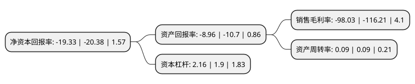

> 本页面由自动化程序生成于 2022年5月20日 01:04
> 内容可能存在错误，如有bug请提交issue至：https://github.com/Eroleice/doc-pi/issues
{.is-warning}

# 上市公司基本情况

## 基本资料

桂林旅游股份有限公司（以下简称“桂林旅游”）成立于1998年04月29日，桂林市。于2000年05月18日在深交所主板上市。

桂林旅游注册资本36,010万元，主营业务:漓江旅游客运，旅游运输客运，旅行社，景区，出租汽车客运。以下是详细信息：

- 公司名称: 桂林旅游股份有限公司
- 股票代码: 000978.SZ
- 所在地: 广西 - 桂林市
- 成立日期: 1998年04月29日
- 注册资本: 36,010万元
- 法定代表人: 李飞影
- 主营业务: 主营业务:漓江旅游客运，旅游运输客运，旅行社，景区，出租汽车客运
- 公司官网: www.guilintravel.com
- 公司介绍: 公司是桂林旅游业的龙头企业，广西第一家旅游类上市公司，也是全国旅游上市公司中以景区类业务为主的国有控股上市企业。公司主要从事旅游服务及与旅游服务相关的业务，主营业务包括：游船客运、景区旅游业务、酒店、公路旅行客运、出租车业务。公司通过资本运作和资产经营相结合，实现了资源、资本、客源的优势互补，现已发展成为桂林乃至广西旅游业的骨干企业，在国内有很高的知名度和影响力，成为集景点景区、旅游车船客运、出租汽车、宾馆酒店、码头场站、管道燃气等经营于一体、具有完整旅游概念、涵盖大桂林旅游圈的大型旅游集团控股上市公司。公司先后获得“中国最具竞争力的大企业集团”、“西部大开发优势企业500强”、“中国优秀企业”等称号及亚洲名优品牌奖、中华旅游文化杰出贡献奖等荣誉，获得了中国产品质量协会颁发的产品质量信誉AAA等级证书，连续多年被桂林市人民政府授予“桂林市先进旅游企业”称号。

## 股东及高管情况

上市公司第一大股东为桂林旅游发展集团有限公司，持股66,120,473股，占比18.36%，**疑似为**上市公司实际控制人。

截至2022年03月31日，上市公司的前十大股东中，共有5名自然人股东，4名机构股东，1个海外主体，其中5%以上大股东共有2名。上市公司前十大股东明细如下：

> 未能通过持股比例判定出上市公司实际控制人（持股30%以上）
> 可能存在通过间接持股、联合持股、协议控制等方式拥有实际控制权的主体，具体请参考上市公司定期公告！
{.is-warning}

> 截至2022年03月31日，上市公司前十大股东信息如下：

| 股东名称 | 持股数量（股） | 持股比例 |
| --- | --- | --- |
| 桂林旅游发展集团有限公司 | 66,120,473 | 18.36% |
| 桂林航空旅游集团有限公司 | 57,616,000 | 16% |
| 舒峥 | 5,173,800 | 1.44% |
| 卢灿理 | 3,048,700 | 0.85% |
| 司徒雯影 | 2,590,900 | 0.72% |
| 倪玉生 | 2,337,700 | 0.65% |
| 刘立 | 2,060,000 | 0.57% |
| 阿拉丁传奇旅游产业集团有限公司 | 2,000,000 | 0.56% |
| JPMORGAN CHASE BANK, NATIONAL ASSOCIATION | 1,777,700 | 0.49% |
| 桂林三花股份有限公司 | 1,577,431 | 0.44% |

## 利润表分析

上市公司2021年总收入为2.38亿元，净利润为-2.35亿元，**未实现盈利**。

## 杜邦分析

> 数据列示周期：2021年 | 2020年 | 2019年
{.is-info}

上市公司的净资产收益率在近一年有所下降，下降幅度为-5.15%，其变化情况分解如下：
- 上市公司的销售毛利率在近一年下降了-15.64%，可能是生产效率的下降、商品原材料价格上涨或商品价格的下跌所致。
- 上市公司的资产周转率在近一年下降了0%，可能是源自于更慢的销售回款或库存管理效果下降。
- 上市公司的财务杠杆比率在近一年上升了13.68%，可能是增加负债扩大生产规模。

