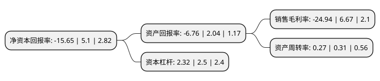

> 本页面由自动化程序生成于 2022年5月20日 01:05
> 内容可能存在错误，如有bug请提交issue至：https://github.com/Eroleice/doc-pi/issues
{.is-warning}

# 上市公司基本情况

## 基本资料

云南旅游股份有限公司（以下简称“云南旅游”）成立于2000年12月29日，昆明市。于2006年08月10日在深交所中小板上市。

云南旅游注册资本101,243.481万元，主营业务是为国内外旅游者，旅游团队提供昆明世博会会址—世博园的参观，游览服务。以下是详细信息：

- 公司名称: 云南旅游股份有限公司
- 股票代码: 002059.SZ
- 所在地: 云南 - 昆明市
- 成立日期: 2000年12月29日
- 注册资本: 101,243.481万元
- 法定代表人: 张睿
- 主营业务: 主营业务是为国内外旅游者，旅游团队提供昆明世博会会址—世博园的参观，游览服务
- 公司官网: www.ynlygf.com
- 公司介绍: 公司是昆明世博会的产物，目前主要经营管理世博园。公司已升级为旅游社区开发营运商，主营将包括世博园景点景区的投资、经营管理、园林园艺产品的展示、旅游房地产投资、生物产品的开发利用等。作为世界上唯一完整保留的世博会会址，世博园凭借全世界规模最大、最具原创性的园林园艺大观园独有的历史文化和景观价值，已经成为具有世界性、民族性、园艺性、高品位性、唯一性、不可模仿性、价值可持续性的会址文化遗产，其所处的昆明市是全国十大热点旅游城市之一，并首批进入“中国优秀旅游城市”行列。

## 股东及高管情况

上市公司第一大股东为云南世博旅游控股集团有限公司，持股361,883,986股，占比35.74%，为上市公司实际控制人。

截至2022年03月31日，上市公司的前十大股东中，共有5名自然人股东，4名机构股东，1个产品账户，其中5%以上大股东共有2名。上市公司前十大股东明细如下：

> 截至2022年03月31日，上市公司前十大股东信息如下：

| 股东名称 | 持股数量（股） | 持股比例 |
| --- | --- | --- |
| 云南世博旅游控股集团有限公司 | 361,883,986 | 35.74% |
| 华侨城集团有限公司 | 183,679,720 | 18.14% |
| 李坚 | 39,185,007 | 3.87% |
| 云南合和(集团)股份有限公司 | 37,979,946 | 3.75% |
| 云南世博广告有限公司 | 30,034,700 | 2.97% |
| 文红光 | 29,388,755 | 2.9% |
| 贾博特 | 29,388,755 | 2.9% |
| 严志平 | 15,691,841 | 1.55% |
| 国联证券-李泽平-国联定新45号单一资产管理计划 | 13,880,000 | 1.37% |
| 潘新玉 | 13,801,001 | 1.36% |

## 利润表分析

上市公司2021年总收入为14.17亿元，净利润为-3.54亿元，**未实现盈利**。

## 杜邦分析

> 数据列示周期：2021年 | 2020年 | 2019年
{.is-info}

上市公司的净资产收益率在近一年有所下降，下降幅度为-406.86%，其变化情况分解如下：
- 上市公司的销售毛利率在近一年下降了-473.91%，可能是生产效率的下降、商品原材料价格上涨或商品价格的下跌所致。
- 上市公司的资产周转率在近一年下降了-12.9%，可能是源自于更慢的销售回款或库存管理效果下降。
- 上市公司的财务杠杆比率在近一年下降了-7.2%，可能是减少负债降低财务费用。

