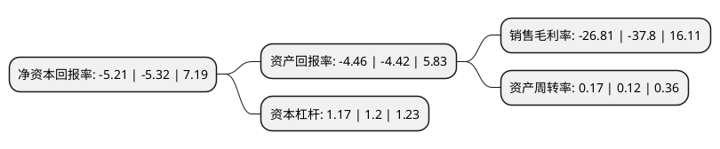

> 本页面由自动化程序生成于 2022年5月20日 01:32
> 内容可能存在错误，如有bug请提交issue至：https://github.com/Eroleice/doc-pi/issues
{.is-warning}

# 上市公司基本情况

## 基本资料

长白山旅游股份有限公司（以下简称“长白山”）成立于2010年12月08日，延边朝鲜族自治州。于2014年08月22日在上交所主板上市。

长白山注册资本26,667万元，主营业务:旅游服务业，包括旅游客运，旅行社及温泉水开发，利用业务。以下是详细信息：

- 公司名称: 长白山旅游股份有限公司
- 股票代码: 603099.SH
- 所在地: 吉林 - 延边朝鲜族自治州
- 成立日期: 2010年12月08日
- 注册资本: 26,667万元
- 法定代表人: 王昆
- 主营业务: 主营业务:旅游服务业，包括旅游客运，旅行社及温泉水开发，利用业务
- 公司官网: www.cbmt.com.cn
- 公司介绍: 公司是吉林省旅游产业的龙头企业，长白山保护开发区A级纳税企业，主营业务为旅游服务业，业务包括旅游客运、旅行社及温泉水开发、利用业务，旅游客运是公司目前的核心业务。公司为我国道路旅客运输二级企业，独家拥有长白山景区内环保车、倒站车的经营许可及收费权，也是目前长白山保护开发区唯一获得交通运输主管部门批准运营景区外环长白山旅游快线的企业。公司是长白山保护开发区最大的旅游客运公司并且是唯一拥有聚龙泉温泉水开采资质的企业。公司立足于长白山自然保护区，面向国内、国际旅游市场，逐步实现旅游产业内多元化扩张，努力成为实力雄厚、业绩优良、成长稳健、运作规范的东北地区最具影响力的综合性旅游服务企业。

## 股东及高管情况

上市公司第一大股东为吉林省长白山开发建设(集团)有限责任公司，持股158,533,060股，占比59.45%，为上市公司实际控制人。

截至2022年03月31日，上市公司的前十大股东中，共有4名自然人股东，5名机构股东，1个产品账户，其中5%以上大股东共有1名。上市公司前十大股东明细如下：

> 截至2022年03月31日，上市公司前十大股东信息如下：

| 股东名称 | 持股数量（股） | 持股比例 |
| --- | --- | --- |
| 吉林省长白山开发建设(集团)有限责任公司 | 158,533,060 | 59.45% |
| 中国吉林森林工业集团有限责任公司 | 13,207,503 | 4.95% |
| 中国华融资产管理股份有限公司 | 7,874,318 | 2.95% |
| 长白山森工集团有限公司 | 6,947,685 | 2.61% |
| 潘立明 | 2,853,670 | 1.07% |
| 阿拉丁传奇旅游产业集团有限公司 | 1,180,000 | 0.44% |
| 沈晓东 | 1,170,400 | 0.44% |
| 刘剑 | 957,500 | 0.36% |
| 中信银行股份有限公司-建信中证500指数增强型证券投资基金 | 807,500 | 0.3% |
| 王京辉 | 737,100 | 0.28% |

## 利润表分析

上市公司2021年总收入为1.92亿元，净利润为-0.52亿元，**未实现盈利**。

## 杜邦分析

> 数据列示周期：2021年 | 2020年 | 2019年
{.is-info}

上市公司的净资产收益率在近一年有所下降，下降幅度为-2.07%，其变化情况分解如下：
- 上市公司的销售毛利率在近一年下降了-29.07%，可能是生产效率的下降、商品原材料价格上涨或商品价格的下跌所致。
- 上市公司的资产周转率在近一年上升了41.67%，可能是源自于更快的销售回款或库存管理效果提升。
- 上市公司的财务杠杆比率在近一年下降了-2.5%，可能是减少负债降低财务费用。

