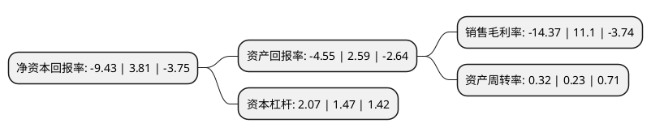

> 本页面由自动化程序生成于 2022年5月20日 01:02
> 内容可能存在错误，如有bug请提交issue至：https://github.com/Eroleice/doc-pi/issues
{.is-warning}

# 上市公司基本情况

## 基本资料

西安旅游股份有限公司（以下简称“西安旅游”）成立于1996年12月31日，西安市。于1996年09月26日在深交所主板上市。

西安旅游注册资本23,674.79万元，主要业务:旅游业务(旅游客房，旅游餐饮，旅游服务)，石油开采。以下是详细信息：

- 公司名称: 西安旅游股份有限公司
- 股票代码: 000610.SZ
- 所在地: 陕西 - 西安市
- 成立日期: 1996年12月31日
- 注册资本: 23,674.79万元
- 法定代表人: 王伟
- 主营业务: 旅游业务(旅游客房，旅游餐饮，旅游服务)，石油开采
- 公司官网: www.xatourism.com
- 公司介绍: 公司是一家具有以旅游业为主,多元化经营的国有控股旅游企业。经过多年发展，构建了完整的旅游产业链，业务涵盖“吃、住、行、游、购、娱”六大旅游要素，经营范围包括旅行社、餐饮、酒店、娱乐、商业、旅游服务、旅游交通、景区开发、房地产开发、商业等多个领域。公司所属西安中旅国际旅行社有限责任公司是国家旅游局批准经营国际旅游业务的国际旅行社，是中、省、市旅行社协会理事单位，是西北五省日本大使馆授权代办个人赴日旅游直接送签和国家旅游局特许经营大陆居民赴台游业务旅行社。西安海外旅游有限责任公司是国家旅游局批准的具有自主外联签证权与公民出境旅游特许权的国际旅行社，同时具有大陆居民赴台旅游资质和西安市教育局特批研学旅游资质。近年来，先后荣获了“国际旅行社四钻级优质服务单位”、“陕西省旅游局十强旅行社”、“荣耀陕西年度旅游品牌旅行社”、“西安信誉质量5A级单位”、“西安消费者协会诚信单位”等多项荣誉称号。

## 股东及高管情况

上市公司第一大股东为西安旅游集团有限责任公司，持股64,602,145股，占比27.29%，**疑似为**上市公司实际控制人。

截至2022年03月31日，上市公司的前十大股东中，共有3名自然人股东，2名机构股东，4个产品账户，1个海外主体，其中5%以上大股东共有2名。上市公司前十大股东明细如下：

> 未能通过持股比例判定出上市公司实际控制人（持股30%以上）
> 可能存在通过间接持股、联合持股、协议控制等方式拥有实际控制权的主体，具体请参考上市公司定期公告！
{.is-warning}

> 截至2022年03月31日，上市公司前十大股东信息如下：

| 股东名称 | 持股数量（股） | 持股比例 |
| --- | --- | --- |
| 西安旅游集团有限责任公司 | 64,602,145 | 27.29% |
| 磐京股权投资基金管理(上海)有限公司-磐京稳赢6号私募证券投资基金 | 11,850,028 | 5.01% |
| 西安江洋商贸公司 | 2,633,477 | 1.11% |
| 陈大强 | 1,979,991 | 0.84% |
| 中国银行股份有限公司-富国中证旅游主题交易型开放式指数证券投资基金 | 1,788,100 | 0.76% |
| 倪玉生 | 1,760,100 | 0.74% |
| 中国建设银行股份有限公司-华安国企改革主题灵活配置混合型证券投资基金 | 1,248,700 | 0.53% |
| 中信银行股份有限公司-华安价值驱动一年持有期混合型证券投资基金 | 1,179,400 | 0.5% |
| JPMORGAN CHASE BANK,NATIONAL ASSOCIATION | 1,124,201 | 0.47% |
| 钟林勉 | 1,100,000 | 0.46% |

## 利润表分析

上市公司2021年总收入为5.6亿元，净利润为-0.81亿元，**未实现盈利**。

## 杜邦分析

> 数据列示周期：2021年 | 2020年 | 2019年
{.is-info}

上市公司的净资产收益率在近一年有所下降，下降幅度为-347.51%，其变化情况分解如下：
- 上市公司的销售毛利率在近一年下降了-229.46%，可能是生产效率的下降、商品原材料价格上涨或商品价格的下跌所致。
- 上市公司的资产周转率在近一年上升了39.13%，可能是源自于更快的销售回款或库存管理效果提升。
- 上市公司的财务杠杆比率在近一年上升了40.82%，可能是增加负债扩大生产规模。

