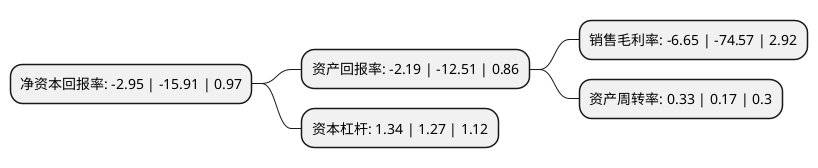

> 本页面由自动化程序生成于 2022年5月20日 01:02
> 内容可能存在错误，如有bug请提交issue至：https://github.com/Eroleice/doc-pi/issues
{.is-warning}

# 上市公司基本情况

## 基本资料

海南大东海旅游中心股份有限公司（以下简称“*ST东海A”）成立于1993年04月26日，三亚市。于1997年01月28日在深交所主板上市。

*ST东海A注册资本36,410万元，主要业务:酒店住宿和餐饮服务。以下是详细信息：

- 公司名称: 海南大东海旅游中心股份有限公司
- 股票代码: 000613.SZ
- 所在地: 海南 - 三亚市
- 成立日期: 1993年04月26日
- 注册资本: 36,410万元
- 法定代表人: 袁小平
- 主营业务: 酒店住宿和餐饮服务
- 公司官网: null
- 公司介绍: 公司酒店位于海南省三亚市大东海景区中心区域，交通便利，面朝大海，环境优美，历史悠久，文化内涵丰富，为全国名酒店成员之一。公司主营业务为酒店住宿和餐饮服务。采购商品主要为酒店、餐饮经营所需的物品、物资，以价廉质优为原则，部分通过与供应商直接签订采购合同购入，部分通过代理商采购。以网络销售为主，非网络销售散客、商务散客、旅行社客源为辅。公司酒店位置临海，拥有优美的园林绿化环境，距离海面仅数十米，一年四季鲜花盛开，享有得天独厚的地理、自然环境优势。且酒店承建开业至今二十年余，属三亚最早的酒店之一，曾经接待过国内外很多国家元首及国家级领导人物。近几年，公司对酒店软硬件设备设施进行了全面的升级改造，进一步改善了酒店内外部经营环境，有效增强了经营竞争能力。目前，公司酒店经营等方面在同区域、同规模、同档次酒店中位于前列。公司将继续努力完善酒店内外部经营环境，加强销售工作力度，加强员工队伍建设，进一步提高经营能力。

## 股东及高管情况

上市公司第一大股东为罗牛山股份有限公司，持股63,885,980股，占比17.55%，**疑似为**上市公司实际控制人。

截至2022年03月31日，上市公司的前十大股东中，共有7名自然人股东，3名机构股东，其中5%以上大股东共有1名。上市公司前十大股东明细如下：

> 未能通过持股比例判定出上市公司实际控制人（持股30%以上）
> 可能存在通过间接持股、联合持股、协议控制等方式拥有实际控制权的主体，具体请参考上市公司定期公告！
{.is-warning}

> 截至2022年03月31日，上市公司前十大股东信息如下：

| 股东名称 | 持股数量（股） | 持股比例 |
| --- | --- | --- |
| 罗牛山股份有限公司 | 63,885,980 | 17.55% |
| 杨美琴 | 16,279,028 | 4.47% |
| 潘安杰 | 14,593,598 | 4.01% |
| 海南雅安居物业服务有限公司 | 8,205,800 | 2.25% |
| 潘爱萍 | 5,972,013 | 1.64% |
| 贺咏梅 | 5,033,797 | 1.38% |
| 陈金莲 | 4,166,400 | 1.14% |
| 拉萨市星晴网络科技有限公司 | 3,760,000 | 1.03% |
| 潘国平 | 3,600,000 | 0.99% |
| 卢章夫 | 3,207,100 | 0.88% |

## 利润表分析

上市公司2021年总收入为0.3亿元，净利润为-0.03亿元，**未实现盈利**。

## 杜邦分析

> 数据列示周期：2021年 | 2020年 | 2019年
{.is-info}

上市公司的净资产收益率在近一年有所下降，下降幅度为-81.46%，其变化情况分解如下：
- 上市公司的销售毛利率在近一年下降了-91.08%，可能是生产效率的下降、商品原材料价格上涨或商品价格的下跌所致。
- 上市公司的资产周转率在近一年上升了94.12%，可能是源自于更快的销售回款或库存管理效果提升。
- 上市公司的财务杠杆比率在近一年上升了5.51%，可能是增加负债扩大生产规模。

