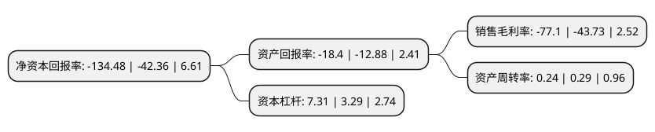

> 本页面由自动化程序生成于 2022年5月20日 01:03
> 内容可能存在错误，如有bug请提交issue至：https://github.com/Eroleice/doc-pi/issues
{.is-warning}

# 上市公司基本情况

## 基本资料

凯撒同盛发展股份有限公司（以下简称“ST凯撒”）成立于1996年05月28日，三亚市。于1997年07月03日在深交所主板上市。

ST凯撒注册资本80,300.026万元，主要业务:食品配餐以下是详细信息：

- 公司名称: 凯撒同盛发展股份有限公司
- 股票代码: 000796.SZ
- 所在地: 海南 - 三亚市
- 成立日期: 1996年05月28日
- 注册资本: 80,300.026万元
- 法定代表人: 陈杰
- 主营业务: 食品配餐
- 公司官网: www.caissatosun.com.cn
- 公司介绍: 公司以出境旅游为主，形成集会奖旅游、旅游电子商务、航空铁路配餐、项目投资与资产管理为一体的全产业链服务。公司恪守“专业、品质、创新、高效”的经营之道，致力于为客户提供最值得信赖的现代出境游服务和从空中延伸至地面的健康饮食新体验。旗下旅行社拥有覆盖全球多个国家和地区、服务于不同人群的高端旅游产品，旗下食品配餐业务拥有先进的技术工艺和创新理念，是国内首家SKYTRAX五星航空食品提供商、中国高铁餐饮服务最大的提供商之一、中国铁路餐饮服务行业标准制订商。

## 股东及高管情况

上市公司第一大股东为凯撒世嘉旅游管理顾问股份有限公司，持股178,414,088股，占比22.22%，**疑似为**上市公司实际控制人。

截至2022年03月31日，上市公司的前十大股东中，共有2名自然人股东，6名机构股东，1个产品账户，1个海外主体，其中5%以上大股东共有2名。上市公司前十大股东明细如下：

> 未能通过持股比例判定出上市公司实际控制人（持股30%以上）
> 可能存在通过间接持股、联合持股、协议控制等方式拥有实际控制权的主体，具体请参考上市公司定期公告！
{.is-warning}

> 截至2022年03月31日，上市公司前十大股东信息如下：

| 股东名称 | 持股数量（股） | 持股比例 |
| --- | --- | --- |
| 凯撒世嘉旅游管理顾问股份有限公司 | 178,414,088 | 22.22% |
| 海航旅游集团有限公司 | 175,295,608 | 21.83% |
| 华夏人寿保险股份有限公司 | 40,187,803 | 5% |
| 海航航空集团有限公司 | 15,503,875 | 1.93% |
| 新余玖兴投资管理中心(有限合伙) | 11,000,000 | 1.37% |
| 新余柏鸣投资管理中心(有限合伙) | 6,400,000 | 0.8% |
| 香港中央结算有限公司(陆股通) | 5,280,559 | 0.66% |
| 李爱儿 | 3,888,800 | 0.48% |
| 张静 | 3,847,842 | 0.48% |
| 中国银行股份有限公司-富国中证旅游主题交易型开放式指数证券投资基金 | 3,634,121 | 0.45% |

## 利润表分析

上市公司2021年总收入为9.39亿元，净利润为-7.25亿元，**未实现盈利**。

## 杜邦分析

> 数据列示周期：2021年 | 2020年 | 2019年
{.is-info}

上市公司的净资产收益率在近一年有所上升，上升幅度为217.47%，其变化情况分解如下：
- 上市公司的销售毛利率在近一年上升了76.31%，可能是生产效率的提升、商品原材料价格下跌或商品价格的上涨所致。
- 上市公司的资产周转率在近一年下降了-17.24%，可能是源自于更慢的销售回款或库存管理效果下降。
- 上市公司的财务杠杆比率在近一年上升了122.19%，可能是增加负债扩大生产规模。

