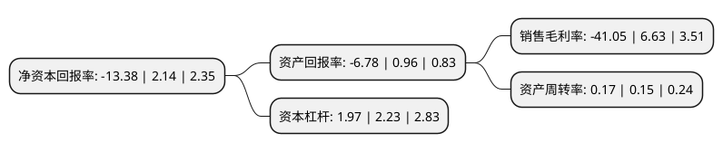

> 本页面由自动化程序生成于 2022年5月20日 01:06
> 内容可能存在错误，如有bug请提交issue至：https://github.com/Eroleice/doc-pi/issues
{.is-warning}

# 上市公司基本情况

## 基本资料

武汉三特索道集团股份有限公司（以下简称“三特索道”）成立于1989年09月05日，武汉市。于2007年08月17日在深交所中小板上市。

三特索道注册资本17,730.133万元，主营业务是以索道，景区，旅游地产为主的综合旅游开发经营。以下是详细信息：

- 公司名称: 武汉三特索道集团股份有限公司
- 股票代码: 002159.SZ
- 所在地: 湖北 - 武汉市
- 成立日期: 1989年09月05日
- 注册资本: 17,730.133万元
- 法定代表人: 张泉
- 主营业务: 主营业务是以索道，景区，旅游地产为主的综合旅游开发经营
- 公司官网: www.sante.com.cn
- 公司介绍: 公司致力于打造“索道+景区+住宿和商业配套”为核心产品的的休闲度假旅游目的地，并将多个旅游目的地项目形成产业联动，发挥品牌优势，以实现连锁经营。在旅游目的地产品方面，公司拥有较为成熟的索道、景区投资、运营、管理经验，市场美誉度较高。国家旅游局高度肯定公司在旅游产业投资方面的成绩，2017年授予公司第三届“中国旅游产业杰出贡献奖(飞马奖)”。

## 股东及高管情况

上市公司第一大股东为武汉当代城市建设发展有限公司，持股66,495,954股，占比37.5%，为上市公司实际控制人。

截至2022年03月31日，上市公司的前十大股东中，共有2名自然人股东，3名机构股东，4个产品账户，1个海外主体，其中5%以上大股东共有2名。上市公司前十大股东明细如下：

> 截至2022年03月31日，上市公司前十大股东信息如下：

| 股东名称 | 持股数量（股） | 持股比例 |
| --- | --- | --- |
| 武汉当代城市建设发展有限公司 | 66,495,954 | 37.5% |
| 武汉东湖新技术开发区发展总公司 | 10,763,305 | 6.07% |
| 武汉当代科技产业集团股份有限公司 | 6,818,700 | 3.85% |
| 中国工商银行股份有限公司-东方红新动力灵活配置混合型证券投资基金 | 4,900,000 | 2.76% |
| 严宇媛 | 3,577,614 | 2.02% |
| 招商银行股份有限公司-东方红京东大数据灵活配置混合型证券投资基金 | 2,750,000 | 1.55% |
| 中国工商银行-国联安德盛小盘精选证券投资基金 | 2,536,300 | 1.43% |
| 梁志鹏 | 2,191,486 | 1.24% |
| MERRILL LYNCH INTERNATIONAL | 1,866,508 | 1.05% |
| 国联安基金-中国太平洋人寿保险股份有限公司-分红险-国联安基金中国太平洋人寿股票相对收益型(保额分红)单一资产管理计划 | 1,578,900 | 0.89% |

## 利润表分析

上市公司2021年总收入为4.34亿元，净利润为-1.79亿元，**未实现盈利**。

## 杜邦分析

> 数据列示周期：2021年 | 2020年 | 2019年
{.is-info}

上市公司的净资产收益率在近一年有所下降，下降幅度为-725.23%，其变化情况分解如下：
- 上市公司的销售毛利率在近一年下降了-719.16%，可能是生产效率的下降、商品原材料价格上涨或商品价格的下跌所致。
- 上市公司的资产周转率在近一年上升了13.33%，可能是源自于更快的销售回款或库存管理效果提升。
- 上市公司的财务杠杆比率在近一年下降了-11.66%，可能是减少负债降低财务费用。

