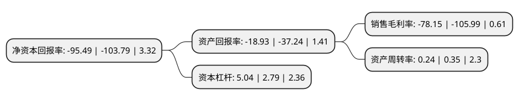

> 本页面由自动化程序生成于 2022年5月20日 01:11
> 内容可能存在错误，如有bug请提交issue至：https://github.com/Eroleice/doc-pi/issues
{.is-warning}

# 上市公司基本情况

## 基本资料

众信旅游集团股份有限公司（以下简称“众信旅游”）成立于1992年08月11日，北京市。于2014年01月23日在深交所中小板上市。

众信旅游注册资本90,637.107万元，主营业务:旅游产品制造者和服务提供商。公司是出境旅游专业运营商，主要从事出境旅游的批发，零售业务，以及商务会奖旅游业务。以下是详细信息：

- 公司名称: 众信旅游集团股份有限公司
- 股票代码: 002707.SZ
- 所在地: 北京 - 北京市
- 成立日期: 1992年08月11日
- 注册资本: 90,637.107万元
- 法定代表人: 冯滨
- 主营业务: 主营业务:旅游产品制造者和服务提供商公司是出境旅游专业运营商，主要从事出境旅游的批发，零售业务，以及商务会奖旅游业务
- 公司官网: www.uzai.com
- 公司介绍: 公司是中国最大的出境游运营商之一，主要经营出境游批发、零售、商务会奖旅游业务。公司坚持实施“批发零售一体、线上线下结合”的发展战略，建立了基本覆盖全国的旅行社代理商网络，并通过众信会员俱乐部，为会员提供差异化、贴心的服务，拥有大批忠实稳定的客户群；旗下众信旅游网作为专业的旅行服务电子商务网站，为旅游者提供团队游、自由行、酒店预订、签证服务、会员服务等一站式全方位的旅游服务。公司还是中国旅行社协会、亚太旅游协会、国际航空运输协会会员，在中国出境游市场特别是长线出境游市场上占有领先地位，多次荣获产品创新奖和营销创新奖等奖项。2015年，公司置入竹园国旅70%股权，竹园国旅的主营业务为出境游的批发，即根据市场需求，采购境外旅游交通、景点、酒店、餐厅等资源，事先设计好旅游产品，通过全国范围内的出境旅游代理商推广并销售给终端消费者，最终由公司为消费者提供产品和服务，并与旅游代理商进行旅游费用结算。

## 股东及高管情况

上市公司第一大股东为冯滨，持股165,404,629股，占比18.25%，**疑似为**上市公司实际控制人。

截至2022年03月31日，上市公司的前十大股东中，共有6名自然人股东，1名机构股东，3个产品账户，其中5%以上大股东共有3名。上市公司前十大股东明细如下：

> 未能通过持股比例判定出上市公司实际控制人（持股30%以上）
> 可能存在通过间接持股、联合持股、协议控制等方式拥有实际控制权的主体，具体请参考上市公司定期公告！
{.is-warning}

> 截至2022年03月31日，上市公司前十大股东信息如下：

| 股东名称 | 持股数量（股） | 持股比例 |
| --- | --- | --- |
| 冯滨 | 165,404,629 | 18.25% |
| 阿里巴巴(中国)网络技术有限公司 | 100,244,018 | 11.06% |
| 郭洪斌 | 53,292,843 | 5.88% |
| 林岩 | 21,834,000 | 2.41% |
| 钮昊晖 | 18,110,000 | 2% |
| 上海烜鼎资产管理有限公司-烜鼎多空套利1号私募证券投资基金 | 14,955,534 | 1.65% |
| 曹建 | 13,385,313 | 1.48% |
| 平安安赢股票型养老金产品-中国银行股份有限公司 | 5,940,600 | 0.66% |
| 中国银行股份有限公司-富国中证旅游主题交易型开放式指数证券投资基金 | 5,829,000 | 0.64% |
| 路振勤 | 5,223,900 | 0.58% |

## 利润表分析

上市公司2021年总收入为7.14亿元，净利润为-5.35亿元，**未实现盈利**。

## 杜邦分析

> 数据列示周期：2021年 | 2020年 | 2019年
{.is-info}

上市公司的净资产收益率在近一年有所下降，下降幅度为-8%，其变化情况分解如下：
- 上市公司的销售毛利率在近一年下降了-26.27%，可能是生产效率的下降、商品原材料价格上涨或商品价格的下跌所致。
- 上市公司的资产周转率在近一年下降了-31.43%，可能是源自于更慢的销售回款或库存管理效果下降。
- 上市公司的财务杠杆比率在近一年上升了80.65%，可能是增加负债扩大生产规模。

