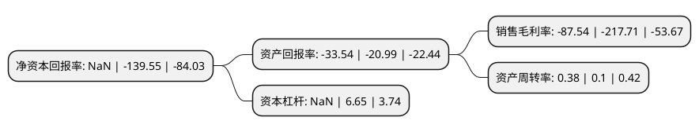

> 本页面由自动化程序生成于 2022年5月20日 01:15
> 内容可能存在错误，如有bug请提交issue至：https://github.com/Eroleice/doc-pi/issues
{.is-warning}

# 上市公司基本情况

## 基本资料

腾邦国际商业服务集团股份有限公司（以下简称“*ST腾邦”）成立于1998年04月29日，深圳市。于2011年02月15日在深交所创业板上市。

*ST腾邦注册资本61,650.829万元，主营业务:主要提供航空客运销售代理服务，同时提供酒店预订，商旅管理，旅游度假等商旅服务。以下是详细信息：

- 公司名称: 腾邦国际商业服务集团股份有限公司
- 股票代码: 300178.SZ
- 所在地: 广东 - 深圳市
- 成立日期: 1998年04月29日
- 注册资本: 61,650.829万元
- 法定代表人: 钟百胜
- 主营业务: 主营业务:主要提供航空客运销售代理服务，同时提供酒店预订，商旅管理，旅游度假等商旅服务
- 公司官网: www.feiren.com
- 公司介绍: 公司是中国旅游行业的龙头企业。业务涵盖旅游度假、航空运营、商旅管理、金融服务四大板块。腾邦国际贯彻执行“旅游×互联网×金融”构建大旅游生态圈的战略，深化构筑“以旅游主业为核心、以航空运营为翅膀、以金融服务为助推器”的产业生态圈，是国家商务部首批“商贸服务典型企业”、国家科技部“现代服务业创新发展示范企业”、国家级高新技术企业。公司通过遍布全球的服务网络，腾邦国际经过多年的努力，夯实了中国旅游业龙头企业地位，并持续完善旅游全产业链布局，打造高端商业服务的第一民族品牌。

## 股东及高管情况

上市公司第一大股东为腾邦集团有限公司，持股113,241,858股，占比18.37%，**疑似为**上市公司实际控制人。

截至2022年03月31日，上市公司的前十大股东中，共有2名自然人股东，6名机构股东，2个产品账户，其中5%以上大股东共有4名。上市公司前十大股东明细如下：

> 未能通过持股比例判定出上市公司实际控制人（持股30%以上）
> 可能存在通过间接持股、联合持股、协议控制等方式拥有实际控制权的主体，具体请参考上市公司定期公告！
{.is-warning}

> 截至2022年03月31日，上市公司前十大股东信息如下：

| 股东名称 | 持股数量（股） | 持股比例 |
| --- | --- | --- |
| 腾邦集团有限公司 | 113,241,858 | 18.37% |
| 腾邦集团有限公司 | 112,753,158 | 18.29% |
| 腾邦集团有限公司 | 108,169,350 | 17.5455% |
| 腾邦集团有限公司 | 107,588,781 | 17.45% |
| 深圳市百胜投资有限公司 | 16,500,000 | 2.68% |
| 钟百胜 | 14,268,913 | 2.31% |
| 建信基金-兴业银行-杭州民新万投投资合伙企业(有限合伙) | 6,267,012 | 1.02% |
| 嘉实基金-农业银行-嘉实中证金融资产管理计划 | 3,126,800 | 0.51% |
| 国信证券股份有限公司 | 2,884,600 | 0.47% |
| 吴琦 | 2,751,400 | 0.45% |

## 利润表分析

上市公司2021年总收入为17.16亿元，净利润为-15.03亿元，**未实现盈利**。

## 杜邦分析

> 数据列示周期：2021年 | 2020年 | 2019年
{.is-info}

上市公司的净资产收益率在近一年有所下降，下降幅度为NaN%，其变化情况分解如下：
- 上市公司的销售毛利率在近一年下降了-59.79%，可能是生产效率的下降、商品原材料价格上涨或商品价格的下跌所致。
- 上市公司的资产周转率在近一年上升了280%，可能是源自于更快的销售回款或库存管理效果提升。
- 上市公司的财务杠杆比率在近一年下降了NaN%，可能是减少负债降低财务费用。

