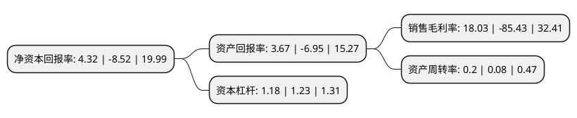

> 本页面由自动化程序生成于 2022年5月20日 01:21
> 内容可能存在错误，如有bug请提交issue至：https://github.com/Eroleice/doc-pi/issues
{.is-warning}

# 上市公司基本情况

## 基本资料

西域旅游开发股份有限公司（以下简称“*ST西域”）成立于2001年01月18日，昌吉回族自治州。于2020年08月06日在深交所创业板上市。

*ST西域注册资本15,500万元，旅游客运，高山索道观光，游船观光，温泉娱乐，旅行社业务和文化演艺等以下是详细信息：

- 公司名称: 西域旅游开发股份有限公司
- 股票代码: 300859.SZ
- 所在地: 新疆 - 昌吉回族自治州
- 成立日期: 2001年01月18日
- 注册资本: 15,500万元
- 法定代表人: 朱生春
- 主营业务: 旅游客运，高山索道观光，游船观光，温泉娱乐，旅行社业务和文化演艺等
- 公司官网: www.xylygf.com
- 公司介绍: 公司依托自然景区、景点的独特资源优势，为游客提供观光、休闲、娱乐的综合旅游服务。主要包括旅游客运、高山索道观光、游船观光、温泉娱乐、旅行社业务和文化演艺等其他服务。目前，公司主要开发经营的景区有：新疆天山天池风景名胜区和新疆五彩湾古海温泉景区。公司在天山天池景区为游客提供区间车、天池游船观光、索道观光、导游、演艺、餐饮和购物等旅游综合服务；在五彩湾开发古海温泉旅游度假区，为游客提供温泉娱乐、会议、沙漠探险观光等综合服务。

## 股东及高管情况

上市公司第一大股东为新疆天池控股有限公司，持股59,287,500股，占比38.25%，为上市公司实际控制人。

截至2022年04月12日，上市公司的前十大股东中，共有3名自然人股东，5名机构股东，1个产品账户，1名其他股东，其中5%以上大股东共有5名。上市公司前十大股东明细如下：

> 截至2022年04月12日，上市公司前十大股东信息如下：

| 股东名称 | 持股数量（股） | 持股比例 |
| --- | --- | --- |
| 新疆天池控股有限公司 | 59,287,500 | 38.25% |
| 新疆天池控股有限公司 | 59,287,500 | 38.25% |
| 新天国际经济技术合作(集团)有限公司 | 38,559,663 | 24.88% |
| 北京湘疆科技发展中心(有限合伙) | 16,728,837 | 10.7928% |
| 海南湘疆创业投资合伙企业(有限合伙) | 16,728,837 | 10.79% |
| 毛伟松 | 1,049,700 | 0.68% |
| 刘蓉 | 337,400 | 0.22% |
| 法国兴业银行 | 317,300 | 0.2% |
| 西藏源乘投资管理有限公司-源乘十三号私募证券投资基金 | 300,000 | 0.19% |
| 郭颖 | 270,000 | 0.17% |

## 杜邦分析

> 数据列示周期：2021年 | 2020年 | 2019年
{.is-info}

上市公司的净资产收益率在近一年有所下降，下降幅度为-150.7%，其变化情况分解如下：
- 上市公司的销售毛利率在近一年下降了-121.1%，可能是生产效率的下降、商品原材料价格上涨或商品价格的下跌所致。
- 上市公司的资产周转率在近一年上升了150%，可能是源自于更快的销售回款或库存管理效果提升。
- 上市公司的财务杠杆比率在近一年下降了-4.07%，可能是减少负债降低财务费用。

