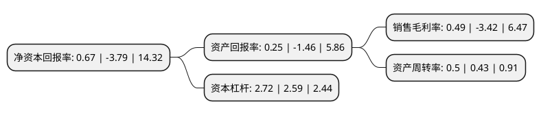

> 本页面由自动化程序生成于 2022年5月20日 01:24
> 内容可能存在错误，如有bug请提交issue至：https://github.com/Eroleice/doc-pi/issues
{.is-warning}

# 上市公司基本情况

## 基本资料

中青旅控股股份有限公司（以下简称“中青旅”）成立于1997年11月25日，北京市。于1997年12月03日在上交所主板上市。

中青旅注册资本72,384万元，主要业务:旅游服务业，科技产品销售及技术服务。以下是详细信息：

- 公司名称: 中青旅控股股份有限公司
- 股票代码: 600138.SH
- 所在地: 北京 - 北京市
- 成立日期: 1997年11月25日
- 注册资本: 72,384万元
- 法定代表人: 康国明
- 主营业务: 旅游服务业，科技产品销售及技术服务
- 公司官网: www.cyts.com
- 公司介绍: 公司主要从事旅游、高科技的投资；经营入境旅游、国内旅游、中国公民自费出境旅游业务；从事高科技产品开发和技术服务、旅游资源配套开发等业务。作为中国旅游行业的领先品牌和综合运营商，公司坚持以创新为发展的根本推动力，不断推进旅游价值链的整合与延伸，在观光旅游、度假旅游、会奖旅游、差旅管理、景区开发、酒店运营等领域具有卓越的竞争优势。中青旅旗下拥有中青旅会展、乌镇、山水酒店、遨游网、百变自由行等一系列国内知名旅游企业和产品品牌，在北京、上海、东京、温哥华、中国香港、广州、天津、南京、杭州、深圳等海内外多个核心城市设有分支机构。公司矢志成为一家具有卓越品牌形象、拥有领先市场份额、跨地域、跨产业链运营的国际化现代旅游集团。

## 股东及高管情况

上市公司第一大股东为中国青旅集团有限公司，持股124,305,000股，占比17.17%，**疑似为**上市公司实际控制人。

截至2022年03月31日，上市公司的前十大股东中，共有3名机构股东，6个产品账户，1个海外主体，其中5%以上大股东共有1名。上市公司前十大股东明细如下：

> 未能通过持股比例判定出上市公司实际控制人（持股30%以上）
> 可能存在通过间接持股、联合持股、协议控制等方式拥有实际控制权的主体，具体请参考上市公司定期公告！
{.is-warning}

> 截至2022年03月31日，上市公司前十大股东信息如下：

| 股东名称 | 持股数量（股） | 持股比例 |
| --- | --- | --- |
| 中国青旅集团有限公司 | 124,305,000 | 17.17% |
| 中青创益投资管理有限公司 | 20,475,000 | 2.83% |
| 中国工商银行股份有限公司-华安媒体互联网混合型证券投资基金 | 15,621,760 | 2.16% |
| 中国光大集团股份公司 | 14,416,306 | 1.99% |
| 中国工商银行股份有限公司-海富通改革驱动灵活配置混合型证券投资基金 | 10,275,500 | 1.42% |
| 中国建设银行股份有限公司-华安沪港深外延增长灵活配置混合型证券投资基金 | 9,030,545 | 1.25% |
| 香港中央结算有限公司(陆股通) | 7,677,322 | 1.06% |
| 平安安赢股票型养老金产品-中国银行股份有限公司 | 7,143,914 | 0.99% |
| 中国农业银行股份有限公司-中邮核心优选混合型证券投资基金 | 6,500,063 | 0.9% |
| 中国农业银行股份有限公司-华安智能生活混合型证券投资基金 | 6,428,264 | 0.89% |

## 利润表分析

上市公司2021年总收入为86.35亿元，净利润为0.42亿元，实现盈利。

## 杜邦分析

> 数据列示周期：2021年 | 2020年 | 2019年
{.is-info}

上市公司的净资产收益率在近一年有所下降，下降幅度为-117.68%，其变化情况分解如下：
- 上市公司的销售毛利率在近一年下降了-114.33%，可能是生产效率的下降、商品原材料价格上涨或商品价格的下跌所致。
- 上市公司的资产周转率在近一年上升了16.28%，可能是源自于更快的销售回款或库存管理效果提升。
- 上市公司的财务杠杆比率在近一年上升了5.02%，可能是增加负债扩大生产规模。

