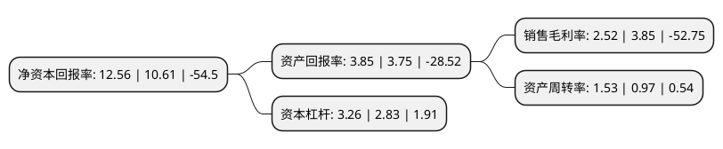

> 本页面由自动化程序生成于 2022年5月20日 01:26
> 内容可能存在错误，如有bug请提交issue至：https://github.com/Eroleice/doc-pi/issues
{.is-warning}

# 上市公司基本情况

## 基本资料

国旅联合股份有限公司（以下简称“国旅联合”）成立于1998年12月29日，南京市。于2000年09月22日在上交所主板上市。

国旅联合注册资本50,493.666万元，主要业务:运输业，旅游业，房地产业，彩票业。以下是详细信息：

- 公司名称: 国旅联合股份有限公司
- 股票代码: 600358.SH
- 所在地: 江苏 - 南京市
- 成立日期: 1998年12月29日
- 注册资本: 50,493.666万元
- 法定代表人: 曾少雄
- 主营业务: 运输业，旅游业，房地产业，彩票业
- 公司官网: www.cutc.com.cn
- 公司介绍: 公司以户外文体娱乐为战略发展方向，以体育产业为核心，以“体育+”作为发展引擎，在高科技智能化体育装备、体育特色小镇、运动健康主题公园、体育旅游大数据等领域进一步延伸拓展并深耕，驱动发展大健康产业业态。目前公司的主要业务包括：水上运动以及海洋休闲旅游的开发运营，体育、文娱产业的投资布局，围甲联赛、电竞等赛事的组织运营，青少年体育培训，体育器材、体育服装贸易等等。公司坚持“快中求稳、稳中突破”的发展策略，紧密围绕公司的战略目标，坚持内生式增长与外延式并购并重的经营思路，将战略发展落到实处。立争成为在国内具有强大竞争力，拥有高度专业化的集投资开发、经营服务为一体的全业务型知名企业。

## 股东及高管情况

上市公司第一大股东为江西省旅游集团股份有限公司，持股98,803,000股，占比19.57%，**疑似为**上市公司实际控制人。

截至2022年03月31日，上市公司的前十大股东中，共有2名自然人股东，8名机构股东，其中5%以上大股东共有2名。上市公司前十大股东明细如下：

> 未能通过持股比例判定出上市公司实际控制人（持股30%以上）
> 可能存在通过间接持股、联合持股、协议控制等方式拥有实际控制权的主体，具体请参考上市公司定期公告！
{.is-warning}

> 截至2022年03月31日，上市公司前十大股东信息如下：

| 股东名称 | 持股数量（股） | 持股比例 |
| --- | --- | --- |
| 江西省旅游集团股份有限公司 | 98,803,000 | 19.57% |
| 厦门当代旅游资源开发有限公司 | 57,936,660 | 11.47% |
| 南京江宁国有资产经营集团有限公司 | 23,880,388 | 4.73% |
| 北京金汇丰盈投资中心(有限合伙) | 15,000,000 | 2.97% |
| 杭州之江发展总公司 | 11,392,273 | 2.26% |
| 华宝信托有限责任公司-天高资本17号单一资金信托 | 8,581,187 | 1.7% |
| 华宝信托有限责任公司-天高资本16号单一资金信托 | 8,303,271 | 1.64% |
| 上海大世界(集团)公司 | 6,284,685 | 1.24% |
| 林柳林 | 3,900,000 | 0.77% |
| 祝虹 | 2,300,000 | 0.46% |

## 利润表分析

上市公司2021年总收入为8.23亿元，净利润为0.2亿元，实现盈利。

## 杜邦分析

> 数据列示周期：2021年 | 2020年 | 2019年
{.is-info}

上市公司的净资产收益率在近一年有所上升，上升幅度为18.38%，其变化情况分解如下：
- 上市公司的销售毛利率在近一年下降了-34.55%，可能是生产效率的下降、商品原材料价格上涨或商品价格的下跌所致。
- 上市公司的资产周转率在近一年上升了57.73%，可能是源自于更快的销售回款或库存管理效果提升。
- 上市公司的财务杠杆比率在近一年上升了15.19%，可能是增加负债扩大生产规模。

