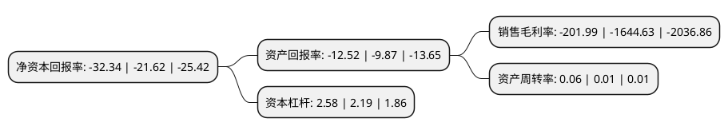

> 本页面由自动化程序生成于 2022年5月20日 01:27
> 内容可能存在错误，如有bug请提交issue至：https://github.com/Eroleice/doc-pi/issues
{.is-warning}

# 上市公司基本情况

## 基本资料

海航创新股份有限公司（以下简称“*ST海创”）成立于1999年01月14日，三亚市。于2001年03月28日在上交所主板上市。

*ST海创注册资本130,350万元，主营业务:主要投资于旅游行业以下是详细信息：

- 公司名称: 海航创新股份有限公司
- 股票代码: 600555.SH
- 所在地: 海南 - 三亚市
- 成立日期: 1999年01月14日
- 注册资本: 130,350万元
- 法定代表人: 廖虹宇
- 主营业务: 主营业务:主要投资于旅游行业
- 公司官网: www.ninedragon.com.cn\www.hnainnovation.com
- 公司介绍: 公司通过转型，逐步成为一家旅游地产企业。公司经营范围包括旅游投资(禁止外商投资的除外)及管理；旅游景点综合经营管理，酒店管理；游艇销售、展览；受所投资企业委托，为其提供投资经营决策，营销策划，会展、会务服务，企业管理咨询；商务信息咨询；体育活动组织策划；节能服务；软件开发，信息技术咨询服务。公司始终坚持用户至上，用心服务于客户，坚持用自己的服务去打动客户。公司秉承“保证一流质量，保持一级信誉”的经营理念，坚持“客户第一”的原则，为广大客户提供优质的服务。

## 股东及高管情况

上市公司第一大股东为海航旅游集团有限公司，持股180,065,443股，占比13.81%，**疑似为**上市公司实际控制人。

截至2022年03月31日，上市公司的前十大股东中，共有7名自然人股东，2名机构股东，1个海外主体，其中5%以上大股东共有3名。上市公司前十大股东明细如下：

> 未能通过持股比例判定出上市公司实际控制人（持股30%以上）
> 可能存在通过间接持股、联合持股、协议控制等方式拥有实际控制权的主体，具体请参考上市公司定期公告！
{.is-warning}

> 截至2022年03月31日，上市公司前十大股东信息如下：

| 股东名称 | 持股数量（股） | 持股比例 |
| --- | --- | --- |
| 海航旅游集团有限公司 | 180,065,443 | 13.81% |
| Ocean Garden Holdings LTD. | 109,209,525 | 8.38% |
| 海航旅业国际(香港)有限公司 | 93,355,175 | 7.16% |
| 俞雷 | 10,000,220 | 0.77% |
| 谢文贤 | 8,004,900 | 0.61% |
| 林滢 | 6,828,000 | 0.52% |
| 平建英 | 6,106,800 | 0.47% |
| 张丽 | 5,500,000 | 0.42% |
| 刘妙娥 | 5,238,900 | 0.4% |
| 徐奕龙 | 4,621,600 | 0.35% |

## 杜邦分析

> 数据列示周期：2021年 | 2020年 | 2019年
{.is-info}

上市公司的净资产收益率在近一年有所上升，上升幅度为49.58%，其变化情况分解如下：
- 上市公司的销售毛利率在近一年下降了-87.72%，可能是生产效率的下降、商品原材料价格上涨或商品价格的下跌所致。
- 上市公司的资产周转率在近一年上升了500%，可能是源自于更快的销售回款或库存管理效果提升。
- 上市公司的财务杠杆比率在近一年上升了17.81%，可能是增加负债扩大生产规模。

