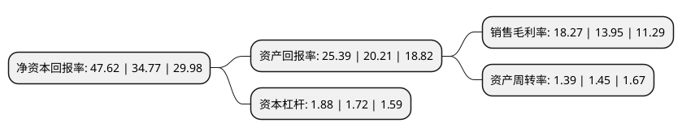

> 本页面由自动化程序生成于 2022年5月20日 01:31
> 内容可能存在错误，如有bug请提交issue至：https://github.com/Eroleice/doc-pi/issues
{.is-warning}

# 上市公司基本情况

## 基本资料

中国旅游集团中免股份有限公司（以下简称“中国中免”）成立于2008年03月28日，北京市。于2009年10月15日在上交所主板上市。

中国中免注册资本195,247.554万元，旅行社业务和免税业务。以下是详细信息：

- 公司名称: 中国旅游集团中免股份有限公司
- 股票代码: 601888.SH
- 所在地: 北京 - 北京市
- 成立日期: 2008年03月28日
- 注册资本: 195,247.554万元
- 法定代表人: 彭辉
- 主营业务: 旅行社业务和免税业务
- 公司官网: www.ctgdutyfree.com.cn
- 公司介绍: 公司所属行业为旅游业，目前主要从事旅行社业务和免税业务，其中旅行社业务主要包括入境游、出境游、国内游、会奖旅游、签证服务、商旅服务、航空服务、电子商务等业务；免税业务主要包括烟酒、香化等免税商品的批发、零售等业务。此外，公司还从事旅游综合项目开发业务，主要包括旅游综合项目投资开发、旅游景区景点投资开发和旅游股权投资等业务。公司下属全资子公司国旅总社、中免公司及国旅投资公司分别负责公司的旅行社业务、免税业务、旅游综合项目投资开发业务。

## 股东及高管情况

上市公司第一大股东为中国旅游集团有限公司，持股1,040,642,690股，占比53.3%，为上市公司实际控制人。

截至2022年03月31日，上市公司的前十大股东中，共有4名自然人股东，3名机构股东，2个产品账户，1个海外主体，其中5%以上大股东共有2名。上市公司前十大股东明细如下：

> 截至2022年03月31日，上市公司前十大股东信息如下：

| 股东名称 | 持股数量（股） | 持股比例 |
| --- | --- | --- |
| 中国旅游集团有限公司 | 1,040,642,690 | 53.3% |
| 香港中央结算有限公司(陆股通) | 190,948,499 | 9.78% |
| 中国证券金融股份有限公司 | 58,442,931 | 2.99% |
| 中国工商银行股份有限公司-景顺长城新兴成长混合型证券投资基金 | 20,790,821 | 1.06% |
| 潘斐莲 | 18,510,000 | 0.95% |
| 中国人寿保险股份有限公司-传统-普通保险产品-005L-CT001沪 | 14,367,983 | 0.74% |
| 陈发树 | 13,013,614 | 0.67% |
| 梁瑞安 | 12,435,252 | 0.64% |
| 中央汇金资产管理有限责任公司 | 11,848,153 | 0.61% |
| 戴穗如 | 9,700,000 | 0.5% |

## 利润表分析

上市公司2021年总收入为676.75亿元，净利润为123.64亿元，实现盈利。

## 杜邦分析

> 数据列示周期：2021年 | 2020年 | 2019年
{.is-info}

上市公司的净资产收益率在近一年有所上升，上升幅度为36.96%，其变化情况分解如下：
- 上市公司的销售毛利率在近一年上升了30.97%，可能是生产效率的提升、商品原材料价格下跌或商品价格的上涨所致。
- 上市公司的资产周转率在近一年下降了-4.14%，可能是源自于更慢的销售回款或库存管理效果下降。
- 上市公司的财务杠杆比率在近一年上升了9.3%，可能是增加负债扩大生产规模。

