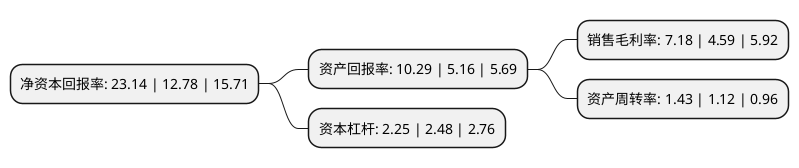

> 本页面由自动化程序生成于 2022年5月20日 01:10
> 内容可能存在错误，如有bug请提交issue至：https://github.com/Eroleice/doc-pi/issues
{.is-warning}

# 上市公司基本情况

## 基本资料

赞宇科技集团股份有限公司（以下简称“赞宇科技”）成立于2000年09月19日，杭州市。于2011年11月25日在深交所中小板上市。

赞宇科技注册资本47,040.1万元，主营业务为主要从事日化表面活性剂系列产品的研究开发和生产经营，以及相关的技术转让，技术服务，检测业务及进出口业务。主要产品是以AES，6501，MES等为代表的天然油脂基表面活性剂(6501属于烷醇酰胺类)及AOS为代表的石油基表面活性剂。以下是详细信息：

- 公司名称: 赞宇科技集团股份有限公司
- 股票代码: 002637.SZ
- 所在地: 浙江 - 杭州市
- 成立日期: 2000年09月19日
- 注册资本: 47,040.1万元
- 法定代表人: 方银军
- 主营业务: 主营业务为主要从事日化表面活性剂系列产品的研究开发和生产经营，以及相关的技术转让，技术服务，检测业务及进出口业务主要产品是以AES，6501，MES等为代表的天然油脂基表面活性剂(6501属于烷醇酰胺类)及AOS为代表的石油基表面活性剂
- 公司官网: www.zanyu.com
- 公司介绍: 公司是专业从事日用化工、表面活性剂等领域研发和生产的高新技术企业，国内研究和生产表面活性剂的龙头企业之一。主营业务为表面活性剂系列产品的研究开发和生产经营，以及相关的技术转让、技术服务、检测业务及进出口业务。公司设有“浙江省表面活性剂重点实验室”和省级企业技术中心，承担国家、省部级研究项目数十余项，获国家发明专利、国家新产品和部省级科技进步奖等多个奖项。公司先后通过ISO9001质量保证体系认证，GB/T24001:2004环境管理体系、GB/T28001-2001职业健康管理体系认证。连续多年获“AAA级信用企业”、“A级纳税信誉单位”等荣誉。

## 股东及高管情况

上市公司第一大股东为河南正商企业发展集团有限责任公司，持股87,277,800股，占比18.55%，**疑似为**上市公司实际控制人。

截至2022年03月31日，上市公司的前十大股东中，共有5名自然人股东，2名机构股东，3个产品账户，其中5%以上大股东共有2名。上市公司前十大股东明细如下：

> 未能通过持股比例判定出上市公司实际控制人（持股30%以上）
> 可能存在通过间接持股、联合持股、协议控制等方式拥有实际控制权的主体，具体请参考上市公司定期公告！
{.is-warning}

> 截至2022年03月31日，上市公司前十大股东信息如下：

| 股东名称 | 持股数量（股） | 持股比例 |
| --- | --- | --- |
| 河南正商企业发展集团有限责任公司 | 87,277,800 | 18.55% |
| 杭州永银投资合伙企业(有限合伙) | 70,000,000 | 14.88% |
| 方银军 | 23,301,840 | 4.95% |
| 洪树鹏 | 7,558,600 | 1.61% |
| 陆伟娟 | 6,936,442 | 1.47% |
| 泰康人寿保险有限责任公司-传统-普通保险产品-019L-CT001深 | 6,802,802 | 1.45% |
| 邹欢金 | 5,830,272 | 1.24% |
| 许荣年 | 5,291,992 | 1.12% |
| 中国工商银行股份有限公司-广发瑞誉一年持有期混合型证券投资基金 | 4,913,881 | 1.04% |
| 上海迎水投资管理有限公司-迎水合力3号私募证券投资基金 | 4,407,600 | 0.94% |

## 利润表分析

上市公司2021年总收入为112.01亿元，净利润为8.04亿元，实现盈利。

## 杜邦分析

> 数据列示周期：2021年 | 2020年 | 2019年
{.is-info}

上市公司的净资产收益率在近一年有所上升，上升幅度为81.06%，其变化情况分解如下：
- 上市公司的销售毛利率在近一年上升了56.43%，可能是生产效率的提升、商品原材料价格下跌或商品价格的上涨所致。
- 上市公司的资产周转率在近一年上升了27.68%，可能是源自于更快的销售回款或库存管理效果提升。
- 上市公司的财务杠杆比率在近一年下降了-9.27%，可能是减少负债降低财务费用。

