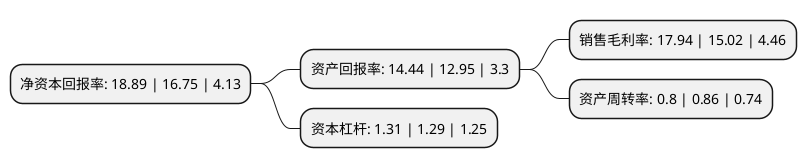

> 本页面由自动化程序生成于 2022年5月20日 01:13
> 内容可能存在错误，如有bug请提交issue至：https://github.com/Eroleice/doc-pi/issues
{.is-warning}

# 上市公司基本情况

## 基本资料

名臣健康用品股份有限公司（以下简称“名臣健康”）成立于1994年12月14日，汕头市。于2017年12月18日在深交所中小板上市。

名臣健康注册资本12,213.575万元，主营业务:主要从事健康护理用品的研发，生产与销售，产品涵盖洗发水，护发素，沐浴露，啫喱水，护肤品等。以下是详细信息：

- 公司名称: 名臣健康用品股份有限公司
- 股票代码: 002919.SZ
- 所在地: 广东 - 汕头市
- 成立日期: 1994年12月14日
- 注册资本: 12,213.575万元
- 法定代表人: 陈建名
- 主营业务: 主营业务:主要从事健康护理用品的研发，生产与销售，产品涵盖洗发水，护发素，沐浴露，啫喱水，护肤品等
- 公司官网: www.mingchen.com.cn
- 公司介绍: 公司是一家研发、生产、销售个人健康护理用品的高新技术企业。公司始终坚持走品牌发展道路，坚持走技术创新、追求卓越品质的道路，坚持走规范管理、可持续发展的道路，以人为本、持续改革、完善管理、不断提升企业经营管理水平，推动企业持续、稳步、健康发展，取得了良好的经营效益和社会效益。目前，名臣已跻身国内个人健康护理用品行业的前列，并缔造了企业持续的竞争优势，呈现广阔的市场发展空间和美好前景。

## 股东及高管情况

上市公司第一大股东为陈勤发，持股45,193,500股，占比37%，为上市公司实际控制人。

截至2022年04月28日，上市公司的前十大股东中，共有7名自然人股东，1名机构股东，2个产品账户，其中5%以上大股东共有2名。上市公司前十大股东明细如下：

> 截至2022年04月28日，上市公司前十大股东信息如下：

| 股东名称 | 持股数量（股） | 持股比例 |
| --- | --- | --- |
| 陈勤发 | 45,193,500 | 37% |
| 刘晓伟 | 15,064,500 | 12.33% |
| 汕头市锦煌投资有限公司 | 5,495,745 | 4.5% |
| 许绍壁 | 5,200,000 | 4.26% |
| 周国金 | 1,729,000 | 1.42% |
| 冯波 | 1,700,000 | 1.39% |
| 曹岳琴 | 1,308,100 | 1.07% |
| 上海烜鼎资产管理有限公司-烜鼎星宿4号私募证券投资基金 | 1,299,200 | 1.06% |
| 彭小青 | 1,227,500 | 1.01% |
| 上海古曲投资管理有限公司-古曲泉盈六号私募证券投资基金 | 1,015,200 | 0.83% |

## 利润表分析

上市公司2021年总收入为7.44亿元，净利润为1.33亿元，实现盈利。

## 杜邦分析

> 数据列示周期：2021年 | 2020年 | 2019年
{.is-info}

上市公司的净资产收益率在近一年有所上升，上升幅度为12.78%，其变化情况分解如下：
- 上市公司的销售毛利率在近一年上升了19.44%，可能是生产效率的提升、商品原材料价格下跌或商品价格的上涨所致。
- 上市公司的资产周转率在近一年下降了-6.98%，可能是源自于更慢的销售回款或库存管理效果下降。
- 上市公司的财务杠杆比率在近一年上升了1.55%，可能是增加负债扩大生产规模。

