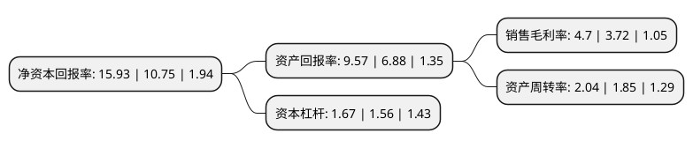

> 本页面由自动化程序生成于 2022年5月20日 01:20
> 内容可能存在错误，如有bug请提交issue至：https://github.com/Eroleice/doc-pi/issues
{.is-warning}

# 上市公司基本情况

## 基本资料

水羊集团股份有限公司（以下简称“水羊股份”）成立于2012年11月01日，长沙市。于2018年02月08日在深交所创业板上市。

水羊股份注册资本41,106.048万元，主营业务:主要从事面膜等护肤品的研发，生产与销售，产品包括面膜类，水乳膏霜类等，其中以面膜类为主。以下是详细信息：

- 公司名称: 水羊集团股份有限公司
- 股票代码: 300740.SZ
- 所在地: 湖南 - 长沙市
- 成立日期: 2012年11月01日
- 注册资本: 41,106.048万元
- 法定代表人: 戴跃锋
- 主营业务: 主营业务:主要从事面膜等护肤品的研发，生产与销售，产品包括面膜类，水乳膏霜类等，其中以面膜类为主
- 公司官网: www.yujiahui.com/www.syounggroup.com
- 公司介绍: 公司是一家依托互联网创立，并逐步发展起来，以自主品牌为核心的“互联网+美妆”企业。公司是中国A股首家IPO电商上市公司，旗下拥有御泥坊、小迷糊、薇风、花瑶花等多个自主护肤品牌。公司自主研发的多个护肤品配方技术及产品外观设计，近两年获得国家专利33项；同时公司开发的多个电商系统获得国家软件著作权。御家汇与天猫、淘宝网、唯品会、京东、云集、聚美优品、苏宁易购、蘑菇街、小红书等国内外多家主流网上商城建立了深度合作关系，并入驻了屈臣氏、沃尔玛等线下渠道。公司是中国面膜行业标准《QB/T2872-2017》和《中国国家标准(卸妆油类)》的起草与制定单位之一，国际化妆品化学家协会学会联盟(IFSCC)全球首家面膜企业金牌会员,中国国家商务部认定的电子商务示范企业。

## 股东及高管情况

上市公司第一大股东为湖南御家投资管理有限公司，持股95,904,214股，占比23.3%，**疑似为**上市公司实际控制人。

截至2022年03月31日，上市公司的前十大股东中，共有3名自然人股东，4名机构股东，2个产品账户，1个海外主体，其中5%以上大股东共有3名。上市公司前十大股东明细如下：

> 未能通过持股比例判定出上市公司实际控制人（持股30%以上）
> 可能存在通过间接持股、联合持股、协议控制等方式拥有实际控制权的主体，具体请参考上市公司定期公告！
{.is-warning}

> 截至2022年03月31日，上市公司前十大股东信息如下：

| 股东名称 | 持股数量（股） | 持股比例 |
| --- | --- | --- |
| 湖南御家投资管理有限公司 | 95,904,214 | 23.3% |
| 长沙汀汀企业管理咨询合伙企业(有限合伙) | 44,523,000 | 10.82% |
| 戴跃锋 | 38,586,611 | 9.37% |
| 长沙御投投资管理合伙企业(有限合伙) | 16,991,115 | 4.13% |
| 刘海浪 | 5,051,454 | 1.23% |
| 香港中央结算有限公司(陆股通) | 4,837,897 | 1.18% |
| 长沙御投叁号企业管理咨询合伙企业(有限合伙) | 3,387,715 | 0.82% |
| 恒识投资管理(上海)有限公司-恒识辰瀚1期私募证券投资基金 | 2,930,000 | 0.71% |
| 前海股权投资基金(有限合伙) | 2,848,800 | 0.69% |
| 戴开波 | 2,633,347 | 0.64% |

## 利润表分析

上市公司2021年总收入为50.1亿元，净利润为2.35亿元，实现盈利。

## 杜邦分析

> 数据列示周期：2021年 | 2020年 | 2019年
{.is-info}

上市公司的净资产收益率在近一年有所上升，上升幅度为48.19%，其变化情况分解如下：
- 上市公司的销售毛利率在近一年上升了26.34%，可能是生产效率的提升、商品原材料价格下跌或商品价格的上涨所致。
- 上市公司的资产周转率在近一年上升了10.27%，可能是源自于更快的销售回款或库存管理效果提升。
- 上市公司的财务杠杆比率在近一年上升了7.05%，可能是增加负债扩大生产规模。

