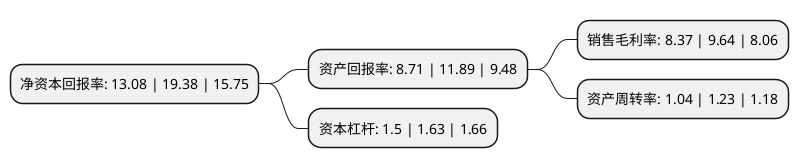

> 本页面由自动化程序生成于 2022年5月20日 01:21
> 内容可能存在错误，如有bug请提交issue至：https://github.com/Eroleice/doc-pi/issues
{.is-warning}

# 上市公司基本情况

## 基本资料

嘉亨家化股份有限公司（以下简称“嘉亨家化”）成立于2005年07月15日，泉州市。于2021年03月24日在深交所创业板上市。

嘉亨家化注册资本10,080万元，主要从事日化产品OEM/ODM及塑料包装容器的研发设计，生产，具备化妆品和家庭护理产品的研发，配制，灌装及塑料包装容器设计，制造的一体化综合服务能力。以下是详细信息：

- 公司名称: 嘉亨家化股份有限公司
- 股票代码: 300955.SZ
- 所在地: 福建 - 泉州市
- 成立日期: 2005年07月15日
- 注册资本: 10,080万元
- 法定代表人: 曾本生
- 主营业务: 主要从事日化产品OEM/ODM及塑料包装容器的研发设计，生产，具备化妆品和家庭护理产品的研发，配制，灌装及塑料包装容器设计，制造的一体化综合服务能力
- 公司官网: www.jahenjh.com
- 公司介绍: 公司主要从事日化产品OEM/ODM及塑料包装容器的研发设计、生产，具备化妆品和家庭护理产品的研发、配制、灌装及塑料包装容器设计、制造的一体化综合服务能力。公司以日化产品OEM/ODM与塑料包装业务协同发展为策略，可为国内外知名日化企业提供日化产品及配套塑料包装的一站式服务。公司的主要产品包括护肤类、洗护类、香水等化妆品，香皂、消毒液、洗手液、洗洁精等家庭护理产品，以及配套的塑料包装容器。公司以稳定高效的生产能力、严格的质量管控、快速迭代的技术研发，在行业内形成了较强的市场影响力，成为多个国内外知名日化品牌的核心供应商。公司始终把技术研发作为发展的原动力，是行业内少数兼具日化产品及塑料包装研发、设计能力的企业。公司系高新技术企业，福建省知识产权优势企业、福建省科技型企业及福建省科技小巨人企业，拥有“福建省日化塑料包装容器企业工程技术研究中心”和“福建省工业设计中心”等研发创新平台，系中国包装联合会常务理事单位。

## 股东及高管情况

上市公司第一大股东为曾本生，持股55,938,212股，占比55.49%，为上市公司实际控制人。

截至2022年03月31日，上市公司的前十大股东中，共有2名自然人股东，8名机构股东，其中5%以上大股东共有1名。上市公司前十大股东明细如下：

> 截至2022年03月31日，上市公司前十大股东信息如下：

| 股东名称 | 持股数量（股） | 持股比例 |
| --- | --- | --- |
| 曾本生 | 55,938,212 | 55.49% |
| 上海辉盈投资合伙企业(有限合伙) | 4,515,619 | 4.48% |
| 福建汇鑫至成股权投资合伙企业(有限合伙) | 2,975,435 | 2.95% |
| 福建汇水至成股权投资合伙企业(有限合伙) | 2,306,101 | 2.29% |
| 泉州市华扬宗兴股权投资合伙企业(有限合伙) | 2,127,555 | 2.11% |
| 泉州市中和股权投资合伙企业(有限合伙) | 1,881,509 | 1.87% |
| 福建汇火至成股权投资合伙企业(有限合伙) | 1,505,209 | 1.49% |
| 泉州嘉禾常兴股权投资合伙企业(有限合伙) | 1,227,434 | 1.22% |
| 宋燕 | 852,251 | 0.85% |
| 泉州宝荣商务咨询中心(有限合伙) | 796,021 | 0.79% |

## 利润表分析

上市公司2021年总收入为11.61亿元，净利润为0.97亿元，实现盈利。

## 杜邦分析

> 数据列示周期：2021年 | 2020年 | 2019年
{.is-info}

上市公司的净资产收益率在近一年有所下降，下降幅度为-32.51%，其变化情况分解如下：
- 上市公司的销售毛利率在近一年下降了-13.17%，可能是生产效率的下降、商品原材料价格上涨或商品价格的下跌所致。
- 上市公司的资产周转率在近一年下降了-15.45%，可能是源自于更慢的销售回款或库存管理效果下降。
- 上市公司的财务杠杆比率在近一年下降了-7.98%，可能是减少负债降低财务费用。

