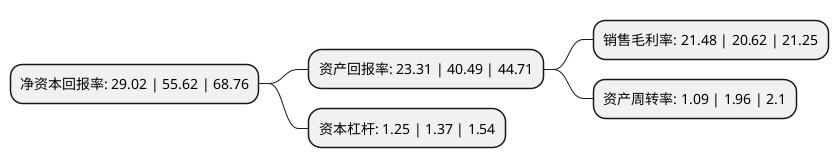

> 本页面由自动化程序生成于 2022年5月20日 01:21
> 内容可能存在错误，如有bug请提交issue至：https://github.com/Eroleice/doc-pi/issues
{.is-warning}

# 上市公司基本情况

## 基本资料

云南贝泰妮生物科技集团股份有限公司（以下简称“贝泰妮”）成立于2010年05月13日，昆明市。于2021年03月25日在深交所创业板上市。

贝泰妮注册资本42,360万元，专注于应用纯天然的植物活性成分提供温和，专业的皮肤护理产品，公司产品主要包括霜，护肤水，面膜，精华，乳液等护肤品类产品及隔离霜，BB霜，卸妆水等彩妆类产品。以下是详细信息：

- 公司名称: 云南贝泰妮生物科技集团股份有限公司
- 股票代码: 300957.SZ
- 所在地: 云南 - 昆明市
- 成立日期: 2010年05月13日
- 注册资本: 42,360万元
- 法定代表人: 郭振宇
- 主营业务: 专注于应用纯天然的植物活性成分提供温和，专业的皮肤护理产品，公司产品主要包括霜，护肤水，面膜，精华，乳液等护肤品类产品及隔离霜，BB霜，卸妆水等彩妆类产品
- 公司官网: www.botanee.com.cn
- 公司介绍: 公司是以“薇诺娜”品牌为核心，专注于应用纯天然的植物活性成分提供温和、专业的皮肤护理产品，重点针对敏感性肌肤，在产品销售渠道上与互联网深度融合的专业化妆品生产企业。公司以“打造中国皮肤健康生态”为使命，深入洞察消费者需求，以皮肤学理论为基础，结合生物学、植物学等多学科技术，持续进行产品研发和技术创新，不断向消费者提供符合不同皮肤特性需求的专业型化妆品。公司坚持走产品专业化路线，随着收入规模的扩大和实力的提升，公司已成为全国领先的化妆品生产企业之一，并树立了针对敏感性肌肤产品的行业标杆。2019年，公司旗下“薇诺娜”品牌被行业权威杂志《化妆品报》评为“敏感肌护理品类第1名”；根据Euromonitor的统计数据，公司旗下“薇诺娜”品牌在2019年度国内皮肤学级护肤品市场排名第1。同时，公司在护肤品细分市场领域中表现出色，根据Euromonitor的统计数据，2019年度，公司爽肤水(护肤水)产品市场排名第12，其中本土企业排名第2；面膜产品市场排名第16，其中本土企业排名第7。

## 股东及高管情况

上市公司第一大股东为昆明诺娜科技有限公司，持股195,212,611股，占比46.08%，为上市公司实际控制人。

截至2022年05月18日，上市公司的前十大股东中，共有10名机构股东，其中5%以上大股东共有10名。上市公司前十大股东明细如下：

> 截至2022年05月18日，上市公司前十大股东信息如下：

| 股东名称 | 持股数量（股） | 持股比例 |
| --- | --- | --- |
| 昆明诺娜科技有限公司 | 195,212,611 | 46.08% |
| 昆明诺娜科技有限公司 | 195,212,611 | 46.08% |
| 天津红杉聚业股权投资合伙企业(有限合伙) | 79,665,257 | 18.8067% |
| 天津红杉聚业股权投资合伙企业(有限合伙) | 79,665,257 | 18.8067% |
| 昆明臻丽咨询有限公司 | 37,330,934 | 8.81% |
| 昆明臻丽咨询有限公司 | 37,330,934 | 8.81% |
| 昆明臻丽咨询有限公司 | 37,330,934 | 8.81% |
| 昆明重楼投资合伙企业(有限合伙) | 25,047,520 | 5.91% |
| 昆明重楼投资合伙企业(有限合伙) | 25,047,520 | 5.91% |
| 厦门重楼投资合伙企业(有限合伙) | 22,454,920 | 5.301% |

## 利润表分析

上市公司2021年总收入为40.22亿元，净利润为8.64亿元，实现盈利。

## 杜邦分析

> 数据列示周期：2021年 | 2020年 | 2019年
{.is-info}

上市公司的净资产收益率在近一年有所下降，下降幅度为-47.82%，其变化情况分解如下：
- 上市公司的销售毛利率在近一年上升了4.17%，可能是生产效率的提升、商品原材料价格下跌或商品价格的上涨所致。
- 上市公司的资产周转率在近一年下降了-44.39%，可能是源自于更慢的销售回款或库存管理效果下降。
- 上市公司的财务杠杆比率在近一年下降了-8.76%，可能是减少负债降低财务费用。

