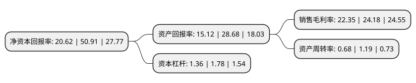

> 本页面由自动化程序生成于 2022年5月20日 01:22
> 内容可能存在错误，如有bug请提交issue至：https://github.com/Eroleice/doc-pi/issues
{.is-warning}

# 上市公司基本情况

## 基本资料

铜陵洁雅生物科技股份有限公司（以下简称“洁雅股份”）成立于1999年08月31日，铜陵市。于2021年12月03日在深交所创业板上市。

洁雅股份注册资本8,120.982万元，专注于湿巾类产品研发，生产与销售，湿巾产品涵盖婴儿系列，成人功能型系列，抗菌消毒系列，家庭清洁系列，医用护理系列和宠物清洁系列等六大系列60多个品种。以下是详细信息：

- 公司名称: 铜陵洁雅生物科技股份有限公司
- 股票代码: 301108.SZ
- 所在地: 安徽 - 铜陵市
- 成立日期: 1999年08月31日
- 注册资本: 8,120.982万元
- 法定代表人: 蔡英传
- 主营业务: 专注于湿巾类产品研发，生产与销售，湿巾产品涵盖婴儿系列，成人功能型系列，抗菌消毒系列，家庭清洁系列，医用护理系列和宠物清洁系列等六大系列60多个品种
- 公司官网: www.babywipes.com.cn
- 公司介绍: 发行人是一家专注于湿巾类产品研发、生产与销售的专业制造商。经过二十多年的发展，公司在湿巾产品的研发和生产等方面拥有深厚的技术积累和行业经验。公司湿巾产品涵盖婴儿系列、成人功能型系列、抗菌消毒系列、家庭清洁系列、医用护理系列和宠物清洁系列等六大系列60多个品种。公司主要采取ODM/OEM的模式为Woolworths、金佰利集团、强生公司、欧莱雅集团、3M、贝亲等世界知名企业生产湿巾类产品。同时，为满足客户需求，公司亦生产部分面膜类产品。司在高端湿巾领域深耕多年，凭借深厚的研发实力，丰富的湿巾产品生产经验以及优质的全球客户资源，逐步成长为国内领先的湿巾类产品专业制造商。本招股说明书签署日，公司拥有4项发明专利、17项实用新型专利和2项外观设计专利。公司参与制定了中华人民共和国国家标准——《湿巾GB/T27728-2011》，并参与了该标准的后续修订。公司为国家高新技术企业，技术研发中心被认定为“省认定企业技术中心”、“安徽省清洁消毒用品工程技术研究中心”。

## 股东及高管情况

上市公司第一大股东为蔡英传，持股42,946,052股，占比52.88%，为上市公司实际控制人。

截至2022年03月31日，上市公司的前十大股东中，共有8名自然人股东，1名机构股东，1个产品账户，其中5%以上大股东共有2名。上市公司前十大股东明细如下：

> 截至2022年03月31日，上市公司前十大股东信息如下：

| 股东名称 | 持股数量（股） | 持股比例 |
| --- | --- | --- |
| 蔡英传 | 42,946,052 | 52.88% |
| 铜陵明源创业投资管理有限公司-铜陵明源循环经济产业创业投资基金中心(有限合伙) | 8,360,000 | 10.29% |
| 冯燕 | 2,164,030 | 2.66% |
| 蔡曙光 | 1,860,746 | 2.29% |
| 苏州工业园区中亿明源创业投资管理有限公司-苏州工业园区中亿明源创业投资中心(有限合伙) | 1,204,926 | 1.48% |
| 章秋萍 | 1,000,000 | 1.23% |
| 邱飞翔 | 611,517 | 0.75% |
| 徐玉林 | 438,720 | 0.54% |
| 程元光 | 398,956 | 0.49% |
| 汪五兴 | 398,956 | 0.49% |

## 利润表分析

上市公司2021年总收入为9.84亿元，净利润为2.2亿元，实现盈利。

## 杜邦分析

> 数据列示周期：2021年 | 2020年 | 2019年
{.is-info}

上市公司的净资产收益率在近一年有所下降，下降幅度为-59.5%，其变化情况分解如下：
- 上市公司的销售毛利率在近一年下降了-7.57%，可能是生产效率的下降、商品原材料价格上涨或商品价格的下跌所致。
- 上市公司的资产周转率在近一年下降了-42.86%，可能是源自于更慢的销售回款或库存管理效果下降。
- 上市公司的财务杠杆比率在近一年下降了-23.6%，可能是减少负债降低财务费用。

