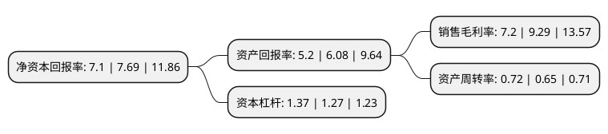

> 本页面由自动化程序生成于 2022年5月20日 01:32
> 内容可能存在错误，如有bug请提交issue至：https://github.com/Eroleice/doc-pi/issues
{.is-warning}

# 上市公司基本情况

## 基本资料

倍加洁集团股份有限公司（以下简称“倍加洁”）成立于1997年01月08日，扬州市。于2018年03月02日在上交所主板上市。

倍加洁注册资本10,000万元，主要业务:口腔清洁护理用品以及一次性卫生用品的研发，生产和销售。以下是详细信息：

- 公司名称: 倍加洁集团股份有限公司
- 股票代码: 603059.SH
- 所在地: 江苏 - 扬州市
- 成立日期: 1997年01月08日
- 注册资本: 10,000万元
- 法定代表人: 张文生
- 主营业务: 口腔清洁护理用品以及一次性卫生用品的研发，生产和销售
- 公司官网: www.toothbrush.com.cn
- 公司介绍: 公司位于江苏省扬州市杭集工业园，成立于1997年，公司主要从事口腔清洁护理用品以及一次性卫生用品的研发、生产和销售，其中口腔清洁护理用品主要包括牙刷、牙线、齿间刷、牙线签、假牙清洁片等产品，一次性卫生用品主要包括湿巾等产品。经过多年发展，公司形成了以ODM为主兼顾自主品牌、国内和国外市场并重的业务格局，并从单一牙刷产品转变为涵盖牙刷、牙线、齿间刷、牙线签、假牙清洁片等口腔清洁护理用品和湿巾等一次性卫生用品的产品布局，已成为国内口腔清洁护理用品以及一次性卫生用品生产规模及出口规模领先的企业。公司先后参与行业内多项国家标准的制定，恒生模具作为高新技术企业，在牙刷模具领域取得多项高新技术产品认证，还建立起了经CNAS认证的研发检测中心，在口腔清洁护理用品和一次性卫生用品行业中均占有重要地位。公司拥有的“倍加洁”商标已连续十多年被评为江苏省著名商标。

## 股东及高管情况

上市公司第一大股东为张文生，持股63,000,000股，占比63%，为上市公司实际控制人。

截至2022年03月31日，上市公司的前十大股东中，共有8名自然人股东，2名机构股东，其中5%以上大股东共有2名。上市公司前十大股东明细如下：

> 截至2022年03月31日，上市公司前十大股东信息如下：

| 股东名称 | 持股数量（股） | 持股比例 |
| --- | --- | --- |
| 张文生 | 63,000,000 | 63% |
| 扬州竟成企业管理咨询合伙企业(有限合伙) | 7,500,000 | 7.5% |
| 扬州和成企业管理咨询合伙企业(有限合伙) | 4,500,000 | 4.5% |
| 陈丙胜 | 820,800 | 0.82% |
| 阮瑞娟 | 364,800 | 0.36% |
| 李然 | 336,000 | 0.34% |
| 姚懿媚 | 243,500 | 0.24% |
| 毛念安 | 212,125 | 0.21% |
| 王京梅 | 210,000 | 0.21% |
| 王论春 | 210,000 | 0.21% |

## 利润表分析

上市公司2021年总收入为10.38亿元，净利润为0.74亿元，实现盈利。

## 杜邦分析

> 数据列示周期：2021年 | 2020年 | 2019年
{.is-info}

上市公司的净资产收益率在近一年有所下降，下降幅度为-7.67%，其变化情况分解如下：
- 上市公司的销售毛利率在近一年下降了-22.5%，可能是生产效率的下降、商品原材料价格上涨或商品价格的下跌所致。
- 上市公司的资产周转率在近一年上升了10.77%，可能是源自于更快的销售回款或库存管理效果提升。
- 上市公司的财务杠杆比率在近一年上升了7.87%，可能是增加负债扩大生产规模。

