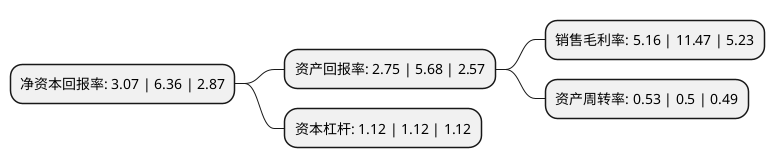

> 本页面由自动化程序生成于 2022年5月20日 01:34
> 内容可能存在错误，如有bug请提交issue至：https://github.com/Eroleice/doc-pi/issues
{.is-warning}

# 上市公司基本情况

## 基本资料

拉芳家化股份有限公司（以下简称“拉芳家化”）成立于2001年12月14日，汕头市。于2017年03月13日在上交所主板上市。

拉芳家化注册资本22,653.55万元，公司主要从事日用化学产品的研发，生产与销售业务，主要产品包括洗发水，护发素，沐浴露，香皂，膏霜等洗护产品。以下是详细信息：

- 公司名称: 拉芳家化股份有限公司
- 股票代码: 603630.SH
- 所在地: 广东 - 汕头市
- 成立日期: 2001年12月14日
- 注册资本: 22,653.55万元
- 法定代表人: 吴桂谦
- 主营业务: 公司主要从事日用化学产品的研发，生产与销售业务，主要产品包括洗发水，护发素，沐浴露，香皂，膏霜等洗护产品
- 公司官网: www.laf.cn
- 公司介绍: 公司成立以来，始终坚持诚信、品质、分享的经营理念，致力为广大消费者提供优质的日化用品和服务，现已跻身国内个人护理用品行业的前列。旗下拥有“拉芳”、“美多丝”、“雨洁”、“圣峰”等众多知名品牌，产品涵盖洗发护发、清洁沐浴、肌肤护理、口腔护理等多个领域，并且在各自的领域内取得了一座座丰碑。公司目前已建成集科研、生产、办公、生活为一体的工业园区，并率先在行业内参考采用GMP生产环境标准。高标准的生产环境、设备和工艺确保旗下各品牌产品“拉芳出品、优质保证”。公司立足个人护理用品领域，实施多品牌发展策略，以科技为依托，以创新为动力，以卓越品质筑造强势品牌。“拉芳”品牌荣获了中国驰名商标、中国消费者喜爱的商标，“缤纯”荣获广东省名牌产品、广东省著名商标。

## 股东及高管情况

上市公司第一大股东为吴桂谦，持股69,503,831股，占比30.68%，为上市公司实际控制人。

截至2022年03月31日，上市公司的前十大股东中，共有8名自然人股东，2名机构股东，其中5%以上大股东共有3名。上市公司前十大股东明细如下：

> 截至2022年03月31日，上市公司前十大股东信息如下：

| 股东名称 | 持股数量（股） | 持股比例 |
| --- | --- | --- |
| 吴桂谦 | 69,503,831 | 30.68% |
| 澳洲萬達國際有限公司 | 47,938,527 | 21.16% |
| 吴滨华 | 20,545,083 | 9.07% |
| 深圳市盛浩开源投资企业(有限合伙) | 4,035,821 | 1.78% |
| 王昵兴 | 2,543,430 | 1.12% |
| 李嘉言 | 1,961,361 | 0.87% |
| 王如法 | 1,313,000 | 0.58% |
| 陈丽娟 | 1,090,300 | 0.48% |
| 徐雪英 | 1,090,000 | 0.48% |
| 胡琦蔚 | 1,060,000 | 0.47% |

## 利润表分析

上市公司2021年总收入为11.01亿元，净利润为0.56亿元，实现盈利。

## 杜邦分析

> 数据列示周期：2021年 | 2020年 | 2019年
{.is-info}

上市公司的净资产收益率在近一年有所下降，下降幅度为-51.73%，其变化情况分解如下：
- 上市公司的销售毛利率在近一年下降了-55.01%，可能是生产效率的下降、商品原材料价格上涨或商品价格的下跌所致。
- 上市公司的资产周转率在近一年上升了6%，可能是源自于更快的销售回款或库存管理效果提升。
- 上市公司的财务杠杆比率在近一年下降了0%，可能是减少负债降低财务费用。

