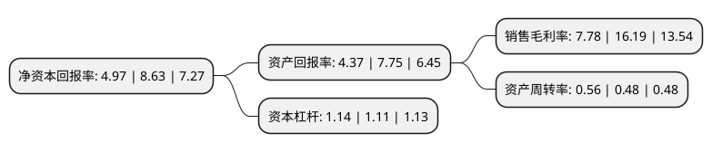

> 本页面由自动化程序生成于 2022年5月20日 01:02
> 内容可能存在错误，如有bug请提交issue至：https://github.com/Eroleice/doc-pi/issues
{.is-warning}

# 上市公司基本情况

## 基本资料

山东金岭矿业股份有限公司（以下简称“金岭矿业”）成立于1996年09月28日，淄博市。于1996年11月28日在深交所主板上市。

金岭矿业注册资本59,534.023万元，主营业务为铁矿石采选以下是详细信息：

- 公司名称: 山东金岭矿业股份有限公司
- 股票代码: 000655.SZ
- 所在地: 山东 - 淄博市
- 成立日期: 1996年09月28日
- 注册资本: 59,534.023万元
- 法定代表人: 戴汉强
- 主营业务: 主营业务为铁矿石采选
- 公司官网: www.sdjlky.com
- 公司介绍: 公司主营业务是铁矿石开采，铁精粉、铜精粉、钴精粉、球团矿的生产、销售及机械加工与销售。主要产品包括铁精粉、铜精粉、钴精粉、球团矿。全资子公司金钢矿业以铁矿石开采、生产、销售为主，全资子公司金召矿业以铁矿石开采、销售、对外工程施工为主，控股子公司金岭球团以生产、销售球团矿为主。公司先后获得“全国五一劳动奖状”、“全国钢铁工业先进集体”、“国际质量信用AAAA等级企业”等荣誉称号。

## 股东及高管情况

上市公司第一大股东为山东金岭铁矿有限公司，持股347,740,145股，占比58.41%，为上市公司实际控制人。

截至2022年03月31日，上市公司的前十大股东中，共有8名自然人股东，2名机构股东，其中5%以上大股东共有1名。上市公司前十大股东明细如下：

> 截至2022年03月31日，上市公司前十大股东信息如下：

| 股东名称 | 持股数量（股） | 持股比例 |
| --- | --- | --- |
| 山东金岭铁矿有限公司 | 347,740,145 | 58.41% |
| 淄博市城市资产运营有限公司 | 6,530,000 | 1.1% |
| 王艳珍 | 6,350,000 | 1.07% |
| 张玉明 | 5,010,000 | 0.84% |
| 刘镜林 | 4,894,200 | 0.82% |
| 吴聪勇 | 1,963,539 | 0.33% |
| 秦涛 | 1,900,800 | 0.32% |
| 吴吉林 | 1,500,000 | 0.25% |
| 罗晓晖 | 1,374,900 | 0.23% |
| 吴炎 | 1,356,100 | 0.23% |

## 利润表分析

上市公司2021年总收入为18.22亿元，净利润为1.41亿元，实现盈利。

## 杜邦分析

> 数据列示周期：2021年 | 2020年 | 2019年
{.is-info}

上市公司的净资产收益率在近一年有所下降，下降幅度为-42.41%，其变化情况分解如下：
- 上市公司的销售毛利率在近一年下降了-51.95%，可能是生产效率的下降、商品原材料价格上涨或商品价格的下跌所致。
- 上市公司的资产周转率在近一年上升了16.67%，可能是源自于更快的销售回款或库存管理效果提升。
- 上市公司的财务杠杆比率在近一年上升了2.7%，可能是增加负债扩大生产规模。

