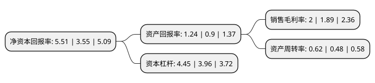

> 本页面由自动化程序生成于 2022年5月20日 01:03
> 内容可能存在错误，如有bug请提交issue至：https://github.com/Eroleice/doc-pi/issues
{.is-warning}

# 上市公司基本情况

## 基本资料

河钢股份有限公司（以下简称“河钢股份”）成立于1997年01月18日，石家庄市。于1997年04月16日在深交所主板上市。

河钢股份注册资本1,061,860.785万元，主要产品:板材，棒材，线材，型材四大类。主要业务:黑色金属冶炼，钢材轧制，金属制品。以下是详细信息：

- 公司名称: 河钢股份有限公司
- 股票代码: 000709.SZ
- 所在地: 河北 - 石家庄市
- 成立日期: 1997年01月18日
- 注册资本: 1,061,860.785万元
- 法定代表人: 王兰玉
- 主营业务: 主要产品:板材，棒材，线材，型材四大类黑色金属冶炼，钢材轧制，金属制品
- 公司官网: www.hebgtgf.com
- 公司介绍: 公司是国内最大钢铁上市公司之一，拥有国际先进水平的工艺技术装备，具备进口钢材国产化、高端产品升级换代的强大基础,在钒钛钢铁冶炼和钒产品生产技术方面处于世界领先地位。公司钢铁产品分为板材、棒材、线材、型材四大类，产品覆盖汽车、石油、铁路、桥梁、建筑、电力、交通、轻工、家电等重要应用领域。冷轧薄板、高强螺纹钢筋、管线钢等品牌产品在国内外享有盛誉，获得了世界汽车供应商质量管理体系认证，汽车板、家电板、管线钢、核电用钢及高强抗震建材打入国内外高端市场。产品中标北京城市副中心、北京新机场、红沿河及石岛湾核电站、港珠澳大桥、“华龙一号”核电、亚投行总部、雄安新区市民行政中心等国家级重点项目。公司始终坚持“为人类文明制造绿色钢铁”的环保理念，被誉为“世界最清洁钢厂”，被国家工信部树为钢厂与城市协调发展的典范。“逆流活性炭烧结烟气净化装置关键技术的研究与应用”和“宽厚板绿色制造关键技术及装备”两项科技成果经中国金属学会专业认定达到国际领先水平。

## 股东及高管情况

上市公司第一大股东为邯郸钢铁集团有限责任公司，持股4,218,763,010股，占比39.73%，为上市公司实际控制人。

截至2022年03月31日，上市公司的前十大股东中，共有3名自然人股东，5名机构股东，1个产品账户，1个海外主体，其中5%以上大股东共有2名。上市公司前十大股东明细如下：

> 截至2022年03月31日，上市公司前十大股东信息如下：

| 股东名称 | 持股数量（股） | 持股比例 |
| --- | --- | --- |
| 邯郸钢铁集团有限责任公司 | 4,218,763,010 | 39.73% |
| 唐山钢铁集团有限责任公司 | 1,853,409,753 | 17.45% |
| 承德钢铁集团有限公司 | 432,063,701 | 4.07% |
| 香港中央结算有限公司(陆股通) | 326,122,522 | 3.07% |
| 中国证券金融股份有限公司 | 230,034,501 | 2.17% |
| 河北钢铁集团矿业有限公司 | 91,970,260 | 0.87% |
| 廖强 | 65,373,568 | 0.62% |
| 郭晓全 | 24,789,900 | 0.23% |
| 中国农业银行股份有限公司-中证500交易型开放式指数证券投资基金 | 20,204,900 | 0.19% |
| 关文海 | 19,300,000 | 0.18% |

## 利润表分析

上市公司2021年总收入为1,496.26亿元，净利润为29.99亿元，实现盈利。

## 杜邦分析

> 数据列示周期：2021年 | 2020年 | 2019年
{.is-info}

上市公司的净资产收益率在近一年有所上升，上升幅度为55.21%，其变化情况分解如下：
- 上市公司的销售毛利率在近一年上升了5.82%，可能是生产效率的提升、商品原材料价格下跌或商品价格的上涨所致。
- 上市公司的资产周转率在近一年上升了29.17%，可能是源自于更快的销售回款或库存管理效果提升。
- 上市公司的财务杠杆比率在近一年上升了12.37%，可能是增加负债扩大生产规模。

