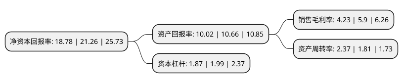

> 本页面由自动化程序生成于 2022年5月20日 01:03
> 内容可能存在错误，如有bug请提交issue至：https://github.com/Eroleice/doc-pi/issues
{.is-warning}

# 上市公司基本情况

## 基本资料

广东韶钢松山股份有限公司（以下简称“韶钢松山”）成立于1997年04月29日，韶关市。于1997年05月08日在深交所主板上市。

韶钢松山注册资本241,952.441万元，主要产品:板材，线材，棒材三大系列。主要业务:黑色金属冶炼加工，金属制品，焦炭及煤化工产品的生产，销售等。以下是详细信息：

- 公司名称: 广东韶钢松山股份有限公司
- 股票代码: 000717.SZ
- 所在地: 广东 - 韶关市
- 成立日期: 1997年04月29日
- 注册资本: 241,952.441万元
- 法定代表人: 解旗
- 主营业务: 主要产品:板材，线材，棒材三大系列黑色金属冶炼加工，金属制品，焦炭及煤化工产品的生产，销售等
- 公司官网: www.sgss.com.cn
- 公司介绍: 公司是广东省最大钢铁生产企业之一，也是全国率先将循环经济导入公司发展战略的企业。公司属于钢铁行业，主营黑色金属冶炼加工，金属制品、焦炭及煤化工产品的生产、销售等，主导产品为板材、线材、棒材三大系列。船体用结构钢板通过了多国船级社工厂认可；桥梁用结构、低合金高强度结构钢、钢板首批通过中国船级社产品认证。公司立足广东市场，辐射华南市场，定位于为华南地区经济社会发展提供配套材料，充分利用在广东省拥有的独特市场优势，由于产品质量好、服务佳、运输快捷，在华南地区有较强的竞争能力。

## 股东及高管情况

上市公司第一大股东为宝武集团中南钢铁有限公司，持股1,283,512,890股，占比52.96%，为上市公司实际控制人。

截至2022年03月31日，上市公司的前十大股东中，共有5名自然人股东，1名机构股东，3个产品账户，1个海外主体，其中5%以上大股东共有2名。上市公司前十大股东明细如下：

> 截至2022年03月31日，上市公司前十大股东信息如下：

| 股东名称 | 持股数量（股） | 持股比例 |
| --- | --- | --- |
| 宝武集团中南钢铁有限公司 | 1,283,512,890 | 52.96% |
| 香港中央结算有限公司(陆股通) | 147,488,676 | 6.09% |
| 柴长茂 | 27,483,800 | 1.13% |
| 银华基金管理股份有限公司-社保基金1105组合 | 19,246,620 | 0.79% |
| 罗献中 | 9,326,700 | 0.38% |
| 谢光权 | 9,000,100 | 0.37% |
| 朱锡源 | 8,653,629 | 0.36% |
| 陈金波 | 8,100,000 | 0.33% |
| 中国农业银行股份有限公司-中证500交易型开放式指数证券投资基金 | 6,450,100 | 0.27% |
| 银华基金-国新投资有限公司-银华基金-国新6号(QDII)单一资产管理计划 | 6,200,700 | 0.26% |

## 利润表分析

上市公司2021年总收入为454.82亿元，净利润为19.22亿元，实现盈利。

## 杜邦分析

> 数据列示周期：2021年 | 2020年 | 2019年
{.is-info}

上市公司的净资产收益率在近一年有所下降，下降幅度为-11.67%，其变化情况分解如下：
- 上市公司的销售毛利率在近一年下降了-28.31%，可能是生产效率的下降、商品原材料价格上涨或商品价格的下跌所致。
- 上市公司的资产周转率在近一年上升了30.94%，可能是源自于更快的销售回款或库存管理效果提升。
- 上市公司的财务杠杆比率在近一年下降了-6.03%，可能是减少负债降低财务费用。

