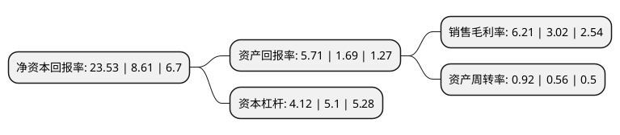

> 本页面由自动化程序生成于 2022年5月20日 01:04
> 内容可能存在错误，如有bug请提交issue至：https://github.com/Eroleice/doc-pi/issues
{.is-warning}

# 上市公司基本情况

## 基本资料

北京首钢股份有限公司（以下简称“首钢股份”）成立于1999年10月15日，北京市。于1999年12月16日在深交所主板上市。

首钢股份注册资本675,032.541万元，主要产品:钢材，钢坯。主要业务:钢铁冶炼，钢压延加工;烧结矿，焦炭，化工产品制造，销售;高炉余压发电及煤气生产，销售;工业生产废异物加工，销售;销售金属材料，焦炭，化工产品，机械电器设备，建筑材料;设备租赁(汽车除外);仓储服务;技术开发，技术咨询，技术转让，技术服务，技术培训;投资及投资管理。以下是详细信息：

- 公司名称: 北京首钢股份有限公司
- 股票代码: 000959.SZ
- 所在地: 北京 - 北京市
- 成立日期: 1999年10月15日
- 注册资本: 675,032.541万元
- 法定代表人: 赵民革
- 主营业务: 主要产品:钢材，钢坯钢铁冶炼，钢压延加工;烧结矿，焦炭，化工产品制造，销售;高炉余压发电及煤气生产，销售;工业生产废异物加工，销售;销售金属材料，焦炭，化工产品，机械电器设备，建筑材料;设备租赁(汽车除外);仓储服务;技术开发，技术咨询，技术转让，技术服务，技术培训;投资及投资管理
- 公司官网: www.sggf.com.cn
- 公司介绍: 公司是首钢集团所属的境内唯一上市公司，拥有国际一流装备和工艺水平，具有品种齐全、规格配套的冷热系全覆盖板材产品序列。其中，电工钢、汽车板、镀锡板、管线钢、家电板，以及其它高端板材产品处于国内领先地位。公司紧密跟踪客户需求，通过加强交货组织和质量管控，加快先期介入推进步伐，提高客户需求响应力度等措施，为客户提供优质产品和增值服务。全面构建循环经济体系，实现余热、余压、余气、固体废弃物循环利用；积极探索“碳交易”新方式，迁钢150MW CCPP成为国内钢铁行业首个自愿减排项目，是国内第一家“碳交易”钢铁企业。公司将继续坚持创新驱动和精品服务战略，建立健全产供销研用一体化运行协同体系，加快推进以汽车板、电工钢、镀锡板为重点的高端产品开发，持续优化品种结构，提升“制造加服务”核心竞争力，实现从产品制造商向综合服务商转变，全面提高企业盈利能力和资本运作能力，努力成为具有世界竞争力的优秀上市公司。

## 股东及高管情况

上市公司第一大股东为首钢集团有限公司，持股4,420,769,800股，占比56.9266%，为上市公司实际控制人。

截至2022年04月20日，上市公司的前十大股东中，共有1名自然人股东，6名机构股东，2个产品账户，1个海外主体，其中5%以上大股东共有6名。上市公司前十大股东明细如下：

> 截至2022年04月20日，上市公司前十大股东信息如下：

| 股东名称 | 持股数量（股） | 持股比例 |
| --- | --- | --- |
| 首钢集团有限公司 | 4,420,769,800 | 56.9266% |
| 中国宝武钢铁集团有限公司 | 793,408,440 | 10.2168% |
| 北京京投投资控股有限公司 | 740,940,679 | 9.5411% |
| 北京京投投资控股有限公司 | 740,940,679 | 10.98% |
| 北京京国瑞国企改革发展基金(有限合伙) | 493,958,306 | 6.3607% |
| 北京京国瑞国企改革发展基金(有限合伙) | 493,958,306 | 7.32% |
| 北京易诊科技发展有限公司 | 82,044,800 | 1.22% |
| 刘伟 | 60,400,000 | 0.89% |
| 山西焦煤集团财务有限责任公司 | 39,138,943 | 0.58% |
| 香港中央结算有限公司(陆股通) | 29,391,858 | 0.44% |

## 利润表分析

上市公司2021年总收入为1,340.34亿元，净利润为83.26亿元，实现盈利。

## 杜邦分析

> 数据列示周期：2021年 | 2020年 | 2019年
{.is-info}

上市公司的净资产收益率在近一年有所上升，上升幅度为173.29%，其变化情况分解如下：
- 上市公司的销售毛利率在近一年上升了105.63%，可能是生产效率的提升、商品原材料价格下跌或商品价格的上涨所致。
- 上市公司的资产周转率在近一年上升了64.29%，可能是源自于更快的销售回款或库存管理效果提升。
- 上市公司的财务杠杆比率在近一年下降了-19.22%，可能是减少负债降低财务费用。

