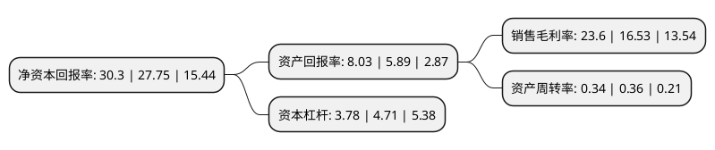

> 本页面由自动化程序生成于 2022年5月20日 01:05
> 内容可能存在错误，如有bug请提交issue至：https://github.com/Eroleice/doc-pi/issues
{.is-warning}

# 上市公司基本情况

## 基本资料

内蒙古大中矿业股份有限公司（以下简称“大中矿业”）成立于1999年10月29日，巴彦淖尔市。于2021年05月10日在深交所主板上市。

大中矿业注册资本150,800万元，铁矿石采选，铁精粉和球团生产销售，机制砂石的加工销售，主要产品为铁精粉和球团。以下是详细信息：

- 公司名称: 内蒙古大中矿业股份有限公司
- 股票代码: 001203.SZ
- 所在地: 内蒙古 - 巴彦淖尔市
- 成立日期: 1999年10月29日
- 注册资本: 150,800万元
- 法定代表人: 吴金涛
- 主营业务: 铁矿石采选，铁精粉和球团生产销售，机制砂石的加工销售，主要产品为铁精粉和球团
- 公司官网: www.dzky.cn
- 公司介绍: 公司所在行业为黑色金属采选行业，主要从事铁矿石采选、铁精粉销售以及球团加工销售。自1999年成立至今，公司一直专注于铁矿石采选业务，并致力于扩大资源占有量及采选规模。公司取得位于安徽省霍邱县的周油坊铁矿和重新集铁矿的矿业权后，控制的资源储量大幅增加，极大增强了公司的发展潜力。2013年公司工会被中华全国总工会授予为“全国模范职工之家”；公司子公司金日盛矿业2014年被六安市工商行政管理局授予为“文明诚信民营企业”。

## 股东及高管情况

上市公司第一大股东为众兴集团有限公司，持股729,524,400股，占比48.38%，为上市公司实际控制人。

截至2022年03月31日，上市公司的前十大股东中，共有3名自然人股东，7名机构股东，其中5%以上大股东共有3名。上市公司前十大股东明细如下：

> 截至2022年03月31日，上市公司前十大股东信息如下：

| 股东名称 | 持股数量（股） | 持股比例 |
| --- | --- | --- |
| 众兴集团有限公司 | 729,524,400 | 48.38% |
| 林来嵘 | 203,083,995 | 13.47% |
| 梁欣雨 | 127,906,000 | 8.48% |
| 杭州联创永源股权投资合伙企业(有限合伙) | 56,451,613 | 3.74% |
| 上海联创永沂创业投资中心(有限合伙) | 30,913,978 | 2.05% |
| 无锡同创创业投资企业(有限合伙) | 26,881,720 | 1.78% |
| 华芳集团有限公司 | 22,560,000 | 1.5% |
| 杭州联创永溢创业投资合伙企业(有限合伙) | 22,311,829 | 1.48% |
| 安素梅 | 18,890,600 | 1.25% |
| 新疆联创永津股权投资企业(有限合伙) | 13,440,860 | 0.89% |

## 利润表分析

上市公司2021年总收入为48.94亿元，净利润为16.24亿元，实现盈利。

## 杜邦分析

> 数据列示周期：2020年 | 2019年 | 2018年
{.is-info}

上市公司的净资产收益率在近一年有所上升，上升幅度为9.19%，其变化情况分解如下：
- 上市公司的销售毛利率在近一年上升了42.77%，可能是生产效率的提升、商品原材料价格下跌或商品价格的上涨所致。
- 上市公司的资产周转率在近一年下降了-5.56%，可能是源自于更慢的销售回款或库存管理效果下降。
- 上市公司的财务杠杆比率在近一年下降了-19.75%，可能是减少负债降低财务费用。

