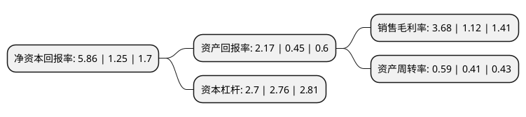

> 本页面由自动化程序生成于 2022年5月20日 01:23
> 内容可能存在错误，如有bug请提交issue至：https://github.com/Eroleice/doc-pi/issues
{.is-warning}

# 上市公司基本情况

## 基本资料

内蒙古包钢钢联股份有限公司（以下简称“包钢股份”）成立于1999年06月29日，包头市。于2001年03月09日在上交所主板上市。

包钢股份注册资本4,558,503.265万元，主要产品:矿产资源开发产品和钢铁产品。主要业务:矿产资源开发利用，钢铁产品的生产与销售。以下是详细信息：

- 公司名称: 内蒙古包钢钢联股份有限公司
- 股票代码: 600010.SH
- 所在地: 内蒙古 - 包头市
- 成立日期: 1999年06月29日
- 注册资本: 4,558,503.265万元
- 法定代表人: 刘振刚
- 主营业务: 主要产品:矿产资源开发产品和钢铁产品矿产资源开发利用，钢铁产品的生产与销售
- 公司官网: www.baoganggf.com
- 公司介绍: 公司是中国重要的钢铁工业基地、世界最大的稀土工业基地和内蒙古自治区工业龙头企业。公司主要从事矿产资源开发利用、钢铁产品的生产与销售。主要产品分为矿产资源开发产品和钢铁产品两类。矿产资源开发的产品主要有：铁精矿、稀土精矿、萤石精矿等；钢铁产品主要有：建筑钢材、冷热轧板卷、镀锌钢板、中厚板、无缝管、重轨、型钢等。产品主要用于基建、房地产、汽车、家电、风电、机械制造、高压锅炉、石油化工、基础设施建设及黑色金属、有色金属冶炼用矿产品等行业。公司已形成年产上千万吨铁、钢、材配套能力，总体装备水平达到国内外一流，形成“板、管、轨、线”四条精品线的生产格局。公司控股股东拥有世界著名的白云鄂博铁矿，所在地区煤炭、电力充足，在资源成本方面具有良好的比较优势。公司多次荣获“全国质量奖”、“全国实施卓越绩效模式先进企业特别奖”、“中国工业大奖提名奖”、“全国钢铁行业五四红旗团委标兵”等证书。

## 股东及高管情况

上市公司第一大股东为包头钢铁(集团)有限责任公司，持股25,082,792,537股，占比55.02%，为上市公司实际控制人。

截至2022年03月31日，上市公司的前十大股东中，共有4名机构股东，5个产品账户，1个海外主体，其中5%以上大股东共有1名。上市公司前十大股东明细如下：

> 截至2022年03月31日，上市公司前十大股东信息如下：

| 股东名称 | 持股数量（股） | 持股比例 |
| --- | --- | --- |
| 包头钢铁(集团)有限责任公司 | 25,082,792,537 | 55.02% |
| 香港中央结算有限公司(陆股通) | 920,937,859 | 2.02% |
| 中国证券金融股份有限公司 | 767,486,730 | 1.68% |
| 招商财富资产-光大银行-内蒙古华宸实业有限公司 | 267,564,888 | 0.59% |
| 中国北方稀土(集团)高科技股份有限公司 | 263,083,300 | 0.58% |
| 内蒙古包钢钢联股份有限公司回购专用证券账户 | 180,090,400 | 0.4% |
| 嘉实基金-农业银行-嘉实中证金融资产管理计划 | 167,831,580 | 0.37% |
| 大成基金-农业银行-大成中证金融资产管理计划 | 167,831,580 | 0.37% |
| 易方达基金-农业银行-易方达中证金融资产管理计划 | 167,831,580 | 0.37% |
| 博时基金-农业银行-博时中证金融资产管理计划 | 167,831,580 | 0.37% |

## 利润表分析

上市公司2021年总收入为861.83亿元，净利润为31.67亿元，实现盈利。

## 杜邦分析

> 数据列示周期：2021年 | 2020年 | 2019年
{.is-info}

上市公司的净资产收益率在近一年有所上升，上升幅度为368.8%，其变化情况分解如下：
- 上市公司的销售毛利率在近一年上升了228.57%，可能是生产效率的提升、商品原材料价格下跌或商品价格的上涨所致。
- 上市公司的资产周转率在近一年上升了43.9%，可能是源自于更快的销售回款或库存管理效果提升。
- 上市公司的财务杠杆比率在近一年下降了-2.17%，可能是减少负债降低财务费用。

