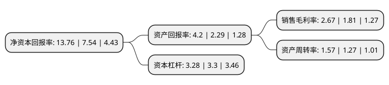

> 本页面由自动化程序生成于 2022年5月20日 01:23
> 内容可能存在错误，如有bug请提交issue至：https://github.com/Eroleice/doc-pi/issues
{.is-warning}

# 上市公司基本情况

## 基本资料

山东钢铁股份有限公司（以下简称“山东钢铁”）成立于2000年12月29日，济南市。于2004年06月29日在上交所主板上市。

山东钢铁注册资本1,094,654.962万元，主要产品:型钢，棒材，钢筋，热轧卷板，冷轧薄板，宽厚板等。以下是详细信息：

- 公司名称: 山东钢铁股份有限公司
- 股票代码: 600022.SH
- 所在地: 山东 - 济南市
- 成立日期: 2000年12月29日
- 注册资本: 1,094,654.962万元
- 法定代表人: 王向东
- 主营业务: 主要产品:型钢，棒材，钢筋，热轧卷板，冷轧薄板，宽厚板等
- 公司官网: www.sdsteel.cc
- 公司介绍: 公司是山东省大型的钢铁联合企业，拥有从焦化、原料、烧结、球团、炼铁、炼钢到轧钢完整的生产工艺系统，钢材品种主要有型钢、棒材、钢筋、板材等，是全国著名的H型钢生产基地。公司主要产品有型钢、棒材、钢筋、热轧卷板、冷轧薄板、宽厚板等，产品广泛应用于汽车、石油、铁路、桥梁、建筑、电力、交通、机械、造船、轻工、家电等多个重要领域，远销美、英、德、印、日、韩等几十个国家和地区。其中，20CrMnTiH齿轮钢产品获得中国钢铁工业协会冶金产品实物质量“金杯奖”、冶金行业“品质卓越产品”、“山东名牌产品”荣誉称号，螺纹钢荣获“国家免检产品”称号。公司目前拥有相对完善的工艺装备及配套设施，所有钢铁生产设施已全部通过了工业和信息化部钢铁企业规范准入审查，已列入符合国家《钢铁行业规范条件》钢铁企业名单，没有淘汰类设备。同时，公司加强技术创新和人才工作，钢铁主业拥有国家认定企业技术中心、省级技术中心以及省级工程技术研究中心、国家级质检中心、博士后科研工作站、省院士工作站。

## 股东及高管情况

上市公司第一大股东为山东钢铁集团有限公司，持股3,572,533,950股，占比32.64%，为上市公司实际控制人。

截至2022年03月31日，上市公司的前十大股东中，共有4名自然人股东，3名机构股东，2个产品账户，1名其他股东，其中5%以上大股东共有2名。上市公司前十大股东明细如下：

> 截至2022年03月31日，上市公司前十大股东信息如下：

| 股东名称 | 持股数量（股） | 持股比例 |
| --- | --- | --- |
| 山东钢铁集团有限公司 | 3,572,533,950 | 32.64% |
| 莱芜钢铁集团有限公司 | 1,996,785,424 | 18.24% |
| 山东省财金投资集团有限公司 | 138,710,445 | 1.27% |
| 方威 | 38,882,074 | 0.36% |
| 卢林丙 | 31,167,288 | 0.28% |
| 中国农业银行股份有限公司-中证500交易型开放式指数证券投资基金 | 26,966,915 | 0.25% |
| 方哲 | 26,000,000 | 0.24% |
| 法国兴业银行 | 23,467,025 | 0.21% |
| 卢木溪 | 22,215,900 | 0.2% |
| 招商银行股份有限公司-国泰中证钢铁交易型开放式指数证券投资基金 | 22,034,718 | 0.2% |

## 利润表分析

上市公司2021年总收入为1,108.5亿元，净利润为29.61亿元，实现盈利。

## 杜邦分析

> 数据列示周期：2021年 | 2020年 | 2019年
{.is-info}

上市公司的净资产收益率在近一年有所上升，上升幅度为82.49%，其变化情况分解如下：
- 上市公司的销售毛利率在近一年上升了47.51%，可能是生产效率的提升、商品原材料价格下跌或商品价格的上涨所致。
- 上市公司的资产周转率在近一年上升了23.62%，可能是源自于更快的销售回款或库存管理效果提升。
- 上市公司的财务杠杆比率在近一年下降了-0.61%，可能是减少负债降低财务费用。

