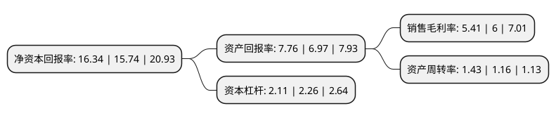

> 本页面由自动化程序生成于 2022年5月20日 01:25
> 内容可能存在错误，如有bug请提交issue至：https://github.com/Eroleice/doc-pi/issues
{.is-warning}

# 上市公司基本情况

## 基本资料

南京钢铁股份有限公司（以下简称“南钢股份”）成立于1999年03月18日，南京市。于2000年09月19日在上交所主板上市。

南钢股份注册资本615,891.601万元，主要产品:宽中厚板(卷)，棒材，线材，带钢，型钢等。主要业务:精品中厚板，优特钢长材的生产，销售及加工配送，同时从事能源环保，信息科技，电子商务，物流等业务。以下是详细信息：

- 公司名称: 南京钢铁股份有限公司
- 股票代码: 600282.SH
- 所在地: 江苏 - 南京市
- 成立日期: 1999年03月18日
- 注册资本: 615,891.601万元
- 法定代表人: 黄一新
- 主营业务: 主要产品:宽中厚板(卷)，棒材，线材，带钢，型钢等精品中厚板，优特钢长材的生产，销售及加工配送，同时从事能源环保，信息科技，电子商务，物流等业务
- 公司官网: www.600282.net
- 公司介绍: 公司是科创驱动、具有产业深度的高新技术企业。公司钢铁业务包括精品中厚板、优特钢长材的生产、销售及加工配送，同时从事能源环保、信息科技、电子商务、物流等业务。依托深度的产业运营，通过持续的科创驱动，公司形成“高效率生产、低成本智造”精品优特钢体系，持续完善并提升企业竞争力。公司拥有南京和宿迁两个钢铁产品生产基地，从铁矿石采选、炼焦、烧结、球团、炼铁、炼钢(含精炼)到轧钢(含热处理)的生产工艺流程完备。公司钢材产品包括宽中厚板(卷)、棒材、线材、带钢、型钢五大类，以精品中厚板和优特钢长材为主导产品，广泛用于工程机械、船舶海工、能源化工、建筑桥梁、汽车、交通运输等行业，为客户提供系列化、个性化的解决方案。公司通过了ISO14001环境管理体系认证，已成为“全国冶金行业节能减排示范基地”、全国钢铁行业第一家“国家循环经济标准化试点单位”和国内钢铁行业第一个实施清洁发展机制项目的企业。

## 股东及高管情况

上市公司第一大股东为南京南钢钢铁联合有限公司，持股3,521,724,593股，占比57.1496%，为上市公司实际控制人。

截至2022年04月26日，上市公司的前十大股东中，共有2名自然人股东，4名机构股东，2个产品账户，2个海外主体，其中5%以上大股东共有3名。上市公司前十大股东明细如下：

> 截至2022年04月26日，上市公司前十大股东信息如下：

| 股东名称 | 持股数量（股） | 持股比例 |
| --- | --- | --- |
| 南京南钢钢铁联合有限公司 | 3,521,724,593 | 57.1496% |
| 南京南钢钢铁联合有限公司 | 3,518,854,193 | 57.1% |
| 香港中央结算有限公司(陆股通) | 321,295,909 | 5.2139% |
| 香港中央结算有限公司(陆股通) | 225,005,049 | 3.65% |
| 华融瑞通股权投资管理有限公司 | 124,760,000 | 2.02% |
| 南京钢铁联合有限公司 | 121,167,491 | 1.97% |
| 基本养老保险基金一零零三组合 | 56,319,766 | 0.91% |
| 李强 | 35,909,900 | 0.58% |
| 熊立武 | 34,526,958 | 0.56% |
| 中信证券股份有限公司-社保基金1106组合 | 31,053,500 | 0.5% |

## 利润表分析

上市公司2021年总收入为756.74亿元，净利润为40.95亿元，实现盈利。

## 杜邦分析

> 数据列示周期：2021年 | 2020年 | 2019年
{.is-info}

上市公司的净资产收益率在近一年有所上升，上升幅度为3.81%，其变化情况分解如下：
- 上市公司的销售毛利率在近一年下降了-9.83%，可能是生产效率的下降、商品原材料价格上涨或商品价格的下跌所致。
- 上市公司的资产周转率在近一年上升了23.28%，可能是源自于更快的销售回款或库存管理效果提升。
- 上市公司的财务杠杆比率在近一年下降了-6.64%，可能是减少负债降低财务费用。

