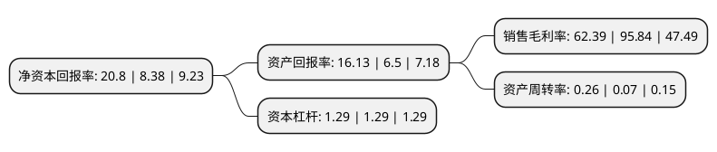

> 本页面由自动化程序生成于 2022年5月20日 01:26
> 内容可能存在错误，如有bug请提交issue至：https://github.com/Eroleice/doc-pi/issues
{.is-warning}

# 上市公司基本情况

## 基本资料

广东明珠集团股份有限公司（以下简称“*ST广珠”）成立于1994年04月21日，梅州市。于2001年01月18日在上交所主板上市。

*ST广珠注册资本78,893.382万元，主要业务:参与PPP模式项目合作，致力于土地一级开发;参与共同合作投资房地产开发项目;经营贸易业务;参与实业投资，如参股，控股实业;对公司现有物业对外出租等。以下是详细信息：

- 公司名称: 广东明珠集团股份有限公司
- 股票代码: 600382.SH
- 所在地: 广东 - 梅州市
- 成立日期: 1994年04月21日
- 注册资本: 78,893.382万元
- 法定代表人: 黄丙娣
- 主营业务: 参与PPP模式项目合作，致力于土地一级开发;参与共同合作投资房地产开发项目;经营贸易业务;参与实业投资，如参股，控股实业;对公司现有物业对外出租等
- 公司官网: www.gdmzh.com
- 公司介绍: 公司从事的主要业务为大宗商品贸易；参与实业投资，如参股、控股实业，对实业实施委托贷款业务；参与PPP模式项目合作，致力于土地一级开发建设；出租物业，对公司现有物业实施对外出租等业务。公司近年来主要深耕于投资领域，发展价值投资，积累了丰富的投资管理经验，构建了结构简单、低成本的业务模式，有利于公司资本发展多元化经营，达到进、退灵敏，易于挖掘新的利润增长点。公司通过集中资源、资金优势参与实体企业的投资扩展，积极参与国家倡导的城镇化建设，行业发展前景广阔。

## 股东及高管情况

上市公司第一大股东为深圳市金信安投资有限公司，持股204,194,341股，占比25.88%，**疑似为**上市公司实际控制人。

截至2022年03月31日，上市公司的前十大股东中，共有7名自然人股东，3名机构股东，其中5%以上大股东共有3名。上市公司前十大股东明细如下：

> 未能通过持股比例判定出上市公司实际控制人（持股30%以上）
> 可能存在通过间接持股、联合持股、协议控制等方式拥有实际控制权的主体，具体请参考上市公司定期公告！
{.is-warning}

> 截至2022年03月31日，上市公司前十大股东信息如下：

| 股东名称 | 持股数量（股） | 持股比例 |
| --- | --- | --- |
| 深圳市金信安投资有限公司 | 204,194,341 | 25.88% |
| 兴宁市金顺安投资有限公司 | 107,717,420 | 13.65% |
| 兴宁市众益福投资有限公司 | 57,419,608 | 7.28% |
| 黄启联 | 5,344,824 | 0.68% |
| 罗永鸿 | 4,605,459 | 0.58% |
| 王辉 | 3,766,392 | 0.48% |
| 张利红 | 3,623,044 | 0.46% |
| 刘文晖 | 3,000,092 | 0.38% |
| 景宝泉 | 3,000,071 | 0.38% |
| 朱晓明 | 2,429,789 | 0.31% |

## 杜邦分析

> 数据列示周期：2021年 | 2020年 | 2019年
{.is-info}

上市公司的净资产收益率在近一年有所上升，上升幅度为148.21%，其变化情况分解如下：
- 上市公司的销售毛利率在近一年下降了-34.9%，可能是生产效率的下降、商品原材料价格上涨或商品价格的下跌所致。
- 上市公司的资产周转率在近一年上升了271.43%，可能是源自于更快的销售回款或库存管理效果提升。
- 上市公司的财务杠杆比率在近一年下降了0%，可能是减少负债降低财务费用。

