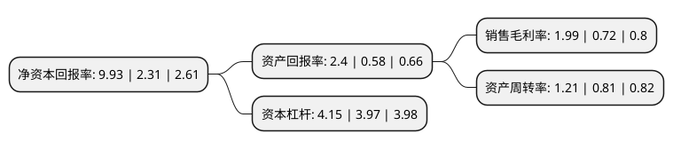

> 本页面由自动化程序生成于 2022年5月20日 01:27
> 内容可能存在错误，如有bug请提交issue至：https://github.com/Eroleice/doc-pi/issues
{.is-warning}

# 上市公司基本情况

## 基本资料

安阳钢铁股份有限公司（以下简称“安阳钢铁”）成立于1996年12月23日，安阳市。于2001年08月20日在上交所主板上市。

安阳钢铁注册资本287,242.139万元，主要产品:中厚板，热轧卷板，高速线材，建材，型材等。以下是详细信息：

- 公司名称: 安阳钢铁股份有限公司
- 股票代码: 600569.SH
- 所在地: 河南 - 安阳市
- 成立日期: 1996年12月23日
- 注册资本: 287,242.139万元
- 法定代表人: 李利剑
- 主营业务: 主要产品:中厚板，热轧卷板，高速线材，建材，型材等
- 公司官网: www.aysteel.com.cn
- 公司介绍: 公司是集炼焦、烧结、冶炼、轧材及科研开发为一体的大型钢铁联合企业，可生产的钢材品种有中厚板、热轧卷板、高速线材、建材、型材等。公司原燃材料采购由采购处、煤炭处和进出口分公司等部门负责。采购方式主要有公开招标、邀请招标等。公司生产管理由生产管理处负责。根据公司产能和市场需求状况制定年度生产经营计划。按照产线效益高低和生产资源的变化，适时调整各产线生产计划，优化资源配置。公司不断深入推进产品创新、质量创优、品牌创建、体系建设、转型升级等工作，坚持市场导向、用户带动和创新引领，抓好需求对接，着力提高供给质量，满足用户需求。公司坚持强化产品创新、品牌创建，以技术创新和科技进步为驱动力，着力提升公司持续发展的能力和水平，日益增强了公司的核心竞争力和影响力。上市以来，公司先后被评为“上市公司50强”，“中国纳税百强企业，”，“上证180指数、”，“上证50指数”，“上证50红利指数”，“沪深300指数”，“巨潮100指数”。

## 股东及高管情况

上市公司第一大股东为安阳钢铁集团有限责任公司，持股1,343,824,209股，占比46.78%，为上市公司实际控制人。

截至2022年03月31日，上市公司的前十大股东中，共有4名自然人股东，5名机构股东，1个产品账户，其中5%以上大股东共有4名。上市公司前十大股东明细如下：

> 截至2022年03月31日，上市公司前十大股东信息如下：

| 股东名称 | 持股数量（股） | 持股比例 |
| --- | --- | --- |
| 安阳钢铁集团有限责任公司 | 1,343,824,209 | 46.78% |
| 安阳钢铁集团有限责任公司 | 1,343,824,209 | 46.78% |
| 河南机械装备投资集团有限责任公司 | 574,484,277 | 20% |
| 河南机械装备投资集团有限责任公司 | 574,484,277 | 20% |
| 华泰证券股份有限公司 | 11,979,066 | 0.42% |
| 胡建军 | 9,083,422 | 0.32% |
| 王志良 | 7,002,200 | 0.24% |
| 龚礼明 | 5,750,000 | 0.2% |
| 朱玉芬 | 5,578,489 | 0.19% |
| 河南伊洛投资管理有限公司-伊洛15号私募证券投资基金 | 4,823,900 | 0.17% |

## 杜邦分析

> 数据列示周期：2021年 | 2020年 | 2019年
{.is-info}

上市公司的净资产收益率在近一年有所上升，上升幅度为329.87%，其变化情况分解如下：
- 上市公司的销售毛利率在近一年上升了176.39%，可能是生产效率的提升、商品原材料价格下跌或商品价格的上涨所致。
- 上市公司的资产周转率在近一年上升了49.38%，可能是源自于更快的销售回款或库存管理效果提升。
- 上市公司的财务杠杆比率在近一年上升了4.53%，可能是增加负债扩大生产规模。

