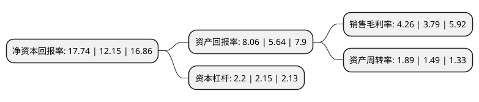

> 本页面由自动化程序生成于 2022年5月20日 01:29
> 内容可能存在错误，如有bug请提交issue至：https://github.com/Eroleice/doc-pi/issues
{.is-warning}

# 上市公司基本情况

## 基本资料

新余钢铁股份有限公司（以下简称“新钢股份”）成立于2003年10月10日，新余市。于1996年12月25日在上交所主板上市。

新钢股份注册资本318,872.27万元，主要产品:中厚板，热轧卷板，冷轧卷板，线棒材，钢绞线等钢材产品。以下是详细信息：

- 公司名称: 新余钢铁股份有限公司
- 股票代码: 600782.SH
- 所在地: 江西 - 新余市
- 成立日期: 2003年10月10日
- 注册资本: 318,872.27万元
- 法定代表人: 刘建荣
- 主营业务: 主要产品:中厚板，热轧卷板，冷轧卷板，线棒材，钢绞线等钢材产品
- 公司官网: www.xinsteel.com.cn
- 公司介绍: 公司是集矿石采选、钢铁冶炼、钢材轧制等于一体，拥有冷热轧薄板、中板、厚板、特厚板、金属制品、化工制品等产品系列的省属国有大型钢铁联合企业。公司专业生产高质量的中厚板、热轧卷板、冷轧卷板、线棒材、钢绞线等钢材产品，产品被广泛应用于机械制造、造船、石油化工、能源交通、汽车、家电、电力等行业领域。公司拥有一批具有自主知识产权的钢铁生产核心技术，整体装备技术达到国内领先水平，部分装备、工艺技术处于国际先进水平，产品品种规格齐全，产品市场竞争力较强。公司作为国内著名的线缆制造企业之一，连续多年荣获全国外商投资双优企业、江西省“优秀企业”等称号；产品也多次荣获“出口名优产品”、“江西省名牌产品”等称号。

## 股东及高管情况

上市公司第一大股东为新余钢铁集团有限公司，持股1,217,098,232股，占比38.17%，为上市公司实际控制人。

截至2022年04月15日，上市公司的前十大股东中，共有3名机构股东，4个产品账户，3个海外主体，其中5%以上大股东共有4名。上市公司前十大股东明细如下：

> 截至2022年04月15日，上市公司前十大股东信息如下：

| 股东名称 | 持股数量（股） | 持股比例 |
| --- | --- | --- |
| 新余钢铁集团有限公司 | 1,217,098,232 | 38.17% |
| 新余钢铁集团有限公司 | 1,217,098,232 | 38.17% |
| 新钢集团-华泰联合证券-19新钢EB担保及信托财产专户 | 211,701,268 | 6.64% |
| 香港中央结算有限公司(陆股通) | 205,874,559 | 6.46% |
| 香港中央结算有限公司(陆股通) | 152,275,907 | 4.78% |
| 全国社保基金四零三组合 | 28,119,100 | 0.88% |
| 中国建设银行股份有限公司-华安聚优精选混合型证券投资基金 | 22,372,300 | 0.7% |
| 中国银行股份有限公司-华安优势企业混合型证券投资基金 | 20,096,327 | 0.63% |
| 前海人寿保险股份有限公司-分红保险产品华泰组合 | 18,589,100 | 0.58% |
| 华泰证券股份有限公司 | 17,116,201 | 0.54% |

## 利润表分析

上市公司2021年总收入为1,049.12亿元，净利润为44.7亿元，实现盈利。

## 杜邦分析

> 数据列示周期：2021年 | 2020年 | 2019年
{.is-info}

上市公司的净资产收益率在近一年有所上升，上升幅度为46.01%，其变化情况分解如下：
- 上市公司的销售毛利率在近一年上升了12.4%，可能是生产效率的提升、商品原材料价格下跌或商品价格的上涨所致。
- 上市公司的资产周转率在近一年上升了26.85%，可能是源自于更快的销售回款或库存管理效果提升。
- 上市公司的财务杠杆比率在近一年上升了2.33%，可能是增加负债扩大生产规模。

