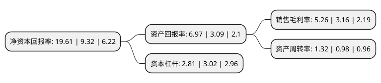

> 本页面由自动化程序生成于 2022年5月20日 01:29
> 内容可能存在错误，如有bug请提交issue至：https://github.com/Eroleice/doc-pi/issues
{.is-warning}

# 上市公司基本情况

## 基本资料

马鞍山钢铁股份有限公司（以下简称“马钢股份”）成立于1993年09月01日，马鞍山市。于1994年01月06日在上交所主板上市。

马钢股份注册资本770,068.119万元，主营业务:钢铁产品的生产和销售。主要产品:钢材，大致可分为板材，长材和轮轴三大类。以下是详细信息：

- 公司名称: 马鞍山钢铁股份有限公司
- 股票代码: 600808.SH
- 所在地: 安徽 - 马鞍山市
- 成立日期: 1993年09月01日
- 注册资本: 770,068.119万元
- 法定代表人: 丁毅
- 主营业务: 主营业务:钢铁产品的生产和销售主要产品:钢材，大致可分为板材，长材和轮轴三大类
- 公司官网: www.magang.com.cn/www.magang.com.hk
- 公司介绍: 公司是中国特大型钢铁联合企业和重要的钢材生产基地，是中国最大钢铁生产和销售商之一。公司主营业务为黑色金属冶炼及其压延加工与产品销售、钢铁产品延伸加工、矿产品采选、建筑、设计、钢结构、设备制造及安装、技术咨询及劳务服务等。公司以结构调整、创新驱动为主线，拥有世界先进的冷热轧薄板、彩涂板、镀锌板、H型钢、高速线材、高速棒材和车轮轮箍等生产线，长材、板带、轮轴三大系列产品全面升级换代，车轮、H型钢、冷镦钢、管线钢等产品拥有自主知识产权和核心技术，车轮和H型钢产品获得“中国名牌”称号，马钢商标被评为中国驰名商标；构建“1+7”多元产业协同发展新格局。

## 股东及高管情况

上市公司第一大股东为马钢(集团)控股有限公司，持股3,506,467,456股，占比45.535%，为上市公司实际控制人。

截至2022年03月31日，上市公司的前十大股东中，共有1名自然人股东，4名机构股东，3个产品账户，2个海外主体，其中5%以上大股东共有2名。上市公司前十大股东明细如下：

> 截至2022年03月31日，上市公司前十大股东信息如下：

| 股东名称 | 持股数量（股） | 持股比例 |
| --- | --- | --- |
| 马钢(集团)控股有限公司 | 3,506,467,456 | 45.535% |
| 香港中央结算(代理人)有限公司 | 1,718,080,550 | 22.311% |
| 马钢集团投资有限公司 | 158,282,159 | 2.055% |
| 中央汇金资产管理有限责任公司 | 139,172,300 | 1.807% |
| 香港中央结算有限公司(陆股通) | 116,945,579 | 1.519% |
| 北京国星物业管理有限责任公司 | 37,170,600 | 0.483% |
| 中国工商银行股份有限公司-海富通改革驱动灵活配置混合型证券投资基金 | 31,057,764 | 0.403% |
| 北京银行股份有限公司-景顺长城景颐双利债券型证券投资基金 | 25,586,800 | 0.332% |
| 国寿养老策略4号股票型养老金产品-中国工商银行股份有限公司 | 25,565,520 | 0.332% |
| 张武 | 20,800,000 | 0.27% |

## 利润表分析

上市公司2021年总收入为1,138.51亿元，净利润为59.93亿元，实现盈利。

## 杜邦分析

> 数据列示周期：2021年 | 2020年 | 2019年
{.is-info}

上市公司的净资产收益率在近一年有所上升，上升幅度为110.41%，其变化情况分解如下：
- 上市公司的销售毛利率在近一年上升了66.46%，可能是生产效率的提升、商品原材料价格下跌或商品价格的上涨所致。
- 上市公司的资产周转率在近一年上升了34.69%，可能是源自于更快的销售回款或库存管理效果提升。
- 上市公司的财务杠杆比率在近一年下降了-6.95%，可能是减少负债降低财务费用。

