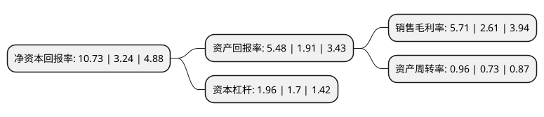

> 本页面由自动化程序生成于 2022年5月20日 01:30
> 内容可能存在错误，如有bug请提交issue至：https://github.com/Eroleice/doc-pi/issues
{.is-warning}

# 上市公司基本情况

## 基本资料

重庆钢铁股份有限公司（以下简称“重庆钢铁”）成立于1997年08月11日，重庆市。于2007年02月28日在上交所主板上市。

重庆钢铁注册资本891,860.227万元，主要产品:中厚钢板，型材，线材，棒材，钢坯，冷轧板以及焦化副产品，炼铁副产品等。主要业务:生产，加工，销售板材，型材，线材，棒材，钢坯，薄板带;生产，销售煤化工制品，生铁及水渣，钢渣，废钢。以下是详细信息：

- 公司名称: 重庆钢铁股份有限公司
- 股票代码: 601005.SH
- 所在地: 重庆 - 重庆市
- 成立日期: 1997年08月11日
- 注册资本: 891,860.227万元
- 法定代表人: 张文学
- 主营业务: 主要产品:中厚钢板，型材，线材，棒材，钢坯，冷轧板以及焦化副产品，炼铁副产品等生产，加工，销售板材，型材，线材，棒材，钢坯，薄板带;生产，销售煤化工制品，生铁及水渣，钢渣，废钢
- 公司官网: www.cqgt.cn
- 公司介绍: 公司是我国大型钢铁企业和最大的中厚钢板生产商之一。公司主要从事生产、加工、销售板材、型材、线材、棒材、钢坯、薄板带；生产、销售煤化工制品、生铁及水渣、钢渣、废钢。公司立足重庆、深耕川渝、辐射西南，以“成为中国西南地区最具竞争力的钢铁企业，成为内陆钢厂绿色友好和转型升级的引领者，成为员工与企业共同发展的公司典范”为愿景，持续深化改革，实施成本领先、制造技术领先战略，着力打造“实力重钢”、“美丽重钢”、“魅力重钢”，提升公司核心竞争力。公司按ISO9001-2015、ISO14001-2015、GB/T28001：2011标准建立了质量、环境及职业健康安全管理体系。船板、锅炉和压力容器用钢板等产品曾多次荣获国家质量金奖、国家冶金产品实物质量“金杯奖”和重庆名牌产品称号；普通、高强度船板及超高强度船体结构用钢板获中、美、英、德、法、挪、日、韩、意等国船级社的认证。公司先后获得全国五一劳动奖状、全国实施卓越绩效模式先进企业、重庆市著名商标、重庆市质量效益型企业、重庆市重合同守信用企业等荣誉称号。

## 股东及高管情况

上市公司第一大股东为重庆长寿钢铁有限公司，持股2,096,981,600股，占比23.51%，**疑似为**上市公司实际控制人。

截至2022年03月31日，上市公司的前十大股东中，共有9名机构股东，1个海外主体，其中5%以上大股东共有2名。上市公司前十大股东明细如下：

> 未能通过持股比例判定出上市公司实际控制人（持股30%以上）
> 可能存在通过间接持股、联合持股、协议控制等方式拥有实际控制权的主体，具体请参考上市公司定期公告！
{.is-warning}

> 截至2022年03月31日，上市公司前十大股东信息如下：

| 股东名称 | 持股数量（股） | 持股比例 |
| --- | --- | --- |
| 重庆长寿钢铁有限公司 | 2,096,981,600 | 23.51% |
| 香港中央结算(代理人)有限公司 | 532,270,621 | 5.97% |
| 重庆千信集团有限公司 | 427,195,760 | 4.79% |
| 重庆农村商业银行股份有限公司 | 289,268,939 | 3.24% |
| 重庆国创投资管理有限公司 | 278,288,059 | 3.12% |
| 重庆银行股份有限公司 | 226,042,920 | 2.53% |
| 兴业银行股份有限公司重庆分行 | 219,633,096 | 2.46% |
| 中国农业银行股份有限公司重庆市分行 | 216,403,628 | 2.43% |
| 中船工业成套物流有限公司 | 211,461,370 | 2.37% |
| 交通银行股份有限公司重庆市分行 | 140,760,305 | 1.58% |

## 利润表分析

上市公司2021年总收入为398.49亿元，净利润为22.74亿元，实现盈利。

## 杜邦分析

> 数据列示周期：2021年 | 2020年 | 2019年
{.is-info}

上市公司的净资产收益率在近一年有所上升，上升幅度为231.17%，其变化情况分解如下：
- 上市公司的销售毛利率在近一年上升了118.77%，可能是生产效率的提升、商品原材料价格下跌或商品价格的上涨所致。
- 上市公司的资产周转率在近一年上升了31.51%，可能是源自于更快的销售回款或库存管理效果提升。
- 上市公司的财务杠杆比率在近一年上升了15.29%，可能是增加负债扩大生产规模。

