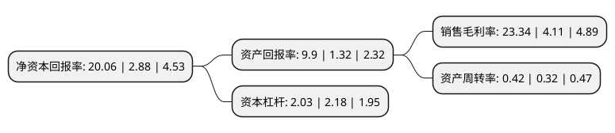

> 本页面由自动化程序生成于 2022年5月20日 01:32
> 内容可能存在错误，如有bug请提交issue至：https://github.com/Eroleice/doc-pi/issues
{.is-warning}

# 上市公司基本情况

## 基本资料

海南矿业股份有限公司（以下简称“海南矿业”）成立于2007年08月22日，昌江黎族自治县。于2014年12月09日在上交所主板上市。

海南矿业注册资本202,170.173万元，本公司主营业务为铁矿石采，选和销售，主要产品为铁矿石产品，具体包括:块矿，粉矿和铁精粉。以下是详细信息：

- 公司名称: 海南矿业股份有限公司
- 股票代码: 601969.SH
- 所在地: 海南 - 昌江黎族自治县
- 成立日期: 2007年08月22日
- 注册资本: 202,170.173万元
- 法定代表人: 刘明东
- 主营业务: 本公司主营业务为铁矿石采，选和销售，主要产品为铁矿石产品，具体包括:块矿，粉矿和铁精粉
- 公司官网: www.hnmining.com
- 公司介绍: 公司是一家以铁矿石开采为主业的股份制企业。公司旗下的石碌铁矿，是一个多金属和非金属矿伴生的矿区，以富铁矿石储量大、品位高而著称，被誉为“中国最大的富铁矿生产商”。海南矿业的露天开采，机械化程度较高，具有采矿、选矿、尾矿回收、设备维修、金属加工等综合生产能力。生产规模年采剥总量达1,200万吨，原铁矿石460万吨，成品铁矿石350万吨。主要产品为块矿、粉矿、铁精粉等，产品销往武钢股份、天津铁厂和韶钢松山等国内多家钢铁企业。公司将以中国发展为动力,以整合全球资源为己任，以矿产资源开拓为核心，力争成为具有全球投融资能力的矿产资源专业服务商，致力于打造国际知名、中国一流的矿产资源集团。公司将借助资本市场平台，着眼于全球化、多矿种、深耕国家南海资源发展战略，把握矿业周期规律，实现多品种、多地区的投资覆盖，加大境内外跨行业扩张并购，积极拓展公司的资源发展领域；同时加强对矿业贸易、物流、终端销售的移动互联网运营投资，实现矿业资源线上线下的打通，形成一体化产业闭环，进一步壮大企业规模，增强公司综合竞争实力。

## 股东及高管情况

上市公司第一大股东为上海复星产业投资有限公司，持股651,783,000股，占比32.2393%，为上市公司实际控制人。

截至2022年04月08日，上市公司的前十大股东中，共有2名自然人股东，7名机构股东，1个海外主体，其中5%以上大股东共有5名。上市公司前十大股东明细如下：

> 截至2022年04月08日，上市公司前十大股东信息如下：

| 股东名称 | 持股数量（股） | 持股比例 |
| --- | --- | --- |
| 上海复星产业投资有限公司 | 651,783,000 | 32.2393% |
| 上海复星产业投资有限公司 | 651,783,000 | 32.24% |
| 海南海钢集团有限公司 | 598,108,679 | 29.5844% |
| 海南海钢集团有限公司 | 598,108,679 | 29.58% |
| 上海复星高科技(集团)有限公司 | 336,000,000 | 16.62% |
| JPMORGAN CHASE BANK,NATIONAL ASSOCIATION | 6,006,102 | 0.3% |
| 中信证券股份有限公司 | 4,633,103 | 0.23% |
| 芦虎 | 3,949,100 | 0.2% |
| 王一添 | 3,786,800 | 0.19% |
| 中信建投证券股份有限公司 | 3,408,347 | 0.17% |

## 利润表分析

上市公司2021年总收入为41.19亿元，净利润为9.61亿元，实现盈利。

## 杜邦分析

> 数据列示周期：2021年 | 2020年 | 2019年
{.is-info}

上市公司的净资产收益率在近一年有所上升，上升幅度为596.53%，其变化情况分解如下：
- 上市公司的销售毛利率在近一年上升了467.88%，可能是生产效率的提升、商品原材料价格下跌或商品价格的上涨所致。
- 上市公司的资产周转率在近一年上升了31.25%，可能是源自于更快的销售回款或库存管理效果提升。
- 上市公司的财务杠杆比率在近一年下降了-6.88%，可能是减少负债降低财务费用。

