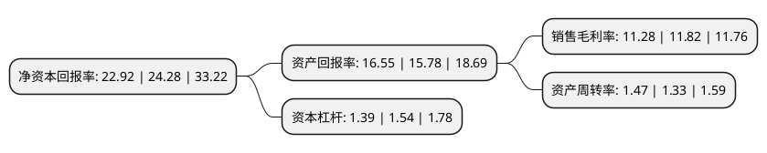

> 本页面由自动化程序生成于 2022年5月20日 01:05
> 内容可能存在错误，如有bug请提交issue至：https://github.com/Eroleice/doc-pi/issues
{.is-warning}

# 上市公司基本情况

## 基本资料

江苏泰慕士针纺科技股份有限公司（以下简称“泰慕士”）成立于1992年08月26日，南通市。于2022年01月11日在深交所主板上市。

泰慕士注册资本10,666.67万元，公司主营业务为针织面料与针织服装的研发，生产和销售，公司主要产品可以分为运动服装，休闲服装及儿童服装。以下是详细信息：

- 公司名称: 江苏泰慕士针纺科技股份有限公司
- 股票代码: 001234.SZ
- 所在地: 江苏 - 南通市
- 成立日期: 1992年08月26日
- 注册资本: 10,666.67万元
- 法定代表人: 陆彪
- 主营业务: 公司主营业务为针织面料与针织服装的研发，生产和销售，公司主要产品可以分为运动服装，休闲服装及儿童服装
- 公司官网: www.times-clothing.com
- 公司介绍: 公司主营业务为针织面料与针织服装的研发、生产和销售，主要为迪卡侬、森马服饰、Quiksilver、Kappa、佐丹奴、全棉时代等知名服装品牌提供贴牌加工服务，公司主要产品可以分为运动服装、休闲服装及儿童服装。公司拥有在行业内具备领先优势的纵向一体化针织服装产业链，涵盖了针织面料开发、织造、染整以及针织服装裁剪、印绣花、缝制等诸多生产环节，通过构建全流程信息控制系统和自动仓储系统，依靠专业设备自动化、核心工序模块化、员工操作标准化管理，建立了能够满足客户多品种、小批量、多批次采购需求的柔性生产链。公司是经江苏省科学技术厅、江苏省财政厅、国家税务总局江苏省税务局联合认定的高新技术企业，截至2020年6月30日，公司拥有专利授权38项，其中发明专利32项。公司为国家知识产权优势企业，建有江苏省研究生工作站、江苏省企业技术中心、江苏省针织高档面料工程技术研究中心，自主开发的多款面料产品被评定为江苏省高新技术产品，合作开发的高耐磨色牢度热湿舒适针织产品开发关键技术获中国纺织工业联合会科学进步一等奖。公司亦荣获“中国服装行业百强企业”、“江苏省服装行业五十强企业”、“江苏省示范智能制造车间”等称号。

## 股东及高管情况

上市公司第一大股东为如皋新泰投资有限公司，持股48,000,000股，占比45%，为上市公司实际控制人。

截至2022年03月31日，上市公司的前十大股东中，共有5名自然人股东，3名机构股东，2个海外主体，其中5%以上大股东共有3名。上市公司前十大股东明细如下：

> 截至2022年03月31日，上市公司前十大股东信息如下：

| 股东名称 | 持股数量（股） | 持股比例 |
| --- | --- | --- |
| 如皋新泰投资有限公司 | 48,000,000 | 45% |
| 陆彪 | 10,800,000 | 10.12% |
| 杨敏 | 10,800,000 | 10.12% |
| 南通泰达股权投资合伙企业(有限合伙) | 4,000,000 | 3.75% |
| 南通泰然股权投资合伙企业(有限合伙) | 4,000,000 | 3.75% |
| 高军 | 2,400,000 | 2.25% |
| UBS AG | 243,522 | 0.23% |
| JPMORGAN CHASE BANK,NATIONAL ASSOCIATION | 211,771 | 0.2% |
| 汪友元 | 193,523 | 0.18% |
| 谢楷 | 193,200 | 0.18% |

## 利润表分析

上市公司2021年总收入为8.69亿元，净利润为0.98亿元，实现盈利。

## 杜邦分析

> 数据列示周期：2021年 | 2020年 | 2019年
{.is-info}

上市公司的净资产收益率在近一年有所下降，下降幅度为-5.6%，其变化情况分解如下：
- 上市公司的销售毛利率在近一年下降了-4.57%，可能是生产效率的下降、商品原材料价格上涨或商品价格的下跌所致。
- 上市公司的资产周转率在近一年上升了10.53%，可能是源自于更快的销售回款或库存管理效果提升。
- 上市公司的财务杠杆比率在近一年下降了-9.74%，可能是减少负债降低财务费用。

