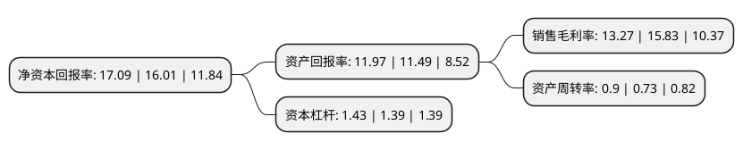

> 本页面由自动化程序生成于 2022年5月20日 01:05
> 内容可能存在错误，如有bug请提交issue至：https://github.com/Eroleice/doc-pi/issues
{.is-warning}

# 上市公司基本情况

## 基本资料

浙江伟星实业发展股份有限公司（以下简称“伟星股份”）成立于1988年05月11日，台州市。于2004年06月25日在深交所中小板上市。

伟星股份注册资本79,785.043万元，主要产品:钮扣，拉链，其他服装辅料。以下是详细信息：

- 公司名称: 浙江伟星实业发展股份有限公司
- 股票代码: 002003.SZ
- 所在地: 浙江 - 台州市
- 成立日期: 1988年05月11日
- 注册资本: 79,785.043万元
- 法定代表人: 章卡鹏
- 主营业务: 主要产品:钮扣，拉链，其他服装辅料
- 公司官网: www.weixing.cn
- 公司介绍: 公司是一家品类全、响应快的服装辅料企业，也是中国纽扣和拉链行业首家上市公司。公司专业从事钮扣、拉链、金属制品等服装辅料的研发、制造与销售，是世界上最大的钮扣生产企业之一，中国钮扣行业标准的主要制订单位。公司在技术与研发、装备与规模、营销与服务、品牌以及管理团队等方面已形成较强的综合竞争优势。公司以“传承服饰文化，提升时尚品味”为使命，致力于为客户提供快捷、贴心的“一站式”服务，为客户“量身定制”一体化辅料解决方案，已成为全球众多知名服装品牌企业的战略合作伙伴。

## 股东及高管情况

上市公司第一大股东为伟星集团有限公司，持股232,620,518股，占比29.16%，**疑似为**上市公司实际控制人。

截至2022年03月31日，上市公司的前十大股东中，共有3名自然人股东，1名机构股东，6个产品账户，其中5%以上大股东共有2名。上市公司前十大股东明细如下：

> 未能通过持股比例判定出上市公司实际控制人（持股30%以上）
> 可能存在通过间接持股、联合持股、协议控制等方式拥有实际控制权的主体，具体请参考上市公司定期公告！
{.is-warning}

> 截至2022年03月31日，上市公司前十大股东信息如下：

| 股东名称 | 持股数量（股） | 持股比例 |
| --- | --- | --- |
| 伟星集团有限公司 | 232,620,518 | 29.16% |
| 章卡鹏 | 51,008,540 | 6.39% |
| 张三云 | 33,794,187 | 4.24% |
| 谢瑾琨 | 24,096,969 | 3.02% |
| 中泰证券资管-招商银行-中泰星河12号集合资产管理计划 | 18,315,087 | 2.3% |
| 大家人寿保险股份有限公司-万能产品 | 15,354,755 | 1.92% |
| 平安基金-中国平安人寿保险股份有限公司-平安人寿-平安基金权益委托投资1号单一资产管理计划 | 13,201,818 | 1.65% |
| 基本养老保险基金一零零一组合 | 9,889,970 | 1.24% |
| 中国建设银行股份有限公司-南方匠心优选股票型证券投资基金 | 9,758,028 | 1.22% |
| 中泰证券资管-招商银行-中泰星河22号集合资产管理计划 | 8,423,639 | 1.06% |

## 利润表分析

上市公司2021年总收入为33.55亿元，净利润为4.45亿元，实现盈利。

## 杜邦分析

> 数据列示周期：2021年 | 2020年 | 2019年
{.is-info}

上市公司的净资产收益率在近一年有所上升，上升幅度为6.75%，其变化情况分解如下：
- 上市公司的销售毛利率在近一年下降了-16.17%，可能是生产效率的下降、商品原材料价格上涨或商品价格的下跌所致。
- 上市公司的资产周转率在近一年上升了23.29%，可能是源自于更快的销售回款或库存管理效果提升。
- 上市公司的财务杠杆比率在近一年上升了2.88%，可能是增加负债扩大生产规模。

