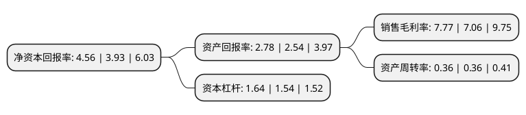

> 本页面由自动化程序生成于 2022年5月20日 01:05
> 内容可能存在错误，如有bug请提交issue至：https://github.com/Eroleice/doc-pi/issues
{.is-warning}

# 上市公司基本情况

## 基本资料

福建七匹狼实业股份有限公司（以下简称“七匹狼”）成立于2001年07月23日，泉州市。于2004年08月06日在深交所中小板上市。

七匹狼注册资本75,567万元，主要产品:茄克，T恤，休闲装，裤装，棉褛，衬衫，毛衫以下是详细信息：

- 公司名称: 福建七匹狼实业股份有限公司
- 股票代码: 002029.SZ
- 所在地: 福建 - 泉州市
- 成立日期: 2001年07月23日
- 注册资本: 75,567万元
- 法定代表人: 周少雄
- 主营业务: 主要产品:茄克，T恤，休闲装，裤装，棉褛，衬衫，毛衫
- 公司官网: www.septwolves-group.com
- 公司介绍: 公司是以经营七匹狼品牌男休闲装的大型企业，是科技厅认定高新技术企业。公司主导服装开发、生产、销售，拥有“七匹狼”男装品牌，是以品牌经营为核心的上市公司。公司拥有世界上先进的电脑自动化生产设备，国际标准化、封闭式的工业园，是目前国内高级男休闲装的代表，在全国休闲服装行业中名列前茅。作为中国服装业首家高科技上市公司，公司在行业内率先系统提出服装品牌文化经营理论，形成了以品牌为核心、以生活形态产业为主导的现代企业经营体系。公司通过多元化品牌运作和产业投资，业务涉及时尚、金融、地产、投资等多个领域，在时尚产业板块，除了自主品牌七匹狼男装、狼图腾、16N，还授权七匹狼针纺等品类，并收购国际时尚品牌KarlLagerfeld，入股现代传播数码业务。

## 股东及高管情况

上市公司第一大股东为福建七匹狼集团有限公司，持股259,136,718股，占比34.29%，为上市公司实际控制人。

截至2022年03月31日，上市公司的前十大股东中，共有3名自然人股东，1名机构股东，6个产品账户，其中5%以上大股东共有1名。上市公司前十大股东明细如下：

> 截至2022年03月31日，上市公司前十大股东信息如下：

| 股东名称 | 持股数量（股） | 持股比例 |
| --- | --- | --- |
| 福建七匹狼集团有限公司 | 259,136,718 | 34.29% |
| 洪泽君 | 37,180,000 | 4.92% |
| 周少雄 | 13,190,200 | 1.75% |
| 周少明 | 13,190,200 | 1.75% |
| 银华基金-农业银行-银华中证金融资产管理计划 | 4,853,000 | 0.64% |
| 易方达基金-农业银行-易方达中证金融资产管理计划 | 4,853,000 | 0.64% |
| 中欧基金-农业银行-中欧中证金融资产管理计划 | 4,853,000 | 0.64% |
| 博时基金-农业银行-博时中证金融资产管理计划 | 4,853,000 | 0.64% |
| 工银瑞信基金-农业银行-工银瑞信中证金融资产管理计划 | 4,853,000 | 0.64% |
| 广发基金-农业银行-广发中证金融资产管理计划 | 4,853,000 | 0.64% |

## 利润表分析

上市公司2021年总收入为35.14亿元，净利润为2.73亿元，实现盈利。

## 杜邦分析

> 数据列示周期：2021年 | 2020年 | 2019年
{.is-info}

上市公司的净资产收益率在近一年有所上升，上升幅度为16.03%，其变化情况分解如下：
- 上市公司的销售毛利率在近一年上升了10.06%，可能是生产效率的提升、商品原材料价格下跌或商品价格的上涨所致。
- 上市公司的资产周转率在近一年下降了0%，可能是源自于更慢的销售回款或库存管理效果下降。
- 上市公司的财务杠杆比率在近一年上升了6.49%，可能是增加负债扩大生产规模。

