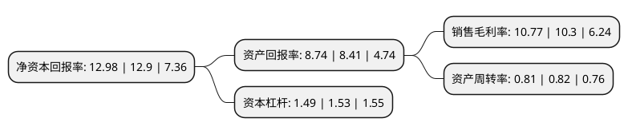

> 本页面由自动化程序生成于 2022年5月20日 01:06
> 内容可能存在错误，如有bug请提交issue至：https://github.com/Eroleice/doc-pi/issues
{.is-warning}

# 上市公司基本情况

## 基本资料

报喜鸟控股股份有限公司（以下简称“报喜鸟”）成立于2001年06月20日，温州市。于2007年08月16日在深交所中小板上市。

报喜鸟注册资本145,933.373万元，主营业务:本公司主要从事“报喜鸟”品牌西服，衬衫等男士系列服饰产品的生产和销售以下是详细信息：

- 公司名称: 报喜鸟控股股份有限公司
- 股票代码: 002154.SZ
- 所在地: 浙江 - 温州市
- 成立日期: 2001年06月20日
- 注册资本: 145,933.373万元
- 法定代表人: 吴志泽
- 主营业务: 主营业务:本公司主要从事“报喜鸟”品牌西服，衬衫等男士系列服饰产品的生产和销售
- 公司官网: www.bxn.com\www.baoxiniao.com.cn
- 公司介绍: 公司是一家以服装为主业，涉足投资领域的股份制企业。公司主要从事报喜鸟品牌西服和衬衫等男士系列服饰产品的设计、生产和销售。公司坚持走国内高档精品男装的发展路线，在国内率先引进专卖连锁特许加盟的销售模式，目前已拥有形象统一、价格统一、服务统一、管理统一的专卖店500多家。公司注册商标“报喜鸟”获多个国家的国际注册，被国家工商行政管理总局认定为“中国驰名商标”，报喜鸟产品被国家质量监督检验检疫总局评为“中国名牌”和中国首批西服“国家免检产品”。公司结合移动互联网及大数据技术，打通线上与线下，为消费者提供全方位、多品牌、互动与服务结合的全渠道购物体验。同时借助智能制造技术的发展，积极推进内部转型升级，成立云翼智能平台，部署工业4.0智能化生产。

## 股东及高管情况

上市公司第一大股东为吴志泽，持股367,777,954股，占比25.2%，**疑似为**上市公司实际控制人。

截至2022年03月31日，上市公司的前十大股东中，共有3名自然人股东，7个产品账户，其中5%以上大股东共有2名。上市公司前十大股东明细如下：

> 未能通过持股比例判定出上市公司实际控制人（持股30%以上）
> 可能存在通过间接持股、联合持股、协议控制等方式拥有实际控制权的主体，具体请参考上市公司定期公告！
{.is-warning}

> 截至2022年03月31日，上市公司前十大股东信息如下：

| 股东名称 | 持股数量（股） | 持股比例 |
| --- | --- | --- |
| 吴志泽 | 367,777,954 | 25.2% |
| 吴婷婷 | 185,564,542 | 12.72% |
| 广发证券资管-工商银行-广发资管平衡精选一年持有混合型集合资产管理计划 | 27,595,051 | 1.89% |
| 吴特 | 21,800,466 | 1.49% |
| 中国建设银行股份有限公司-汇添富消费行业混合型证券投资基金 | 17,000,003 | 1.16% |
| 兴业银行股份有限公司-南方兴润价值一年持有期混合型证券投资基金 | 14,532,900 | 1% |
| 中国建设银行股份有限公司-华夏内需驱动混合型证券投资基金 | 11,953,142 | 0.82% |
| 中国建设银行股份有限公司-中欧价值发现股票型证券投资基金 | 11,799,906 | 0.81% |
| 中国工商银行-南方绩优成长股票型证券投资基金 | 11,789,100 | 0.81% |
| 平安银行股份有限公司-东方红睿轩三年定期开放灵活配置混合型证券投资基金 | 11,785,900 | 0.81% |

## 利润表分析

上市公司2021年总收入为44.51亿元，净利润为4.79亿元，实现盈利。

## 杜邦分析

> 数据列示周期：2021年 | 2020年 | 2019年
{.is-info}

上市公司的净资产收益率在近一年有所上升，上升幅度为0.62%，其变化情况分解如下：
- 上市公司的销售毛利率在近一年上升了4.56%，可能是生产效率的提升、商品原材料价格下跌或商品价格的上涨所致。
- 上市公司的资产周转率在近一年下降了-1.22%，可能是源自于更慢的销售回款或库存管理效果下降。
- 上市公司的财务杠杆比率在近一年下降了-2.61%，可能是减少负债降低财务费用。

